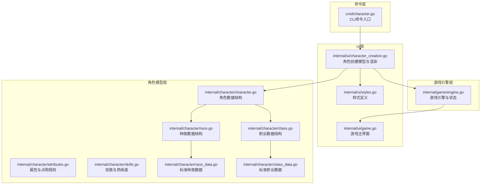
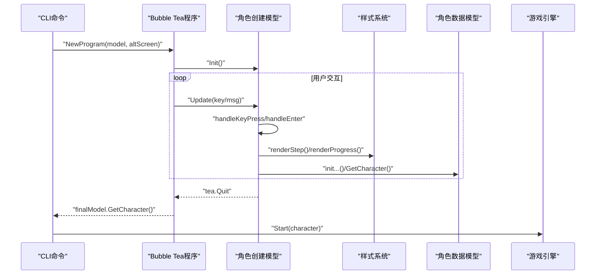
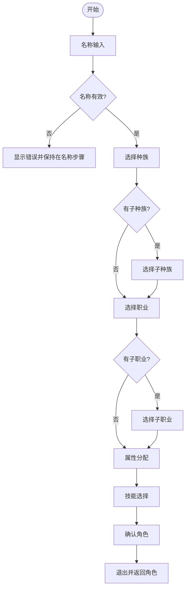
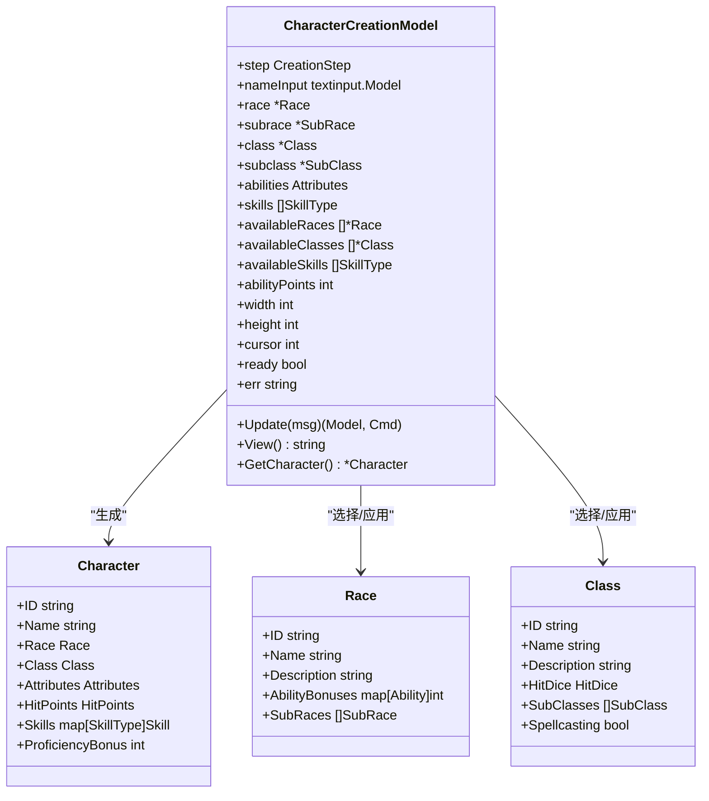
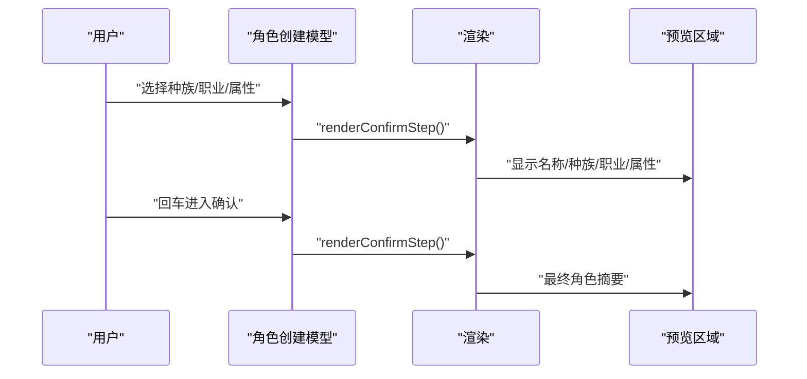
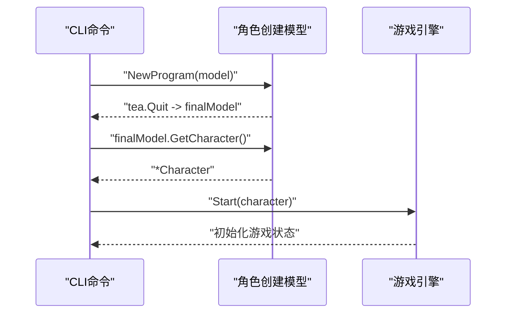
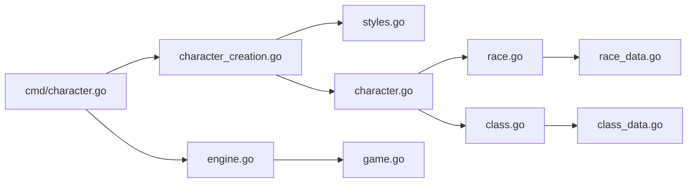

# 角色创建界面

<cite>
**本文引用的文件**
- [character_creation.go](file://internal/ui/character_creation.go)
- [styles.go](file://internal/ui/styles.go)
- [character.go](file://internal/character/character.go)
- [race.go](file://internal/character/race.go)
- [class.go](file://internal/character/class.go)
- [attributes.go](file://internal/character/attributes.go)
- [skills.go](file://internal/character/skills.go)
- [race_data.go](file://internal/character/race_data.go)
- [class_data.go](file://internal/character/class_data.go)
- [character.go](file://cmd/character.go)
- [engine.go](file://internal/game/engine.go)
- [game.go](file://internal/ui/game.go)
</cite>

## 目录
1. [简介](#简介)
2. [项目结构](#项目结构)
3. [核心组件](#核心组件)
4. [架构总览](#架构总览)
5. [详细组件分析](#详细组件分析)
6. [依赖关系分析](#依赖关系分析)
7. [性能考虑](#性能考虑)
8. [故障排除指南](#故障排除指南)
9. [结论](#结论)

## 简介
本文件面向CDND项目中的“角色创建界面”，系统性梳理其UI实现、数据绑定、导航逻辑、验证规则、预览机制、响应式设计与无障碍支持，以及与角色管理系统的集成与数据流。该界面采用Bubble Tea框架构建，提供步骤式向导，支持键盘导航与实时预览，最终生成可直接投入游戏的D&D 5e角色数据结构。

## 项目结构
角色创建界面位于UI层，核心文件为`internal/ui/character_creation.go`，配合样式定义`internal/ui/styles.go`，以及角色数据模型与规则定义位于`internal/character/`目录。命令入口位于CLI层`cmd/character.go`，最终通过游戏引擎`internal/game/engine.go`与游戏主界面`internal/ui/game.go`衔接。

图表来源
- [character_creation.go:1-537](file://internal/ui/character_creation.go#L1-L537)
- [styles.go:1-209](file://internal/ui/styles.go#L1-L209)
- [character.go:1-223](file://internal/character/character.go#L1-L223)
- [race.go:1-94](file://internal/character/race.go#L1-L94)
- [class.go:1-118](file://internal/character/class.go#L1-L118)
- [attributes.go:1-142](file://internal/character/attributes.go#L1-L142)
- [skills.go:1-172](file://internal/character/skills.go#L1-L172)
- [race_data.go:1-373](file://internal/character/race_data.go#L1-L373)
- [class_data.go:1-677](file://internal/character/class_data.go#L1-L677)
- [character.go:1-99](file://cmd/character.go#L1-L99)
- [engine.go:1-797](file://internal/game/engine.go#L1-L797)
- [game.go:1-359](file://internal/ui/game.go#L1-L359)

章节来源
- [character_creation.go:1-537](file://internal/ui/character_creation.go#L1-L537)
- [styles.go:1-209](file://internal/ui/styles.go#L1-L209)
- [character.go:1-223](file://internal/character/character.go#L1-L223)
- [race.go:1-94](file://internal/character/race.go#L1-L94)
- [class.go:1-118](file://internal/character/class.go#L1-L118)
- [attributes.go:1-142](file://internal/character/attributes.go#L1-L142)
- [skills.go:1-172](file://internal/character/skills.go#L1-L172)
- [race_data.go:1-373](file://internal/character/race_data.go#L1-L373)
- [class_data.go:1-677](file://internal/character/class_data.go#L1-L677)
- [character.go:1-99](file://cmd/character.go#L1-L99)
- [engine.go:1-797](file://internal/game/engine.go#L1-L797)
- [game.go:1-359](file://internal/ui/game.go#L1-L359)

## 核心组件
- 角色创建模型：维护当前步骤、用户输入、候选数据集、游标位置、错误信息等，负责键盘事件处理与渲染。
- 样式系统：集中定义标题、标签、输入、菜单项、进度条、提示与错误等样式，保证一致的视觉风格。
- 角色数据模型：封装角色基本信息、属性、生命值、技能、豁免、装备、法术等，提供默认值与计算方法。
- 种族与职业数据：提供标准D&D 5e种族与职业的完整数据集，含子种族、子职业、特性、熟练度等。
- CLI入口：启动角色创建向导，接收最终角色并打印摘要。
- 游戏引擎：承载角色并驱动后续游戏流程。

章节来源
- [character_creation.go:51-88](file://internal/ui/character_creation.go#L51-L88)
- [styles.go:499-521](file://internal/ui/styles.go#L499-L521)
- [character.go:8-100](file://internal/character/character.go#L8-L100)
- [race.go:44-93](file://internal/character/race.go#L44-L93)
- [class.go:47-117](file://internal/character/class.go#L47-L117)
- [character.go:28-51](file://cmd/character.go#L28-L51)

## 架构总览
角色创建界面采用Bubble Tea的Model-View-Update模式：
- Model：CharacterCreationModel持有当前步骤、输入控件、候选数据、游标与错误状态。
- View：根据当前步骤渲染对应UI片段，包含进度条、步骤标题、列表项、输入框与提示。
- Update：处理键盘事件（上下移动、回车确认、窗口大小变化），更新游标与步骤，必要时初始化数据（如属性点分配、可用技能）。
- 数据绑定：用户输入通过textinput控件绑定到模型的nameInput；游标选择绑定到availableRaces/availableClasses等候选集合。
- 导航逻辑：Step枚举定义步骤序列，handleEnter在每个步骤决定下一步或进入确认。
- 集成：CLI命令启动模型，结束后通过GetCharacter()生成角色并交由游戏引擎。

图表来源
- [character.go:28-51](file://cmd/character.go#L28-L51)
- [character_creation.go:95-202](file://internal/ui/character_creation.go#L95-L202)
- [styles.go:499-521](file://internal/ui/styles.go#L499-L521)
- [character.go:63-100](file://internal/character/character.go#L63-L100)
- [engine.go:79-99](file://internal/game/engine.go#L79-L99)

章节来源
- [character.go:28-51](file://cmd/character.go#L28-L51)
- [character_creation.go:95-202](file://internal/ui/character_creation.go#L95-L202)
- [styles.go:499-521](file://internal/ui/styles.go#L499-L521)
- [character.go:63-100](file://internal/character/character.go#L63-L100)
- [engine.go:79-99](file://internal/game/engine.go#L79-L99)

## 详细组件分析

### 角色创建模型与步骤导航
- 步骤定义：StepName、StepRace、StepSubrace、StepClass、StepSubclass、StepAbilityScores、StepSkills、StepConfirm。
- 键盘处理：支持上下移动游标、回车进入下一步、Ctrl+C退出。
- 窗口尺寸：收到WindowSize消息后标记ready，确保渲染稳定。
- 步骤渲染：renderStep根据当前步骤调用对应renderXxxStep，包含标签、列表项、输入框与提示。
- 条件分支：当选择种族/职业后，若存在子选项则进入子步骤；否则直接进入下一个步骤。
- 回退机制：当前实现为单向前进，未提供显式的“上一步”按钮或快捷键。

图表来源
- [character_creation.go:140-202](file://internal/ui/character_creation.go#L140-L202)
- [character_creation.go:300-322](file://internal/ui/character_creation.go#L300-L322)

章节来源
- [character_creation.go:13-49](file://internal/ui/character_creation.go#L13-L49)
- [character_creation.go:95-138](file://internal/ui/character_creation.go#L95-L138)
- [character_creation.go:140-202](file://internal/ui/character_creation.go#L140-L202)
- [character_creation.go:300-322](file://internal/ui/character_creation.go#L300-L322)

### 数据绑定与输入映射
- 名称输入：textinput控件绑定到nameInput，焦点默认激活，placeholder提示输入。
- 列表选择：游标cursor在各步骤中指向当前选中项，渲染时通过SelectedItem样式突出显示。
- 数据源：availableRaces/availableClasses来自标准数据集（GetAllRaces/GetAllClasses），内部复制副本避免外部修改。
- 属性初始化：initAbilityScores基于种族加值与默认10分的属性值计算初始属性。
- 技能初始化：initAvailableSkills将全部技能类型注入可用列表。

图表来源
- [character_creation.go:51-88](file://internal/ui/character_creation.go#L51-L88)
- [character.go:8-100](file://internal/character/character.go#L8-L100)
- [race.go:44-93](file://internal/character/race.go#L44-L93)
- [class.go:47-117](file://internal/character/class.go#L47-L117)

章节来源
- [character_creation.go:74-88](file://internal/ui/character_creation.go#L74-L88)
- [character_creation.go:231-264](file://internal/ui/character_creation.go#L231-L264)
- [race.go:85-93](file://internal/character/race.go#L85-L93)
- [class.go:110-117](file://internal/character/class.go#L110-L117)

### 验证规则与错误提示
- 名称验证：回车进入下一步前检查nameInput.Value()是否为空，为空则设置错误提示并停留在当前步骤。
- 属性点分配：当前实现未在UI中直接展示点购成本或总花费，但提供了PointBuyCost与ValidatePointBuy函数，可用于扩展验证。
- 技能选择：当前未实现重复选择限制或数量上限校验，可通过isSkillSelected与availableSkills扩展。
- 错误提示：err字段在模型中存储错误信息，渲染时通过CreationStyles.Error显示。

章节来源
- [character_creation.go:144-147](file://internal/ui/character_creation.go#L144-L147)
- [character_creation.go:277-280](file://internal/ui/character_creation.go#L277-L280)
- [attributes.go:98-141](file://internal/character/attributes.go#L98-L141)

### 角色预览与实时状态
- 预览内容：StepConfirm步骤渲染角色名称、种族（优先子种族）、职业（含子职业）、属性值与调整值。
- 生命值计算：GetCharacter中根据职业生命骰与体质调整值计算初始HP。
- 实时更新：每次步骤切换或输入变更都会触发重新渲染，预览即时反映最新选择。

图表来源
- [character_creation.go:460-486](file://internal/ui/character_creation.go#L460-L486)
- [character_creation.go:523-536](file://internal/ui/character_creation.go#L523-L536)
- [character.go:63-100](file://internal/character/character.go#L63-L100)

章节来源
- [character_creation.go:460-486](file://internal/ui/character_creation.go#L460-L486)
- [character_creation.go:523-536](file://internal/ui/character_creation.go#L523-L536)
- [character.go:63-100](file://internal/character/character.go#L63-L100)

### 响应式设计与终端适配
- 自适应布局：模型在Update中接收WindowSize消息，记录宽高并在ready=true后渲染；View中根据ready状态输出占位文本。
- 样式适配：样式系统通过lipgloss的边框、内边距、颜色与字体控制，保证在不同终端尺寸下保持可读性与一致性。
- 文本换行：渲染时使用strings.Builder拼接，避免跨平台换行问题；Viewport在游戏主界面中提供滚动能力。

章节来源
- [character_creation.go:102-106](file://internal/ui/character_creation.go#L102-L106)
- [character_creation.go:267-282](file://internal/ui/character_creation.go#L267-L282)
- [styles.go:1-209](file://internal/ui/styles.go#L1-L209)

### 无障碍访问与键盘导航
- 键盘导航：支持上下箭头移动游标、回车确认、Ctrl+C退出，满足基本键盘操作需求。
- 焦点管理：名称输入框默认获得焦点，便于连续输入。
- 可读性：通过SelectedItem样式与高对比度颜色区分当前选中项，提升可读性。
- 建议改进：可增加Tab切换、Esc返回上一步、空格选择等增强可访问性的快捷键；为屏幕阅读器提供ARIA标签或语义化提示（需在渲染层补充）。

章节来源
- [character_creation.go:99-138](file://internal/ui/character_creation.go#L99-L138)
- [character_creation.go:76-78](file://internal/ui/character_creation.go#L76-L78)

### 与角色管理系统集成
- CLI集成：character create命令启动角色创建模型，运行结束后获取角色并打印摘要。
- 引擎集成：角色创建完成后，CLI调用engine.Start(character)启动游戏会话，将角色注入引擎状态。
- 数据流转：角色创建模型通过GetCharacter()输出角色结构，包含ID、名称、种族、职业、属性、技能、生命值等，供引擎后续使用。

图表来源
- [character.go:28-51](file://cmd/character.go#L28-L51)
- [character_creation.go:523-536](file://internal/ui/character_creation.go#L523-L536)
- [engine.go:79-99](file://internal/game/engine.go#L79-L99)

章节来源
- [character.go:28-51](file://cmd/character.go#L28-L51)
- [character_creation.go:523-536](file://internal/ui/character_creation.go#L523-L536)
- [engine.go:79-99](file://internal/game/engine.go#L79-L99)

## 依赖关系分析
- UI层依赖样式系统：所有渲染均使用CreationStyles与GameStyles统一风格。
- 角色模型依赖数据层：CharacterCreationModel依赖character包的数据结构与工厂函数（NewCharacter、GetAllRaces、GetAllClasses）。
- 数据层依赖标准数据：Race/Class通过StandardRaces/StandardClasses提供完整数据集，支持子种族与子职业。
- CLI依赖UI与引擎：character create命令启动UI模型并调用引擎开始游戏。

图表来源
- [character_creation.go:1-11](file://internal/ui/character_creation.go#L1-L11)
- [styles.go:1-3](file://internal/ui/styles.go#L1-L3)
- [character.go:1-6](file://internal/character/character.go#L1-L6)
- [race.go:1-6](file://internal/character/race.go#L1-L6)
- [class.go:1-6](file://internal/character/class.go#L1-L6)
- [race_data.go:1-4](file://internal/character/race_data.go#L1-L4)
- [class_data.go:1-4](file://internal/character/class_data.go#L1-L4)
- [character.go:1-9](file://cmd/character.go#L1-L9)
- [engine.go:1-18](file://internal/game/engine.go#L1-L18)
- [game.go:1-14](file://internal/ui/game.go#L1-L14)

章节来源
- [character_creation.go:1-11](file://internal/ui/character_creation.go#L1-L11)
- [styles.go:1-3](file://internal/ui/styles.go#L1-L3)
- [character.go:1-6](file://internal/character/character.go#L1-L6)
- [race.go:1-6](file://internal/character/race.go#L1-L6)
- [class.go:1-6](file://internal/character/class.go#L1-L6)
- [race_data.go:1-4](file://internal/character/race_data.go#L1-L4)
- [class_data.go:1-4](file://internal/character/class_data.go#L1-L4)
- [character.go:1-9](file://cmd/character.go#L1-L9)
- [engine.go:1-18](file://internal/game/engine.go#L1-L18)
- [game.go:1-14](file://internal/ui/game.go#L1-L14)

## 性能考虑
- 渲染开销：每次Update仅重绘当前步骤与进度条，避免全屏刷新；ready标志确保在窗口尺寸就绪后再渲染。
- 数据拷贝：GetAllRaces/GetAllClasses返回副本，避免共享修改带来的副作用。
- 字符串拼接：使用strings.Builder减少内存分配；长文本通过Viewport滚动而非一次性渲染。
- 计算复杂度：属性初始化与技能列表生成为O(1)/O(n)线性操作，开销极低。

## 故障排除指南
- 输入为空导致无法进入下一步：检查名称输入是否为空，确保输入非空后回车。
- 选择种族/职业后未进入子步骤：确认所选对象HasSubRaces/HasSubClasses返回true，否则将直接进入下一阶段。
- 颜色显示异常：检查终端是否支持ANSI颜色；若不支持，可调整样式或禁用颜色。
- 窗口尺寸异常：等待WindowSize消息到达后ready=true，再进行交互；若渲染空白，重启程序或调整终端大小。

章节来源
- [character_creation.go:144-147](file://internal/ui/character_creation.go#L144-L147)
- [character_creation.go:153-161](file://internal/ui/character_creation.go#L153-L161)
- [character_creation.go:102-106](file://internal/ui/character_creation.go#L102-L106)

## 结论
角色创建界面以清晰的步骤化流程、简洁的键盘交互与一致的样式体系，实现了D&D 5e角色的快速创建。通过与角色数据模型、标准种族/职业数据与游戏引擎的紧密集成，该界面能够高效地将用户输入转化为可运行的游戏角色，并为后续游戏体验奠定基础。建议在未来版本中增强验证规则、支持“上一步”导航、扩展技能选择限制与点购成本校验，并进一步完善无障碍与键盘导航体验。