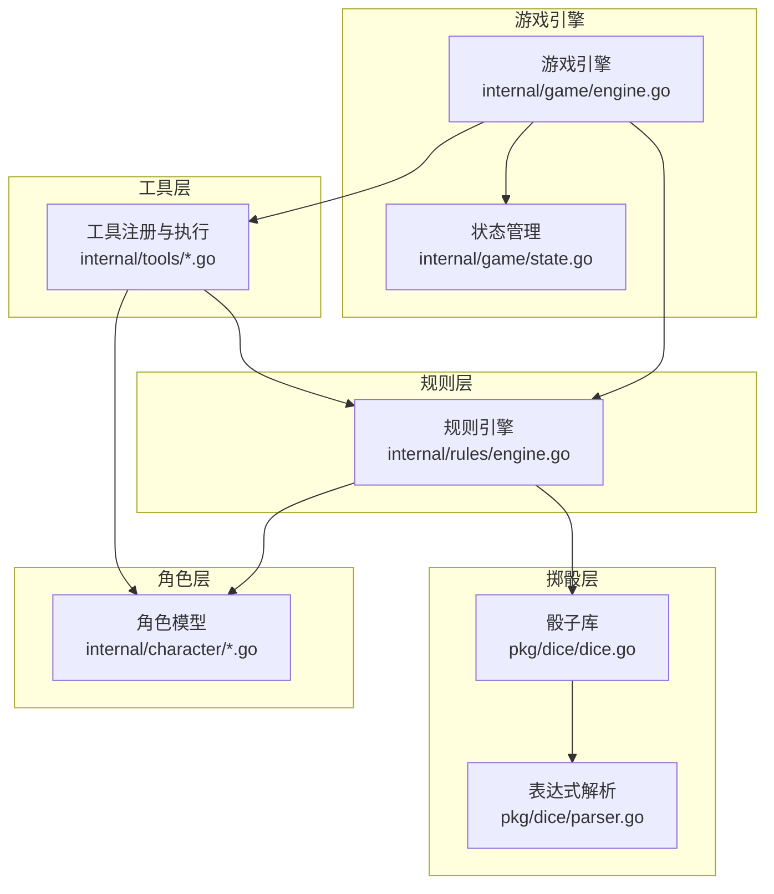
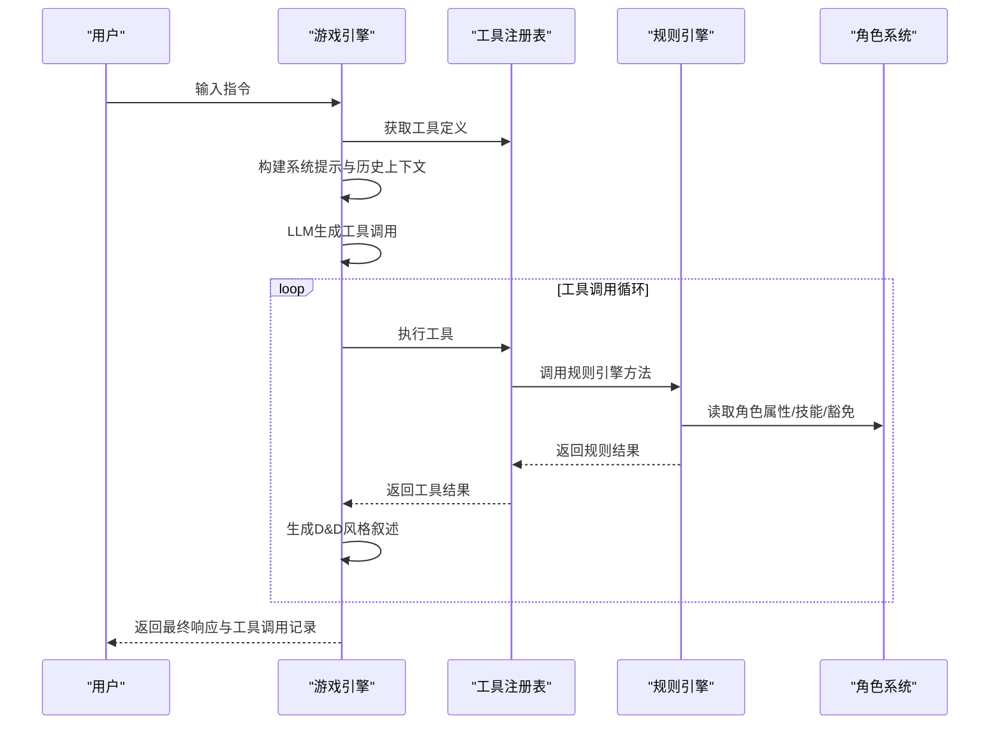
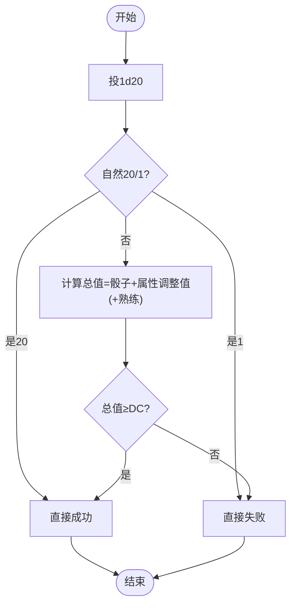
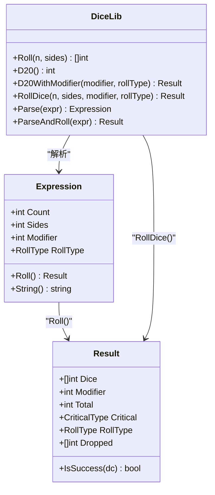
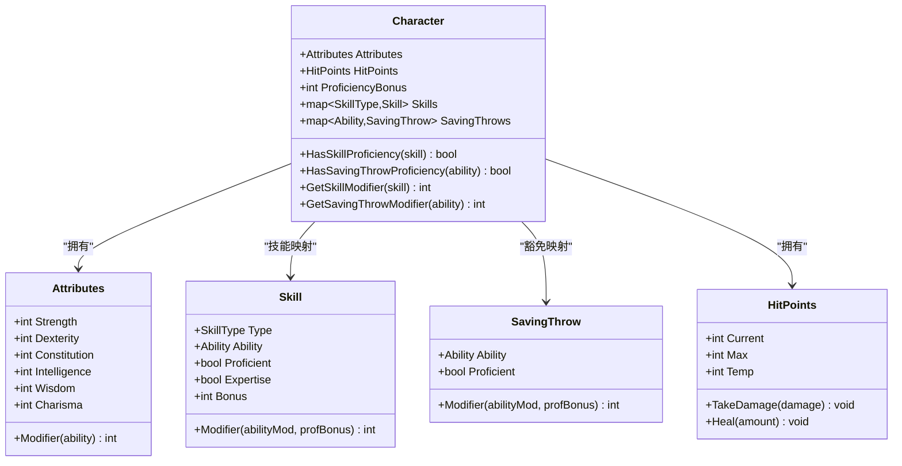
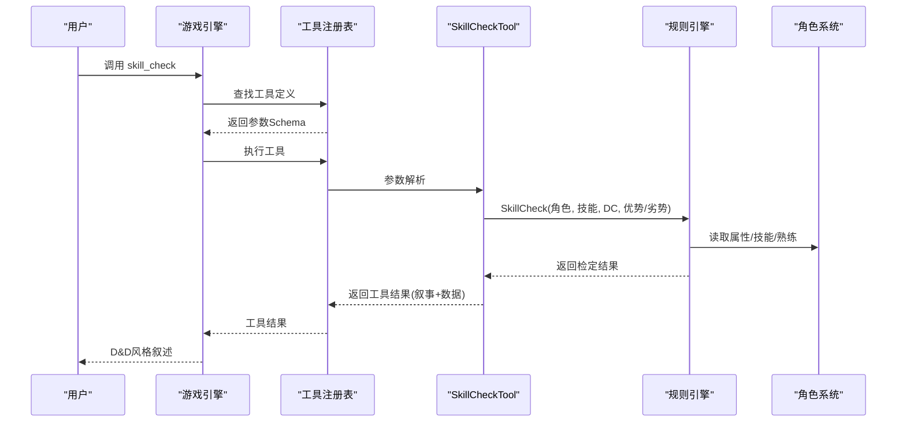
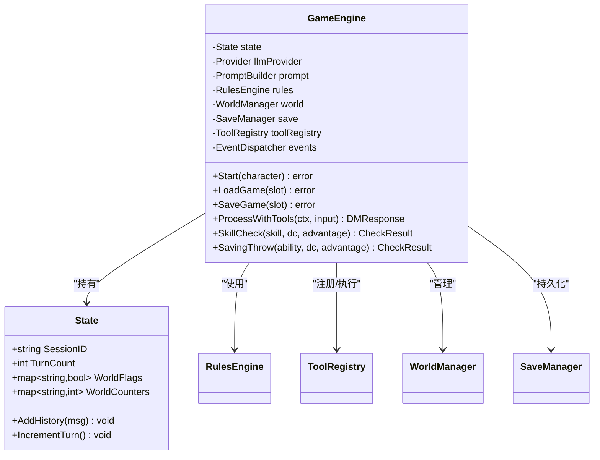
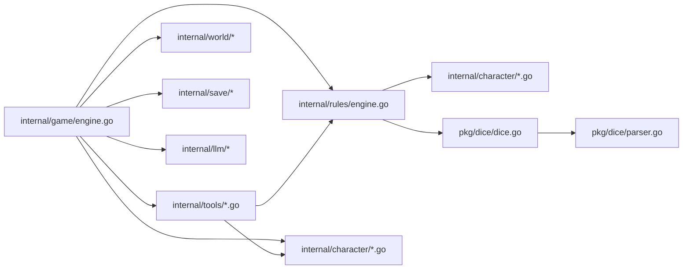

# 规则引擎

<cite>
**本文引用的文件**
- [internal/rules/engine.go](file://internal/rules/engine.go)
- [pkg/dice/dice.go](file://pkg/dice/dice.go)
- [pkg/dice/parser.go](file://pkg/dice/parser.go)
- [internal/game/engine.go](file://internal/game/engine.go)
- [internal/character/character.go](file://internal/character/character.go)
- [internal/character/skills.go](file://internal/character/skills.go)
- [internal/character/attributes.go](file://internal/character/attributes.go)
- [internal/tools/dice_tools.go](file://internal/tools/dice_tools.go)
- [internal/tools/character_tools.go](file://internal/tools/character_tools.go)
- [internal/tools/types.go](file://internal/tools/types.go)
- [internal/game/state.go](file://internal/game/state.go)
- [pkg/dice/dice_test.go](file://pkg/dice/dice_test.go)
- [go.mod](file://go.mod)
</cite>

## 目录
1. [简介](#简介)
2. [项目结构](#项目结构)
3. [核心组件](#核心组件)
4. [架构总览](#架构总览)
5. [详细组件分析](#详细组件分析)
6. [依赖关系分析](#依赖关系分析)
7. [性能考量](#性能考量)
8. [故障排查指南](#故障排查指南)
9. [结论](#结论)
10. [附录](#附录)

## 简介
本技术文档面向CDND的规则引擎，系统性阐述D&D 5e规则体系在代码中的实现，覆盖掷骰机制、检定系统（属性检定、技能检定、豁免检定）、伤害计算、AC计算、以及规则引擎的架构设计（规则定义、执行引擎、结果处理）。同时给出掷骰系统实现细节（骰子类型、加值计算、特殊效果）、技能与属性检定算法（含熟练度加值与环境影响）、规则扩展与自定义机制、性能优化策略与缓存思路、一致性验证与错误处理、面向游戏设计师的规则定制与平衡性建议，以及规则引擎与角色系统、工具系统的集成方式。

## 项目结构
CDND采用分层模块化组织：
- 规则引擎：位于 internal/rules，封装D&D 5e核心规则（检定、豁免、攻击、伤害、AC）。
- 掷骰子库：位于 pkg/dice，提供d20优势/劣势、普通多面骰、表达式解析与结果结构。
- 游戏引擎：位于 internal/game，编排LLM交互、工具调用、状态管理、事件分发。
- 角色系统：位于 internal/character，角色模型、属性、技能、豁免、生命值等。
- 工具系统：位于 internal/tools，围绕规则引擎的工具注册与执行（掷骰、检定、伤害、治疗、状态等）。
- 状态与事件：位于 internal/game/state.go 与 engine.go 中的事件分发器。

图表来源
- [internal/game/engine.go:22-56](file://internal/game/engine.go#L22-L56)
- [internal/rules/engine.go:8-14](file://internal/rules/engine.go#L8-L14)
- [pkg/dice/dice.go:43-143](file://pkg/dice/dice.go#L43-L143)
- [pkg/dice/parser.go:32-85](file://pkg/dice/parser.go#L32-L85)
- [internal/character/character.go:8-61](file://internal/character/character.go#L8-L61)
- [internal/tools/dice_tools.go:12-71](file://internal/tools/dice_tools.go#L12-L71)

章节来源
- [internal/game/engine.go:22-56](file://internal/game/engine.go#L22-L56)
- [internal/rules/engine.go:8-14](file://internal/rules/engine.go#L8-L14)
- [pkg/dice/dice.go:43-143](file://pkg/dice/dice.go#L43-L143)
- [pkg/dice/parser.go:32-85](file://pkg/dice/parser.go#L32-L85)
- [internal/character/character.go:8-61](file://internal/character/character.go#L8-L61)
- [internal/tools/dice_tools.go:12-71](file://internal/tools/dice_tools.go#L12-L71)

## 核心组件
- 规则引擎 Engine：提供属性检定、技能检定、豁免检定、攻击检定、伤害计算、AC计算等核心规则方法。
- 掷骰子库 dice：提供Roll、D20、D20WithModifier、RollDice、表达式解析与结果结构，支持优势/劣势与自然20/1的暴击判定。
- 角色系统 character：提供角色模型、属性、技能、豁免、生命值、熟练度等。
- 工具系统 tools：围绕规则引擎提供工具（掷骰、技能检定、豁免检定、造成伤害、治疗、状态变更等），并统一参数校验与结果格式。
- 游戏引擎 game：编排LLM对话、工具调用循环、事件分发、状态持久化与加载。

章节来源
- [internal/rules/engine.go:59-271](file://internal/rules/engine.go#L59-L271)
- [pkg/dice/dice.go:43-158](file://pkg/dice/dice.go#L43-L158)
- [internal/character/character.go:8-223](file://internal/character/character.go#L8-L223)
- [internal/tools/dice_tools.go:12-314](file://internal/tools/dice_tools.go#L12-L314)
- [internal/game/engine.go:22-797](file://internal/game/engine.go#L22-L797)

## 架构总览
规则引擎通过“规则定义 + 执行引擎 + 结果处理”的模式工作：
- 规则定义：在 internal/rules/engine.go 中以方法形式定义检定、豁免、攻击、伤害、AC等规则。
- 执行引擎：由 internal/game/engine.go 的 Engine 调用规则引擎与工具系统，驱动LLM与工具的协作循环。
- 结果处理：工具将规则结果转化为叙事文本与结构化数据，游戏引擎负责事件分发与状态更新。

图表来源
- [internal/game/engine.go:195-316](file://internal/game/engine.go#L195-L316)
- [internal/tools/dice_tools.go:137-198](file://internal/tools/dice_tools.go#L137-L198)
- [internal/rules/engine.go:59-184](file://internal/rules/engine.go#L59-L184)
- [internal/character/character.go:135-167](file://internal/character/character.go#L135-L167)

## 详细组件分析

### 规则引擎（D&D 5e规则实现）
- 检定流程
  - 属性检定：投1d20，加属性调整值；自然20直接成功，自然1直接失败；否则比较总值与DC。
  - 技能检定：投1d20，加属性调整值与熟练加值（若熟练）；自然20直接成功，自然1直接失败。
  - 豁免检定：投1d20，加属性调整值与熟练加值（若豁免熟练）；自然20直接成功，自然1直接失败。
  - 攻击检定：投1d20，加属性调整值与熟练加值；自然20直接命中，自然1直接未命中。
- 伤害计算
  - 基础伤害：解析伤害表达式（如2d6+3），投骰并累加修正值。
  - 暴击：若命中为自然20，额外再投一次相同伤害表达式并累加。
- AC计算
  - 基础AC=10+敏捷调整值；当前实现为简化版本，后续可接入护甲加值。

图表来源
- [internal/rules/engine.go:59-184](file://internal/rules/engine.go#L59-L184)
- [pkg/dice/dice.go:117-143](file://pkg/dice/dice.go#L117-L143)

章节来源
- [internal/rules/engine.go:59-271](file://internal/rules/engine.go#L59-L271)
- [pkg/dice/dice.go:117-158](file://pkg/dice/dice.go#L117-L158)

### 掷骰系统（dice包）
- 骰子类型与投掷
  - Roll(n,s)：投n个s面骰。
  - D20()/D20WithModifier(modifier, rollType)：d20投掷，支持优势/劣势，自动识别自然20/1的暴击类型。
  - RollDice(n, sides, modifier, rollType)：通用投掷入口，对1d20优势/劣势做专门处理。
- 表达式解析
  - Parse(expr)：解析XdY、dY、+N/-N、adv/dis/a/d等，生成表达式对象。
  - ParseAndRoll(expr)：一步完成解析与投掷。
- 结果结构
  - Result：包含骰子序列、调整值、总值、暴击类型、投掷类型、丢弃的骰子等。

图表来源
- [pkg/dice/dice.go:43-158](file://pkg/dice/dice.go#L43-L158)
- [pkg/dice/parser.go:10-131](file://pkg/dice/parser.go#L10-L131)

章节来源
- [pkg/dice/dice.go:43-158](file://pkg/dice/dice.go#L43-L158)
- [pkg/dice/parser.go:18-131](file://pkg/dice/parser.go#L18-L131)
- [pkg/dice/dice_test.go:7-204](file://pkg/dice/dice_test.go#L7-L204)

### 角色系统（character包）
- 属性与调整值
  - Attributes：六项基础属性，提供Modifier计算（(属性-10)/2向下取整）。
- 技能与熟练
  - Skill/SavingThrow：记录熟练与专家级（双倍熟练）状态，提供Modifier计算。
  - 技能映射：技能类型与对应属性的映射，便于检定时选择正确的属性调整值。
- 生命值与状态
  - HitPoints：支持临时生命值优先抵消，上限不超过最大值。
  - Conditions：状态效果集合，支持添加/移除/查询。

图表来源
- [internal/character/character.go:8-223](file://internal/character/character.go#L8-L223)
- [internal/character/attributes.go:22-96](file://internal/character/attributes.go#L22-L96)
- [internal/character/skills.go:65-100](file://internal/character/skills.go#L65-L100)

章节来源
- [internal/character/character.go:8-223](file://internal/character/character.go#L8-L223)
- [internal/character/attributes.go:22-96](file://internal/character/attributes.go#L22-L96)
- [internal/character/skills.go:65-100](file://internal/character/skills.go#L65-L100)

### 工具系统（tools包）
- 工具接口与结果
  - Tool/ToolResult/ToolDefinition：统一工具接口、参数Schema与执行结果。
  - BaseTool：可选嵌入的基础实现，提供默认参数与错误处理。
- 关键工具
  - RollDiceTool：解析表达式并投骰，输出总值、骰子明细、暴击类型、投掷类型。
  - SkillCheckTool：根据技能名称映射到技能类型，调用规则引擎技能检定，输出叙事与结构化数据。
  - SavingThrowTool：根据属性名称映射到能力类型，调用规则引擎豁免检定。
  - DealDamageTool/HealCharacterTool/AddConditionTool/RemoveConditionTool：角色与状态变更工具，输出叙事与结构化数据。
- 参数校验与错误处理
  - 工具执行前进行参数类型校验，返回统一错误码（如无效参数、状态不可用等）。

图表来源
- [internal/tools/dice_tools.go:137-198](file://internal/tools/dice_tools.go#L137-L198)
- [internal/rules/engine.go:91-140](file://internal/rules/engine.go#L91-L140)
- [internal/character/character.go:135-167](file://internal/character/character.go#L135-L167)

章节来源
- [internal/tools/dice_tools.go:12-314](file://internal/tools/dice_tools.go#L12-L314)
- [internal/tools/character_tools.go:8-321](file://internal/tools/character_tools.go#L8-L321)
- [internal/tools/types.go:24-118](file://internal/tools/types.go#L24-L118)

### 游戏引擎（game包）
- 启动与生命周期
  - NewEngine：初始化规则引擎、世界管理、存档、工具注册表、事件分发器与LLM提供方。
  - Start/LoadGame/SaveGame：会话初始化、存档加载与保存，维护状态对象引用不变以保持工具内部状态有效。
- LLM与工具协作循环
  - ProcessWithTools：构建系统提示与历史上下文，调用LLM生成工具调用，循环执行工具，生成D&D风格叙述并分发事件。
- 事件与状态
  - 事件分发器：角色受伤/治疗、场景切换、阶段变更等事件。
  - State：会话ID、回合数、当前场景、世界标志/计数器、任务、历史、战斗状态、时间戳等。

图表来源
- [internal/game/engine.go:22-797](file://internal/game/engine.go#L22-L797)
- [internal/game/state.go:13-236](file://internal/game/state.go#L13-L236)

章节来源
- [internal/game/engine.go:22-797](file://internal/game/engine.go#L22-L797)
- [internal/game/state.go:13-236](file://internal/game/state.go#L13-L236)

## 依赖关系分析
- 内部依赖
  - internal/game/engine.go 依赖 internal/rules/engine.go、internal/character/*、internal/tools/*、internal/world、internal/save、internal/llm。
  - internal/rules/engine.go 依赖 internal/character/* 与 pkg/dice。
  - internal/tools/* 依赖 internal/rules/engine.go 与 internal/character/*。
- 外部依赖
  - go.mod 显示项目使用 OpenAI、Anthropic SDK、UUID、Cobra/Viper等库，用于LLM集成与CLI配置。

图表来源
- [internal/game/engine.go:3-20](file://internal/game/engine.go#L3-L20)
- [internal/rules/engine.go:3-6](file://internal/rules/engine.go#L3-L6)
- [pkg/dice/dice.go:4-8](file://pkg/dice/dice.go#L4-L8)
- [pkg/dice/parser.go:3-8](file://pkg/dice/parser.go#L3-L8)
- [go.mod:5-14](file://go.mod#L5-L14)

章节来源
- [internal/game/engine.go:3-20](file://internal/game/engine.go#L3-L20)
- [internal/rules/engine.go:3-6](file://internal/rules/engine.go#L3-L6)
- [pkg/dice/dice.go:4-8](file://pkg/dice/dice.go#L4-L8)
- [pkg/dice/parser.go:3-8](file://pkg/dice/parser.go#L3-L8)
- [go.mod:5-14](file://go.mod#L5-L14)

## 性能考量
- 掷骰性能
  - RollDice对1d20优势/劣势路径做了专门优化，避免重复逻辑分支，减少不必要的数组构造。
  - 使用crypto/rand作为主要随机源，失败时回退到安全策略，保证稳定性。
- 规则执行
  - 检定/豁免/攻击均为O(1)操作，主要开销在LLM调用与工具循环。
- 缓存机制
  - 当前未实现显式缓存。建议在以下场景引入缓存：
    - 表达式解析结果缓存（表达式→解析树）。
    - 角色属性/技能/豁免调整值缓存（按属性与熟练状态组合）。
    - LLM提示模板与历史上下文的轻量缓存（需注意隐私与上下文时效性）。
- 并发与事件
  - 工具执行与事件分发采用顺序执行，确保规则一致性；若未来扩展为并发，需保证规则引擎与状态更新的原子性。

[本节为通用性能讨论，无需特定文件引用]

## 故障排查指南
- 掷骰与表达式解析
  - 无效表达式：Parse返回错误，工具层捕获并返回“投骰失败”。
  - 随机源问题：rollDie在crypto/rand失败时回退，测试用例验证了边界行为。
- 工具执行错误
  - 参数类型不符：返回“无效的参数”。
  - 状态不可用：返回“游戏状态不可用”。
  - 工具未实现：返回“工具未实现”。
- 规则一致性
  - 检定/豁免/攻击的自然20/1判定与熟练加值逻辑已在规则引擎中集中实现，建议通过单元测试覆盖关键路径。

章节来源
- [pkg/dice/parser.go:32-85](file://pkg/dice/parser.go#L32-L85)
- [pkg/dice/dice.go:52-64](file://pkg/dice/dice.go#L52-L64)
- [pkg/dice/dice_test.go:85-100](file://pkg/dice/dice_test.go#L85-L100)
- [internal/tools/dice_tools.go:38-71](file://internal/tools/dice_tools.go#L38-L71)
- [internal/tools/types.go:110-118](file://internal/tools/types.go#L110-L118)

## 结论
CDND规则引擎以清晰的分层设计实现了D&D 5e的核心规则：掷骰、检定、豁免、攻击、伤害与AC。通过工具系统与游戏引擎的协作，实现了LLM驱动的自动化规则执行与叙事反馈。当前实现简洁可靠，具备良好的扩展性与可维护性。建议在未来引入表达式与属性值缓存、并发安全的规则执行与状态更新，以及更完善的规则一致性测试与平衡性校验机制。

[本节为总结性内容，无需特定文件引用]

## 附录

### 规则扩展与自定义机制
- 新增技能/属性
  - 在 character/skills.go 中新增技能类型与映射，在 character/attributes.go 中新增属性枚举。
  - 在 character/character.go 中初始化默认技能/豁免状态。
- 新增规则方法
  - 在 internal/rules/engine.go 中新增规则方法，遵循现有CheckResult/DamageResult结构。
  - 在 internal/tools 中新增对应工具，定义JSON Schema参数与叙事输出。
- 新增掷骰表达式
  - 使用 pkg/dice/parser.go 的解析器扩展支持新的表达式语法（需同步更新解析与RollDice逻辑）。

章节来源
- [internal/character/skills.go:36-63](file://internal/character/skills.go#L36-L63)
- [internal/character/attributes.go:17-20](file://internal/character/attributes.go#L17-L20)
- [internal/character/character.go:63-99](file://internal/character/character.go#L63-L99)
- [internal/rules/engine.go:224-271](file://internal/rules/engine.go#L224-L271)
- [pkg/dice/parser.go:18-85](file://pkg/dice/parser.go#L18-L85)

### 规则一致性验证与错误处理
- 单元测试
  - dice包提供掷骰、表达式解析、暴击检测等测试用例，建议补充规则引擎方法的测试矩阵（不同熟练度、优势/劣势、自然20/1）。
- 错误处理
  - 工具层统一返回错误码，规则引擎与掷骰库返回具体错误信息，便于上层展示与日志追踪。

章节来源
- [pkg/dice/dice_test.go:7-204](file://pkg/dice/dice_test.go#L7-L204)
- [internal/tools/types.go:110-118](file://internal/tools/types.go#L110-L118)

### 规则引擎与角色系统、工具系统的集成
- 角色系统提供属性、技能、豁免、生命值等数据，规则引擎基于这些数据计算检定与伤害。
- 工具系统通过统一接口调用规则引擎，输出结构化结果与D&D风格叙事，游戏引擎负责事件分发与状态持久化。

章节来源
- [internal/character/character.go:135-167](file://internal/character/character.go#L135-L167)
- [internal/tools/dice_tools.go:137-198](file://internal/tools/dice_tools.go#L137-L198)
- [internal/game/engine.go:58-76](file://internal/game/engine.go#L58-L76)