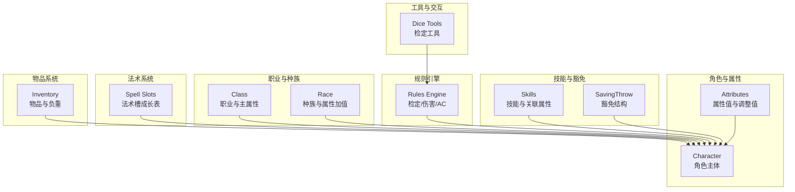
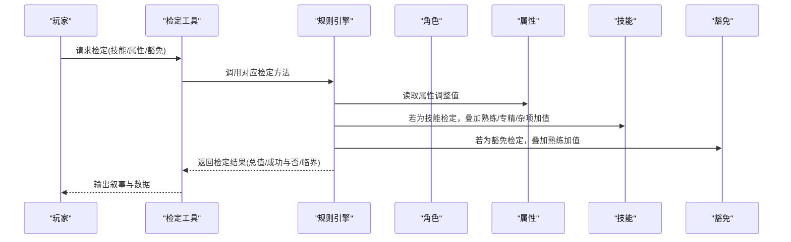
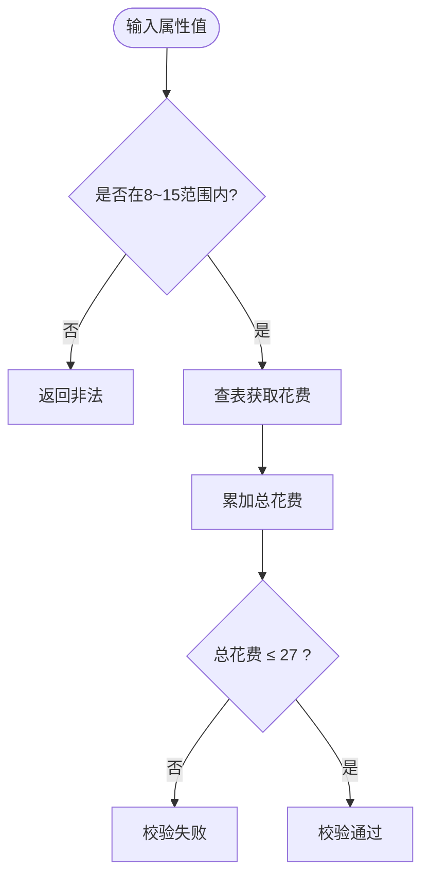
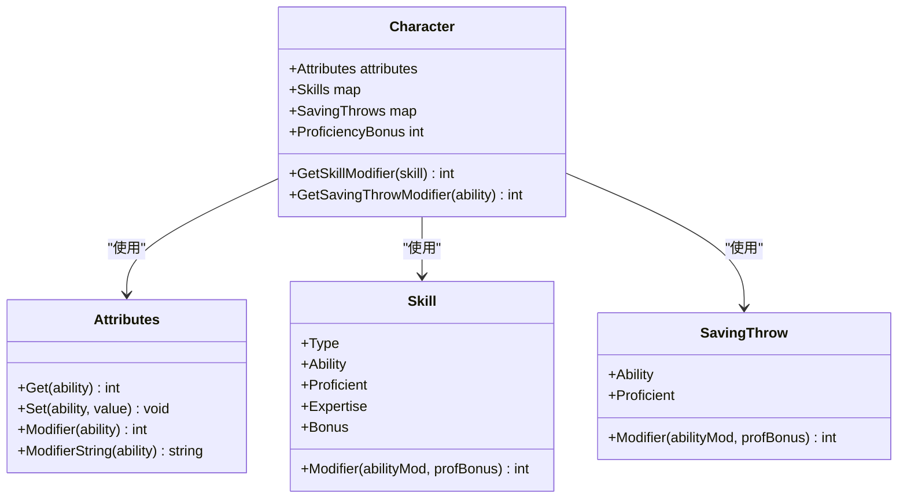
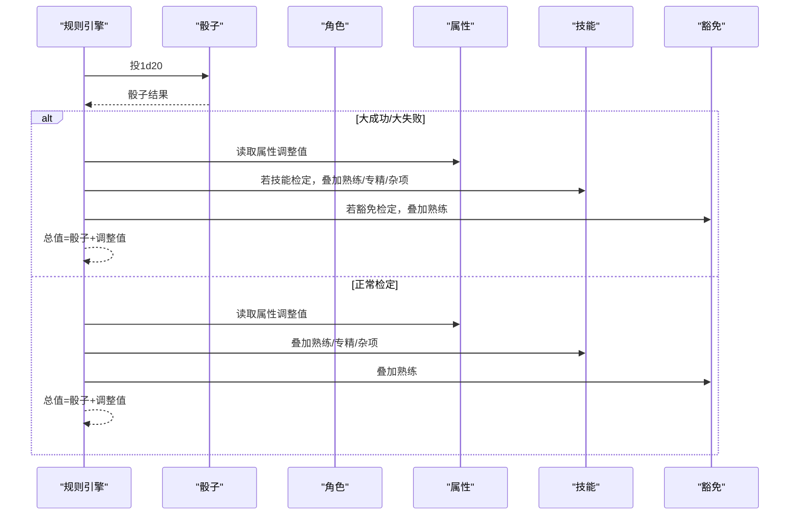
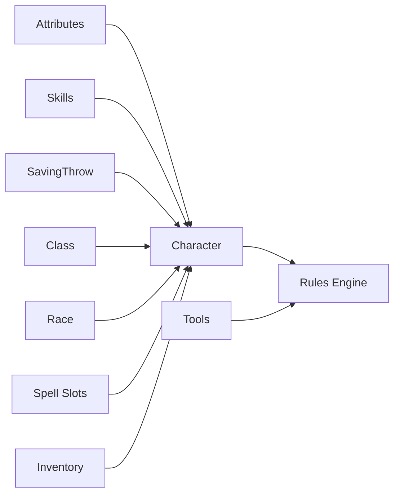

# 属性系统

<cite>
**本文引用的文件**
- [internal/character/attributes.go](file://internal/character/attributes.go)
- [internal/character/character.go](file://internal/character/character.go)
- [internal/character/skills.go](file://internal/character/skills.go)
- [internal/rules/engine.go](file://internal/rules/engine.go)
- [internal/character/inventory.go](file://internal/character/inventory.go)
- [internal/character/class.go](file://internal/character/class.go)
- [internal/character/race.go](file://internal/character/race.go)
- [internal/character/spell_slots.go](file://internal/character/spell_slots.go)
- [internal/tools/dice_tools.go](file://internal/tools/dice_tools.go)
</cite>

## 目录
1. [简介](#简介)
2. [项目结构](#项目结构)
3. [核心组件](#核心组件)
4. [架构概览](#架构概览)
5. [详细组件分析](#详细组件分析)
6. [依赖分析](#依赖分析)
7. [性能考量](#性能考量)
8. [故障排除指南](#故障排除指南)
9. [结论](#结论)
10. [附录](#附录)

## 简介
本文件为 CDND 属性系统的技术文档，全面阐述 D&D 5e 标准属性体系的实现，包括力量、敏捷、体质、智力、感知、魅力六个基本属性的设计与计算逻辑；属性值到调整值的转换算法及边界处理；属性的获取、设置与调整机制（含天赋加值、临时加值、状态效果影响）；属性在角色其他系统中的应用（技能检定、豁免检定、攻击检定、伤害计算、AC 计算等）；属性平衡性考虑与数值设计原则；以及属性相关的工具函数与扩展指南。文档同时提供可视化图示与流程图，帮助游戏设计师与开发者快速理解与扩展属性系统。

## 项目结构
属性系统主要分布在以下模块：
- 角色与属性：internal/character/attributes.go、internal/character/character.go
- 技能与豁免：internal/character/skills.go
- 规则引擎：internal/rules/engine.go
- 职业与种族：internal/character/class.go、internal/character/race.go
- 法术槽与施法：internal/character/spell_slots.go
- 工具与交互：internal/tools/dice_tools.go
- 背包与物品：internal/character/inventory.go

图表来源
- [internal/character/attributes.go:1-142](file://internal/character/attributes.go#L1-L142)
- [internal/character/character.go:1-223](file://internal/character/character.go#L1-L223)
- [internal/character/skills.go:1-172](file://internal/character/skills.go#L1-L172)
- [internal/rules/engine.go:1-271](file://internal/rules/engine.go#L1-L271)
- [internal/character/class.go:1-118](file://internal/character/class.go#L1-L118)
- [internal/character/race.go:1-94](file://internal/character/race.go#L1-L94)
- [internal/character/spell_slots.go:89-257](file://internal/character/spell_slots.go#L89-L257)
- [internal/tools/dice_tools.go:169-313](file://internal/tools/dice_tools.go#L169-L313)
- [internal/character/inventory.go:1-138](file://internal/character/inventory.go#L1-L138)

章节来源
- [internal/character/attributes.go:1-142](file://internal/character/attributes.go#L1-L142)
- [internal/character/character.go:1-223](file://internal/character/character.go#L1-L223)
- [internal/character/skills.go:1-172](file://internal/character/skills.go#L1-L172)
- [internal/rules/engine.go:1-271](file://internal/rules/engine.go#L1-L271)
- [internal/character/class.go:1-118](file://internal/character/class.go#L1-L118)
- [internal/character/race.go:1-94](file://internal/character/race.go#L1-L94)
- [internal/character/spell_slots.go:89-257](file://internal/character/spell_slots.go#L89-L257)
- [internal/tools/dice_tools.go:169-313](file://internal/tools/dice_tools.go#L169-L313)
- [internal/character/inventory.go:1-138](file://internal/character/inventory.go#L1-L138)

## 核心组件
- 属性类型与集合：定义六项属性常量与遍历函数，提供默认属性值与属性值读写接口。
- 属性调整值：提供整数调整值计算与带符号字符串表示。
- 点数购买系统：提供属性点数购买花费表与预算校验。
- 角色与属性：角色结构内嵌 Attributes，并提供技能与豁免的调整值计算入口。
- 规则引擎：统一实现属性检定、技能检定、豁免检定、攻击检定、伤害投掷与 AC 计算。
- 技能与豁免：技能与豁免结构，支持熟练与专精加值。
- 职业与种族：职业主属性与种族属性加值，用于角色构建时的初始加值。
- 法术槽：不同施法类型的职业法术槽成长表，与施法属性相关。
- 工具与交互：检定工具封装规则引擎调用，输出叙事文本与数据。

章节来源
- [internal/character/attributes.go:5-142](file://internal/character/attributes.go#L5-L142)
- [internal/character/character.go:8-223](file://internal/character/character.go#L8-L223)
- [internal/character/skills.go:47-100](file://internal/character/skills.go#L47-L100)
- [internal/rules/engine.go:59-271](file://internal/rules/engine.go#L59-L271)
- [internal/character/class.go:47-69](file://internal/character/class.go#L47-L69)
- [internal/character/race.go:44-62](file://internal/character/race.go#L44-L62)
- [internal/character/spell_slots.go:197-257](file://internal/character/spell_slots.go#L197-L257)
- [internal/tools/dice_tools.go:169-313](file://internal/tools/dice_tools.go#L169-L313)

## 架构概览
属性系统围绕“角色(Character)”为核心，通过“属性(Attribute)”驱动“技能(Skill)/豁免(SavingThrow)”检定，再由规则引擎(Rules Engine)统一执行检定与伤害计算，并与职业(Class)、种族(Race)、法术槽(Spell Slots)等系统协同工作。

图表来源
- [internal/tools/dice_tools.go:169-313](file://internal/tools/dice_tools.go#L169-L313)
- [internal/rules/engine.go:59-271](file://internal/rules/engine.go#L59-L271)
- [internal/character/character.go:151-183](file://internal/character/character.go#L151-L183)
- [internal/character/skills.go:75-85](file://internal/character/skills.go#L75-L85)

## 详细组件分析

### 属性类型与计算
- 属性类型：定义六项属性常量，提供遍历函数与默认属性值（均为 10）。
- 属性值读写：通过 Get/Set 方法按属性名访问与修改。
- 调整值计算：采用 floor((属性值 - 10) / 2) 的标准公式，返回整数调整值；提供带符号字符串表示。
- 点数购买系统：提供标准 D&D 5e 点数购买花费表与总预算上限，ValidatePointBuy 校验属性组合是否合法。

图表来源
- [internal/character/attributes.go:98-141](file://internal/character/attributes.go#L98-L141)

章节来源
- [internal/character/attributes.go:5-142](file://internal/character/attributes.go#L5-L142)

### 角色与属性集成
- 角色结构内嵌 Attributes，提供技能与豁免调整值计算入口：GetSkillModifier、GetSavingThrowModifier。
- 技能与豁免结构支持熟练与专精标记，便于规则引擎统一处理。

图表来源
- [internal/character/character.go:8-223](file://internal/character/character.go#L8-L223)
- [internal/character/attributes.go:44-96](file://internal/character/attributes.go#L44-L96)
- [internal/character/skills.go:65-100](file://internal/character/skills.go#L65-L100)

章节来源
- [internal/character/character.go:151-183](file://internal/character/character.go#L151-L183)
- [internal/character/skills.go:65-100](file://internal/character/skills.go#L65-L100)

### 规则引擎与属性应用
- 属性检定：读取属性调整值，结合自然骰结果计算总值与成功与否。
- 技能检定：根据技能关联属性获取调整值，叠加熟练/专精/杂项加值。
- 豁免检定：根据属性调整值，叠加熟练加值。
- 攻击检定：根据攻击属性调整值与熟练加值计算命中。
- 伤害投掷：解析伤害表达式并计算总伤害，支持暴击双倍伤害。
- AC 计算：基础 AC = 10 + 敏捷调整值（护甲加值待扩展）。

图表来源
- [internal/rules/engine.go:59-271](file://internal/rules/engine.go#L59-L271)
- [internal/character/character.go:151-183](file://internal/character/character.go#L151-L183)

章节来源
- [internal/rules/engine.go:59-271](file://internal/rules/engine.go#L59-L271)

### 技能与豁免系统
- 技能与属性关联：每项技能绑定一项属性（如运动→力量、体操/手法/隐匿→敏捷等）。
- 技能调整值：基础=属性调整值，若熟练+熟练加值，若专精再+熟练加值，再加杂项加值。
- 豁免调整值：基础=属性调整值，若熟练+熟练加值。

章节来源
- [internal/character/skills.go:47-100](file://internal/character/skills.go#L47-L100)

### 职业与种族对属性的影响
- 职业：记录主属性、豁免熟练、技能选项等，部分职业具有施法属性与法术槽类型。
- 种族：提供基础属性加值与子种族属性加值，用于角色创建时的初始加值。

章节来源
- [internal/character/class.go:47-69](file://internal/character/class.go#L47-L69)
- [internal/character/race.go:44-62](file://internal/character/race.go#L44-L62)

### 法术槽与施法属性
- 不同施法类型（全施法者、半施法者、三分之一施法者、契约魔法）拥有不同的法术槽成长表。
- 施法属性与职业类型相关，用于决定法术强度与法术槽数量。

章节来源
- [internal/character/spell_slots.go:197-257](file://internal/character/spell_slots.go#L197-L257)

### 工具与交互
- 检定工具封装规则引擎调用，支持技能检定与豁免检定，输出叙事文本与数据字段（roll、modifier、total、dc、success、critical）。

章节来源
- [internal/tools/dice_tools.go:169-313](file://internal/tools/dice_tools.go#L169-L313)

### 背包与物品
- 物品系统包含物品类型、稀有度、重量与价值等，为后续 AC 与负重影响提供基础。

章节来源
- [internal/character/inventory.go:1-138](file://internal/character/inventory.go#L1-L138)

## 依赖分析
- Attributes 与 Character：Character 内嵌 Attributes，并在技能/豁免调整值计算中直接使用。
- Skills 与 Character：Character 通过技能映射与技能结构计算最终调整值。
- Rules Engine 与 Character：规则引擎统一调用 Character 的属性与技能/豁免结构。
- Class/Race：为角色创建提供初始属性加值与施法能力。
- Spell Slots：与职业类型联动，决定法术槽数量。
- Tools：封装规则引擎调用，面向用户交互。

图表来源
- [internal/character/attributes.go:22-96](file://internal/character/attributes.go#L22-L96)
- [internal/character/character.go:8-223](file://internal/character/character.go#L8-L223)
- [internal/rules/engine.go:59-271](file://internal/rules/engine.go#L59-L271)
- [internal/character/class.go:47-69](file://internal/character/class.go#L47-L69)
- [internal/character/race.go:44-62](file://internal/character/race.go#L44-L62)
- [internal/character/spell_slots.go:197-257](file://internal/character/spell_slots.go#L197-L257)
- [internal/tools/dice_tools.go:169-313](file://internal/tools/dice_tools.go#L169-L313)
- [internal/character/inventory.go:1-138](file://internal/character/inventory.go#L1-L138)

章节来源
- [internal/character/attributes.go:22-96](file://internal/character/attributes.go#L22-L96)
- [internal/character/character.go:8-223](file://internal/character/character.go#L8-L223)
- [internal/rules/engine.go:59-271](file://internal/rules/engine.go#L59-L271)
- [internal/character/class.go:47-69](file://internal/character/class.go#L47-L69)
- [internal/character/race.go:44-62](file://internal/character/race.go#L44-L62)
- [internal/character/spell_slots.go:197-257](file://internal/character/spell_slots.go#L197-L257)
- [internal/tools/dice_tools.go:169-313](file://internal/tools/dice_tools.go#L169-L313)
- [internal/character/inventory.go:1-138](file://internal/character/inventory.go#L1-L138)

## 性能考量
- 属性调整值计算为 O(1)，字符串化为 O(1)，点数购买校验为 O(1)（固定六项），整体开销极低。
- 规则引擎检定流程为 O(1)，不涉及复杂循环或递归。
- 建议：在大量并发检定时，保持规则引擎实例复用与骰子库的高效实现。

## 故障排除指南
- 属性值越界：ValidatePointBuy 会拒绝小于 8 或大于 15 的属性值，或总花费超过预算的情况。
- 技能/豁免未初始化：确保角色创建时已初始化 Skills 与 SavingThrows 映射。
- 暴击判定：规则引擎区分自然 1/20 的大失败/大成功，避免误判。
- AC 计算：当前仅基于敏捷调整值，护甲加值需在 Inventory 与装备系统扩展后完善。

章节来源
- [internal/character/attributes.go:126-141](file://internal/character/attributes.go#L126-L141)
- [internal/character/character.go:63-100](file://internal/character/character.go#L63-L100)
- [internal/rules/engine.go:47-57](file://internal/rules/engine.go#L47-L57)
- [internal/rules/engine.go:261-271](file://internal/rules/engine.go#L261-L271)

## 结论
CDND 的属性系统严格遵循 D&D 5e 标准，通过 Attributes 与 Character 的清晰分离，配合规则引擎的统一检定流程，实现了从属性到技能、豁免、攻击、伤害与 AC 的完整闭环。点数购买系统保证了角色构建的平衡性。未来可在装备系统中加入护甲加值，在状态效果系统中引入临时加值与条件影响，进一步增强属性系统的策略深度与可扩展性。

## 附录

### 属性到调整值对照表（示例）
- 属性值 8 → 调整值 -1
- 属性值 9 → 调整值 -1
- 属性值 10 → 调整值 0
- 属性值 11 → 调整值 0
- 属性值 12 → 调整值 +1
- 属性值 13 → 调整值 +1
- 属性值 14 → 调整值 +2
- 属性值 15 → 调整值 +2

章节来源
- [internal/character/attributes.go:82-96](file://internal/character/attributes.go#L82-L96)

### 属性平衡性与数值设计原则
- 点数购买预算：标准总预算为 27，限制极端偏科。
- 属性范围：8-15，避免极端高/低值。
- 调整值曲线：每 2 点属性差带来 1 点调整值，符合 D&D 5e 设计。
- 职业/种族加值：通过主属性与种族天赋加值引导角色定位，避免无意义的均分。

章节来源
- [internal/character/attributes.go:98-141](file://internal/character/attributes.go#L98-L141)
- [internal/character/class.go:47-69](file://internal/character/class.go#L47-L69)
- [internal/character/race.go:44-62](file://internal/character/race.go#L44-L62)

### 扩展与自定义指南
- 新增属性：在 Ability 常量与 Attributes 结构体中添加新字段，更新 Get/Set 与 Modifier。
- 新增技能：在技能映射中添加新技能与其关联属性，并在 Character 中初始化。
- 新增施法类型：在 Spell Slots 成长表中新增类型，并在职业结构中扩展施法属性。
- 状态效果：在 Character 中扩展状态效果数组与处理逻辑，以支持临时加值与条件影响。
- 装备系统：在 Inventory 中扩展护甲与武器属性，完善 AC 计算与负重影响。

章节来源
- [internal/character/attributes.go:5-96](file://internal/character/attributes.go#L5-L96)
- [internal/character/skills.go:47-100](file://internal/character/skills.go#L47-L100)
- [internal/character/spell_slots.go:197-257](file://internal/character/spell_slots.go#L197-L257)
- [internal/character/inventory.go:1-138](file://internal/character/inventory.go#L1-L138)