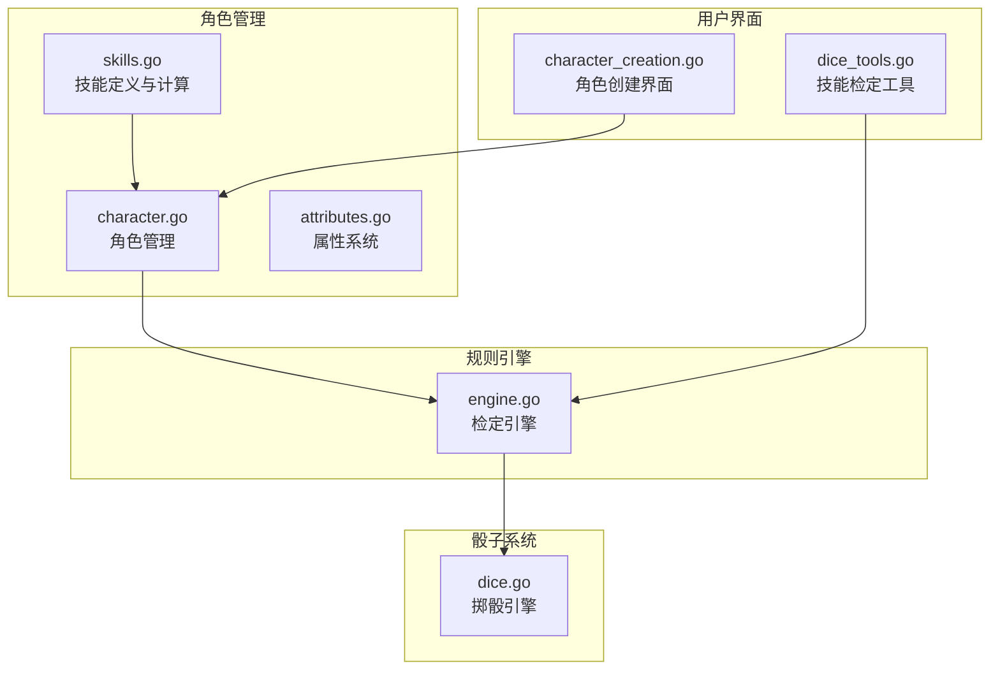
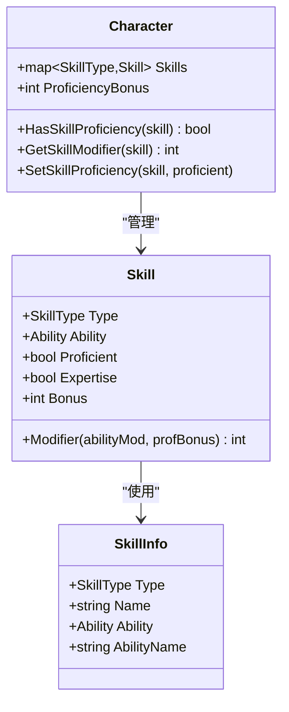
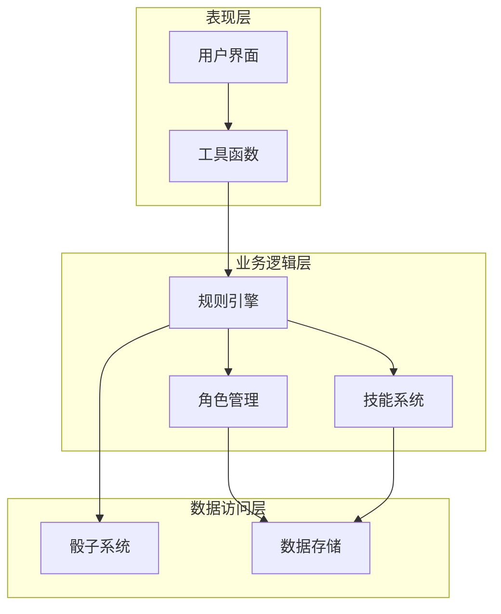
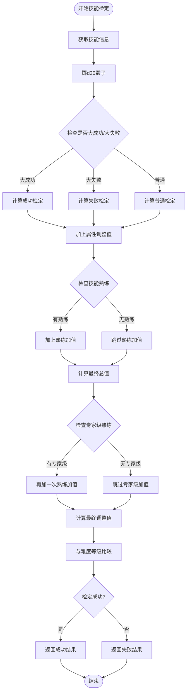
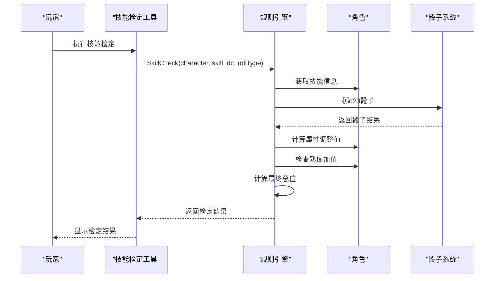
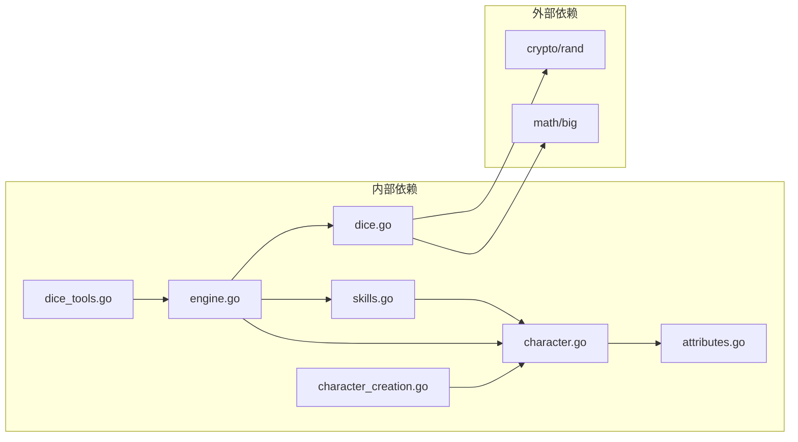

# 技能系统

<cite>
**本文档引用的文件**
- [skills.go](file://internal/character/skills.go)
- [character.go](file://internal/character/character.go)
- [attributes.go](file://internal/character/attributes.go)
- [engine.go](file://internal/rules/engine.go)
- [dice.go](file://pkg/dice/dice.go)
- [dice_tools.go](file://internal/tools/dice_tools.go)
- [character_creation.go](file://internal/ui/character_creation.go)
</cite>

## 目录
1. [简介](#简介)
2. [项目结构](#项目结构)
3. [核心组件](#核心组件)
4. [架构概览](#架构概览)
5. [详细组件分析](#详细组件分析)
6. [依赖关系分析](#依赖关系分析)
7. [性能考虑](#性能考虑)
8. [故障排除指南](#故障排除指南)
9. [结论](#结论)
10. [附录](#附录)

## 简介

CDND技能系统是基于D&D 5e规则实现的完整技能管理系统。该系统提供了全面的技能检定功能，包括技能类型枚举、技能检定计算、熟练度机制等核心功能。系统支持所有标准D&D 5e技能，涵盖力量、敏捷、智力、感知、魅力等不同属性相关的技能。

技能系统采用模块化设计，将技能定义、角色管理、规则引擎和用户界面分离，确保了良好的可维护性和扩展性。系统不仅实现了基础的技能检定功能，还集成了高级特性如专家级熟练、临时调整值等。

## 项目结构

技能系统主要分布在以下目录中：



**图表来源**
- [skills.go:1-172](file://internal/character/skills.go#L1-L172)
- [character.go:1-223](file://internal/character/character.go#L1-L223)
- [engine.go:1-271](file://internal/rules/engine.go#L1-L271)

**章节来源**
- [skills.go:1-172](file://internal/character/skills.go#L1-L172)
- [character.go:1-223](file://internal/character/character.go#L1-L223)
- [engine.go:1-271](file://internal/rules/engine.go#L1-L271)

## 核心组件

### 技能类型系统

技能系统定义了完整的D&D 5e技能分类体系：

| 技能类别 | 技能列表 | 关联属性 |
|---------|---------|---------|
| 力量技能 | 运动 | 力量 |
| 敏捷技能 | 体操、手法、隐匿 | 敏捷 |
| 智力技能 | 奥秘、历史、调查、自然、宗教 | 智力 |
| 感知技能 | 驯兽、洞察、医药、察觉、求生 | 感知 |
| 魅力技能 | 欺瞒、威吓、表演、说服 | 魅力 |

每个技能都有对应的中文名称映射，便于用户界面显示。

**章节来源**
- [skills.go:6-34](file://internal/character/skills.go#L6-L34)
- [skills.go:110-130](file://internal/character/skills.go#L110-L130)

### 技能数据结构

技能系统的核心数据结构包括：



**图表来源**
- [skills.go:65-72](file://internal/character/skills.go#L65-L72)
- [character.go:39-40](file://internal/character/character.go#L39-L40)
- [skills.go:102-108](file://internal/character/skills.go#L102-L108)

**章节来源**
- [skills.go:65-72](file://internal/character/skills.go#L65-L72)
- [character.go:39-40](file://internal/character/character.go#L39-L40)
- [skills.go:102-108](file://internal/character/skills.go#L102-L108)

## 架构概览

技能系统采用分层架构设计，各层职责明确：



**图表来源**
- [character.go:8-61](file://internal/character/character.go#L8-L61)
- [engine.go:8-9](file://internal/rules/engine.go#L8-L9)
- [dice.go:33-41](file://pkg/dice/dice.go#L33-L41)

## 详细组件分析

### 技能检定计算流程

技能检定的计算遵循D&D 5e标准规则：



**图表来源**
- [engine.go:91-140](file://internal/rules/engine.go#L91-L140)
- [skills.go:74-85](file://internal/character/skills.go#L74-L85)

### 熟练度机制详解

技能系统支持两种熟练度级别：

#### 普通熟练
- 检定时获得熟练加值
- 适用于大多数职业和背景
- 通过`SetSkillProficiency`方法设置

#### 专家级熟练
- 检定时获得双倍熟练加值
- 仅限特定职业或专长
- 通过`Expertise`字段标识

**章节来源**
- [skills.go:69-71](file://internal/character/skills.go#L69-L71)
- [character.go:169-175](file://internal/character/character.go#L169-L175)

### 属性调整值计算

属性调整值采用标准D&D 5e公式：
```
调整值 = floor((属性值 - 10) / 2)
```

系统提供多种属性相关的功能：
- `Attributes.Modifier()` 计算调整值
- `Attributes.ModifierString()` 返回带符号的字符串
- `GetSkillModifier()` 获取技能调整值

**章节来源**
- [attributes.go:82-96](file://internal/character/attributes.go#L82-L96)
- [character.go:151-158](file://internal/character/character.go#L151-L158)

### 规则引擎集成

规则引擎负责执行具体的检定逻辑：



**图表来源**
- [dice_tools.go:137-198](file://internal/tools/dice_tools.go#L137-L198)
- [engine.go:91-140](file://internal/rules/engine.go#L91-L140)

**章节来源**
- [dice_tools.go:137-198](file://internal/tools/dice_tools.go#L137-L198)
- [engine.go:91-140](file://internal/rules/engine.go#L91-L140)

## 依赖关系分析

技能系统与其他组件的依赖关系如下：



**图表来源**
- [skills.go:1-172](file://internal/character/skills.go#L1-L172)
- [character.go:1-223](file://internal/character/character.go#L1-L223)
- [engine.go:1-271](file://internal/rules/engine.go#L1-L271)
- [dice.go:1-158](file://pkg/dice/dice.go#L1-L158)

### 外部依赖

骰子系统依赖Go标准库：
- `crypto/rand`: 提供加密安全的随机数
- `math/big`: 提供大整数运算支持

这些依赖确保了骰子系统的安全性和准确性。

**章节来源**
- [dice.go:4-7](file://pkg/dice/dice.go#L4-L7)

## 性能考虑

技能系统在设计时考虑了以下性能因素：

### 内存优化
- 技能数据结构紧凑，只包含必要字段
- 使用字符串常量减少内存分配
- 字符串映射表预分配容量

### 计算效率
- 属性调整值计算使用整数运算
- 技能检定采用分支预测友好的条件判断
- 骰子系统使用高效的随机数生成算法

### 缓存策略
- 技能信息通过映射表缓存
- 属性调整值可重复计算但避免重复分配

## 故障排除指南

### 常见问题及解决方案

#### 技能检定总是失败
**可能原因**：
- 角色没有正确设置技能熟练
- 属性值过低导致调整值为负数
- 难度等级设置过高

**解决方法**：
1. 检查`HasSkillProficiency`返回值
2. 验证属性调整值计算
3. 调整难度等级或增加属性值

#### 技能名称显示异常
**可能原因**：
- 技能名称映射表缺少对应条目
- 中文字符编码问题

**解决方法**：
1. 检查`SkillNames`映射表完整性
2. 确认UTF-8编码支持

#### 骰子结果异常
**可能原因**：
- 随机数生成器初始化失败
- 掷骰类型参数错误

**解决方法**：
1. 检查`crypto/rand`可用性
2. 验证`RollType`参数有效性

**章节来源**
- [dice.go:52-64](file://pkg/dice/dice.go#L52-L64)
- [skills.go:110-130](file://internal/character/skills.go#L110-L130)

## 结论

CDND技能系统是一个功能完整、设计合理的D&D 5e技能管理解决方案。系统实现了标准的技能检定规则，包括属性调整值、熟练加值、专家级熟练等核心机制。通过模块化的架构设计，系统既保证了功能的完整性，又具备良好的可扩展性。

系统的主要优势包括：
- 完整的D&D 5e技能支持
- 清晰的代码结构和职责分离
- 良好的性能表现
- 丰富的扩展接口

对于游戏设计师来说，系统提供了完善的扩展指南，可以轻松添加自定义技能或修改现有技能的行为。

## 附录

### 技能系统扩展指南

#### 添加新技能的方法

1. **定义技能类型**：在`skills.go`中添加新的技能常量
2. **映射关联属性**：在`SkillAbility`函数中添加属性映射
3. **添加中文名称**：在`SkillNames`映射表中添加中文名称
4. **更新技能列表**：在`AllSkillTypes`函数中添加新技能

#### 自定义技能的实现步骤

1. **创建技能数据结构**：扩展`Skill`结构体以支持特殊需求
2. **实现计算逻辑**：根据需要重写`Modifier`方法
3. **更新UI界面**：在角色创建界面中添加新技能选项
4. **测试检定逻辑**：编写单元测试验证新技能行为

#### 熟练度管理最佳实践

- **专家级熟练的使用场景**：建议仅限于重要技能，避免过度平衡
- **临时调整值的应用**：用于魔法效果、环境影响等临时因素
- **熟练度的动态管理**：通过游戏事件动态调整角色的熟练度

通过遵循这些指南，开发者可以有效地扩展和定制技能系统，满足不同游戏场景的需求。