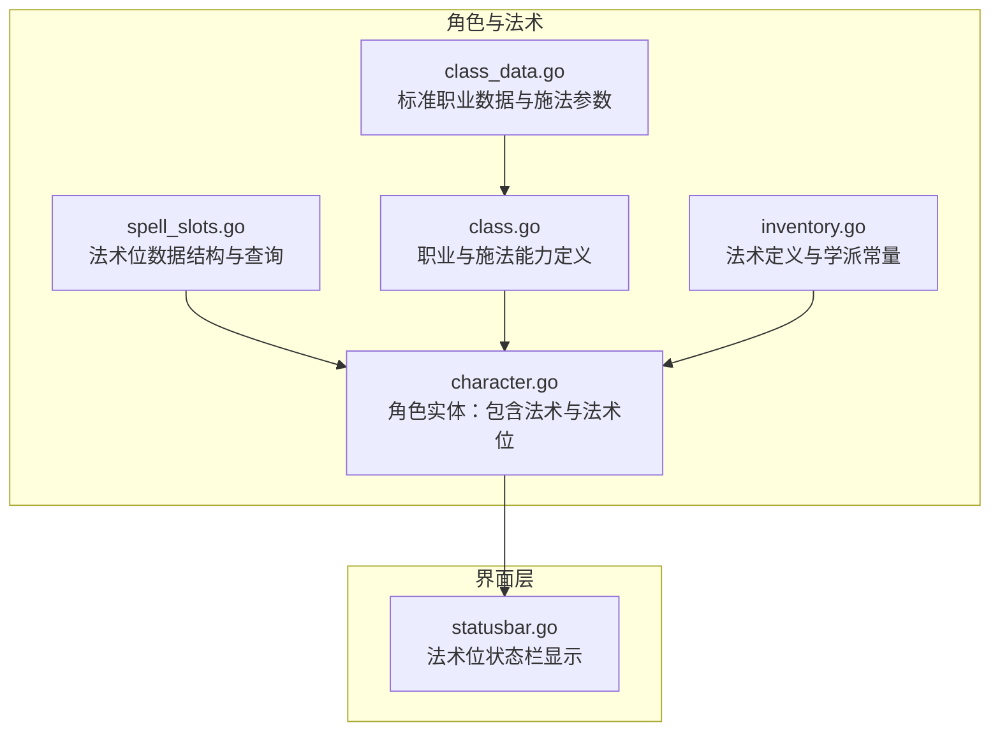
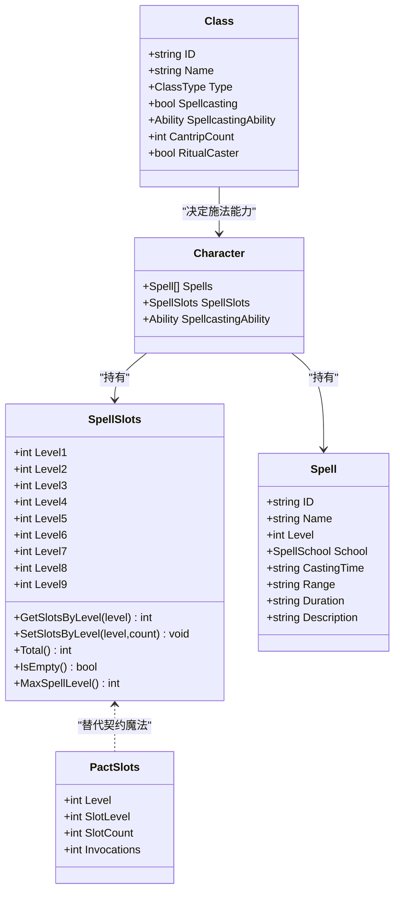
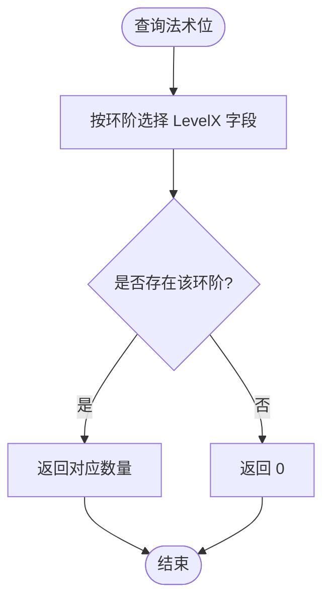
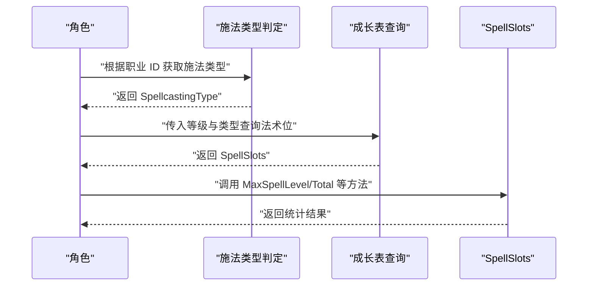
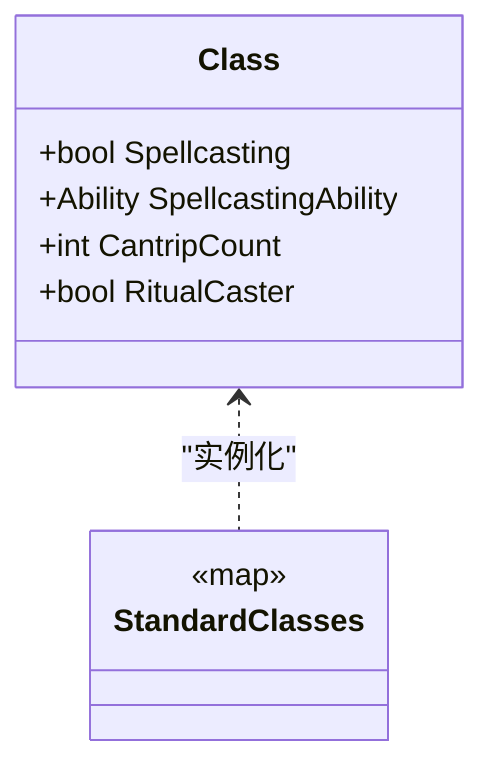
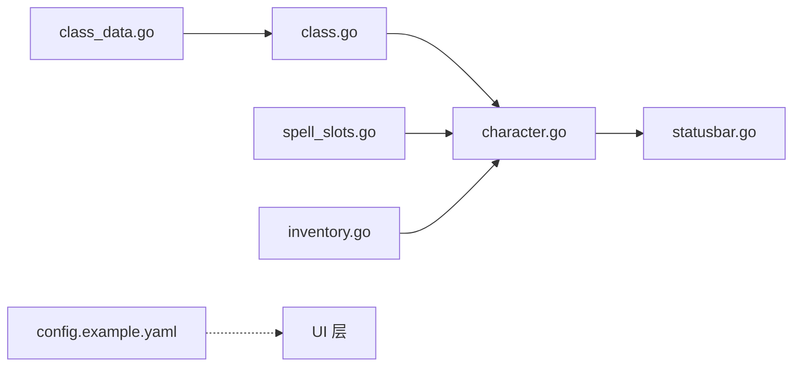

# 法术系统

<cite>
**本文引用的文件**
- [spell_slots.go](file://internal/character/spell_slots.go)
- [class.go](file://internal/character/class.go)
- [class_data.go](file://internal/character/class_data.go)
- [character.go](file://internal/character/character.go)
- [inventory.go](file://internal/character/inventory.go)
- [statusbar.go](file://internal/ui/statusbar.go)
- [config.example.yaml](file://config.example.yaml)
</cite>

## 目录
1. [简介](#简介)
2. [项目结构](#项目结构)
3. [核心组件](#核心组件)
4. [架构总览](#架构总览)
5. [详细组件分析](#详细组件分析)
6. [依赖分析](#依赖分析)
7. [性能考量](#性能考量)
8. [故障排查指南](#故障排查指南)
9. [结论](#结论)
10. [附录](#附录)

## 简介
本文件面向游戏设计师与开发者，系统化阐述 CDND 法术系统的实现与扩展方法。重点覆盖以下方面：
- 法术位管理：法术位等级、可用数量、最大数量、中文命名与学派映射
- 法术位恢复机制：短休恢复、长休恢复、法术位升级的策略与实现要点
- 法术准备与施放：施法者能力、施法类型、戏法数量、契约魔法（邪术师）特例
- 法术在战斗与探索中的应用：法术环阶、施法时间、范围、持续时间等
- 平衡性与难度设计原则：基于职业与施法类型的数据表
- 工具函数与辅助方法：查询、计算、显示与国际化支持
- 扩展开发指南：新增法术、自定义施法类型与数据表维护

## 项目结构
法术系统主要分布在角色与 UI 模块中，核心数据结构与逻辑集中在 character 包，UI 层负责展示法术位状态。

**图表来源**
- [spell_slots.go:1-332](file://internal/character/spell_slots.go#L1-L332)
- [class.go:1-118](file://internal/character/class.go#L1-L118)
- [class_data.go:1-677](file://internal/character/class_data.go#L1-L677)
- [character.go:1-223](file://internal/character/character.go#L1-L223)
- [inventory.go:68-138](file://internal/character/inventory.go#L68-L138)
- [statusbar.go:70-150](file://internal/ui/statusbar.go#L70-L150)

**章节来源**
- [spell_slots.go:1-332](file://internal/character/spell_slots.go#L1-L332)
- [class.go:1-118](file://internal/character/class.go#L1-L118)
- [class_data.go:1-677](file://internal/character/class_data.go#L1-L677)
- [character.go:1-223](file://internal/character/character.go#L1-L223)
- [inventory.go:68-138](file://internal/character/inventory.go#L68-L138)
- [statusbar.go:70-150](file://internal/ui/statusbar.go#L70-L150)

## 核心组件
- 法术位数据结构：SpellSlots（1-9环法术槽）、PactSlots（邪术师契约魔法）
- 施法类型：SpellcastingType（全施法者、半施法者、契约魔法、三分之一施法者）
- 职业与施法能力：Class（含施法属性、戏法数量、仪式施法等）
- 角色实体：Character（包含 Spells、SpellSlots、SpellcastingAbility）
- 法术定义：Spell（含环阶、学派、施法时间、范围、持续时间、描述等）

**章节来源**
- [spell_slots.go:3-15](file://internal/character/spell_slots.go#L3-L15)
- [spell_slots.go:16-26](file://internal/character/spell_slots.go#L16-L26)
- [class.go:47-69](file://internal/character/class.go#L47-L69)
- [character.go:8-61](file://internal/character/character.go#L8-L61)
- [inventory.go:68-94](file://internal/character/inventory.go#L68-L94)

## 架构总览
法术系统围绕“角色-职业-法术位”三层组织：
- 职业决定施法类型与施法能力（施法属性、戏法数量、仪式施法）
- 角色持有法术列表与当前法术位
- 法术位由施法类型与等级决定，提供查询与统计能力
- UI 层根据角色法术位进行状态栏展示

**图表来源**
- [spell_slots.go:3-332](file://internal/character/spell_slots.go#L3-L332)
- [class.go:47-69](file://internal/character/class.go#L47-L69)
- [character.go:8-61](file://internal/character/character.go#L8-L61)
- [inventory.go:68-94](file://internal/character/inventory.go#L68-L94)

## 详细组件分析

### 法术位数据结构与查询
- 字段设计：1-9 环法术槽分别以 LevelX 字段存储，便于按环阶查询与设置
- 查询与统计：GetSlotsByLevel/SetSlotsByLevel 支持按环阶读写；Total/IsEmpty 提供总量与空槽检测；MaxSpellLevel 返回最高可用环阶
- 中文命名：SpellLevelName 提供环阶中文名称映射，便于 UI 展示
- 学派映射：SchoolName 提供学派中文名称映射，支持多学派常量

**图表来源**
- [spell_slots.go:28-52](file://internal/character/spell_slots.go#L28-L52)

**章节来源**
- [spell_slots.go:3-15](file://internal/character/spell_slots.go#L3-L15)
- [spell_slots.go:28-52](file://internal/character/spell_slots.go#L28-L52)
- [spell_slots.go:78-87](file://internal/character/spell_slots.go#L78-L87)
- [spell_slots.go:259-289](file://internal/character/spell_slots.go#L259-L289)
- [spell_slots.go:291-311](file://internal/character/spell_slots.go#L291-L311)
- [spell_slots.go:313-331](file://internal/character/spell_slots.go#L313-L331)

### 施法类型与法术位成长表
- 施法类型：全施法者（法师、牧师、德鲁伊、吟游诗人、术士）、半施法者（圣武士、游侠）、契约魔法（邪术师）、三分之一施法者（奥法骑士、诡术师）
- 成长表：
  - 全施法者：按等级提供 1-9 环法术槽，参考玩家手册
  - 半施法者：从 2 级起按等级/2 向下取整的有效施法者等级
  - 第三分之一施法者：按等级/3 向下取整的有效施法者等级
  - 邪术师：使用 PactSlots，统一环阶但随等级增加槽位数量与祈唤次数
- 查询接口：GetSpellSlotsByType 根据施法类型与角色等级返回对应法术位；GetCasterType 根据职业 ID 推断施法类型

**图表来源**
- [spell_slots.go:229-241](file://internal/character/spell_slots.go#L229-L241)
- [spell_slots.go:243-257](file://internal/character/spell_slots.go#L243-L257)
- [spell_slots.go:197-227](file://internal/character/spell_slots.go#L197-L227)

**章节来源**
- [spell_slots.go:17-26](file://internal/character/spell_slots.go#L17-L26)
- [spell_slots.go:89-162](file://internal/character/spell_slots.go#L89-L162)
- [spell_slots.go:173-195](file://internal/character/spell_slots.go#L173-L195)
- [spell_slots.go:197-227](file://internal/character/spell_slots.go#L197-L227)
- [spell_slots.go:229-257](file://internal/character/spell_slots.go#L229-L257)

### 职业与施法能力
- Class 定义了施法相关字段：Spellcasting、SpellcastingAbility、CantripCount、RitualCaster
- StandardClasses 提供标准职业数据，包含各职业的施法属性、戏法数量、仪式施法等
- GetClass/AllClasses 提供职业查询与列表访问

**图表来源**
- [class.go:47-69](file://internal/character/class.go#L47-L69)
- [class_data.go:5-637](file://internal/character/class_data.go#L5-L637)

**章节来源**
- [class.go:47-69](file://internal/character/class.go#L47-L69)
- [class_data.go:5-637](file://internal/character/class_data.go#L5-L637)

### 角色实体中的法术与法术位
- Character 包含 Spells（法术列表）、SpellSlots（当前法术位）、SpellcastingAbility（施法属性）
- 用于承载角色的施法状态与法术资源

**章节来源**
- [character.go:8-61](file://internal/character/character.go#L8-L61)

### 法术定义与学派
- Spell 定义了法术的基本属性：ID、名称、环阶、学派、施法时间、范围、持续时间、描述、可施放职业
- SpellSchool 定义了学派常量与中文映射

**章节来源**
- [inventory.go:68-94](file://internal/character/inventory.go#L68-L94)

### UI 层法术位状态展示
- statusbar 在角色法术位非空时，计算最高两个环阶的法术位使用比例并以 Unicode 方式展示
- 通过 Character 的 SpellSlots 字段与工具函数进行状态计算

**章节来源**
- [statusbar.go:70-150](file://internal/ui/statusbar.go#L70-L150)

## 依赖分析
- 组件耦合：
  - Character 依赖 SpellSlots 与 Spell
  - Class 决定施法类型与施法能力，间接影响 SpellSlots 的查询
  - UI 层依赖 Character 的法术位状态进行展示
- 数据流向：
  - 职业数据 → 施法类型 → 成长表 → SpellSlots
  - SpellSlots → 角色实体 → UI 展示
- 外部依赖：
  - 配置文件 config.example.yaml 提供 LLM 与游戏显示等通用配置，与法术系统无直接耦合

**图表来源**
- [class_data.go:5-637](file://internal/character/class_data.go#L5-L637)
- [class.go:47-69](file://internal/character/class.go#L47-L69)
- [character.go:8-61](file://internal/character/character.go#L8-L61)
- [spell_slots.go:197-257](file://internal/character/spell_slots.go#L197-L257)
- [inventory.go:68-94](file://internal/character/inventory.go#L68-L94)
- [statusbar.go:70-150](file://internal/ui/statusbar.go#L70-L150)
- [config.example.yaml:1-72](file://config.example.yaml#L1-L72)

**章节来源**
- [class_data.go:5-637](file://internal/character/class_data.go#L5-L637)
- [class.go:47-69](file://internal/character/class.go#L47-L69)
- [character.go:8-61](file://internal/character/character.go#L8-L61)
- [spell_slots.go:197-257](file://internal/character/spell_slots.go#L197-L257)
- [inventory.go:68-94](file://internal/character/inventory.go#L68-L94)
- [statusbar.go:70-150](file://internal/ui/statusbar.go#L70-L150)
- [config.example.yaml:1-72](file://config.example.yaml#L1-L72)

## 性能考量
- 查询复杂度：SpellSlots 的按环阶查询为 O(1)，Total/IsEmpty/MaxSpellLevel 为 O(n)（n=9），在当前实现中属于常数时间操作
- 数据表规模：成长表为固定长度数组，查询为 O(1)，适合频繁访问
- UI 更新：statusbar 仅在法术位非空时计算比例，避免不必要的开销

[本节为一般性指导，无需列出具体文件来源]

## 故障排查指南
- 法术位为空：检查 Character.SpellSlots.IsEmpty()，确认角色是否为施法者以及施法类型判定是否正确
- 环阶查询异常：确认传入的环阶是否在 1-9 范围内，超出范围将返回 0
- 最高环阶显示错误：检查 MaxSpellLevel 的实现逻辑与 SpellSlots 的字段赋值
- 学派名称显示异常：确认 SpellSchool 常量与映射表一致
- UI 不更新：确认 statusbar 的触发条件与角色法术位状态同步

**章节来源**
- [spell_slots.go:84-87](file://internal/character/spell_slots.go#L84-L87)
- [spell_slots.go:259-289](file://internal/character/spell_slots.go#L259-L289)
- [spell_slots.go:313-331](file://internal/character/spell_slots.go#L313-L331)
- [statusbar.go:70-150](file://internal/ui/statusbar.go#L70-L150)

## 结论
CDND 的法术系统以清晰的数据结构与明确的施法类型划分为基础，通过职业数据驱动法术位成长，辅以工具函数与 UI 展示形成完整的施法体验。系统具备良好的扩展性，便于后续添加新职业、新法术与自定义施法规则。

[本节为总结性内容，无需列出具体文件来源]

## 附录

### 法术位恢复机制与策略
- 短休恢复：法师、德鲁伊等职业在短休时可恢复部分法术位，建议在游戏流程中提供短休动作并调用恢复逻辑
- 长休恢复：长休时恢复全部法术位，应在 UI 中提示长休后的状态重置
- 法术位升级：随角色等级提升自动更新成长表，确保查询接口返回最新数据

[本节为一般性指导，无需列出具体文件来源]

### 法术在战斗与探索中的应用
- 法术环阶：通过 Spell.Level 与 SpellSlots.MaxSpellLevel 判断可用法术范围
- 施法时间与范围：Spell.CastingTime 与 Spell.Range 用于判定施法可行性与目标选择
- 持续时间：Spell.Duration 用于跟踪法术效果的持续回合或条件满足

**章节来源**
- [inventory.go:68-94](file://internal/character/inventory.go#L68-L94)
- [spell_slots.go:259-289](file://internal/character/spell_slots.go#L259-L289)

### 法术平衡性与难度设计原则
- 戏法数量：依据职业的 CantripCount 控制低环阶法术频率
- 法术位上限：通过成长表限制高环阶法术槽数量，避免过早获得强力法术
- 施法类型差异：全施法者、半施法者、三分之一施法者与契约魔法在法术位数量与恢复上有明显差异，需在难度设计中体现

**章节来源**
- [class.go:64-69](file://internal/character/class.go#L64-L69)
- [class_data.go:5-637](file://internal/character/class_data.go#L5-L637)
- [spell_slots.go:89-162](file://internal/character/spell_slots.go#L89-L162)
- [spell_slots.go:173-195](file://internal/character/spell_slots.go#L173-L195)

### 工具函数与辅助方法实现细节
- 查询与统计：GetSlotsByLevel/SetSlotsByLevel、Total/IsEmpty/MaxSpellLevel
- 名称映射：GetSpellLevelName、GetSchoolName
- 施法类型判定：GetCasterType、GetSpellSlotsByType
- UI 辅助：statusbar 中的状态栏比例计算

**章节来源**
- [spell_slots.go:28-52](file://internal/character/spell_slots.go#L28-L52)
- [spell_slots.go:78-87](file://internal/character/spell_slots.go#L78-L87)
- [spell_slots.go:259-289](file://internal/character/spell_slots.go#L259-L289)
- [spell_slots.go:305-311](file://internal/character/spell_slots.go#L305-L311)
- [spell_slots.go:325-331](file://internal/character/spell_slots.go#L325-L331)
- [statusbar.go:70-150](file://internal/ui/statusbar.go#L70-L150)

### 扩展开发指南：自定义法术与施法类型
- 新增法术
  - 在数据层定义新的 Spell 实例，填写环阶、学派、施法时间、范围、持续时间与描述
  - 在角色的 Spells 列表中加入该法术
- 新增施法类型
  - 在 SpellcastingType 中新增枚举值
  - 在 GetCasterType 中添加职业到新类型的映射
  - 在 GetSpellSlotsByType 中添加新类型的查询分支
  - 如需独立成长表，参照现有全施法者/半施法者/三分之一施法者/契约魔法模式新增表与查询函数
- 新增职业
  - 在 StandardClasses 中添加 Class 定义，设置 Spellcasting、SpellcastingAbility、CantripCount、RitualCaster 等
  - 确保职业与施法类型匹配，以便法术位查询正常工作

**章节来源**
- [inventory.go:68-94](file://internal/character/inventory.go#L68-L94)
- [character.go:8-61](file://internal/character/character.go#L8-L61)
- [class_data.go:5-637](file://internal/character/class_data.go#L5-L637)
- [spell_slots.go:17-26](file://internal/character/spell_slots.go#L17-L26)
- [spell_slots.go:243-257](file://internal/character/spell_slots.go#L243-L257)
- [spell_slots.go:229-241](file://internal/character/spell_slots.go#L229-L241)