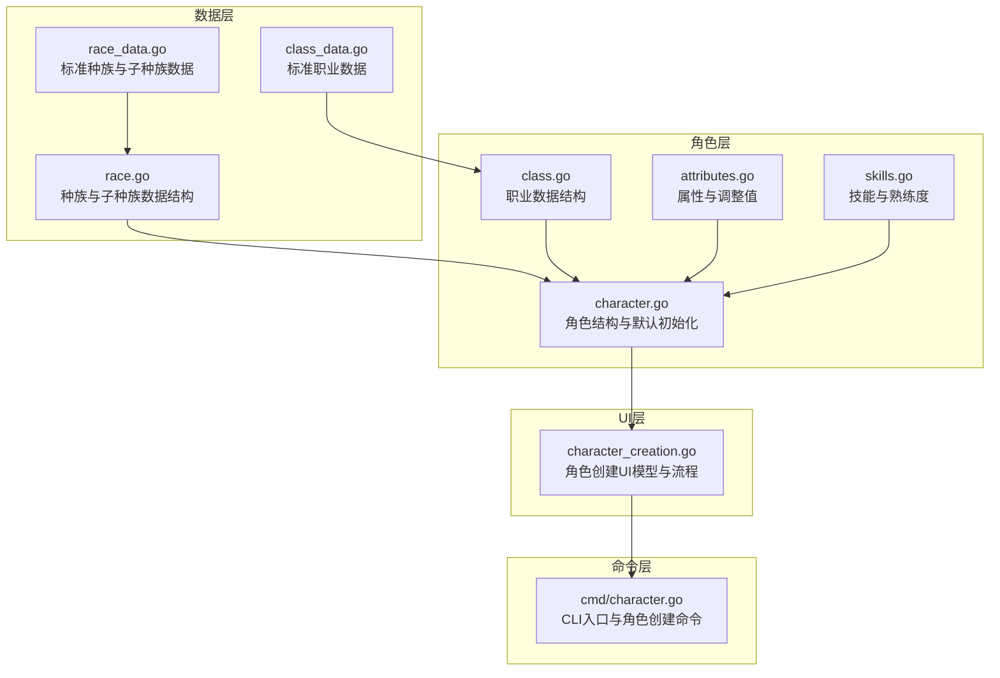
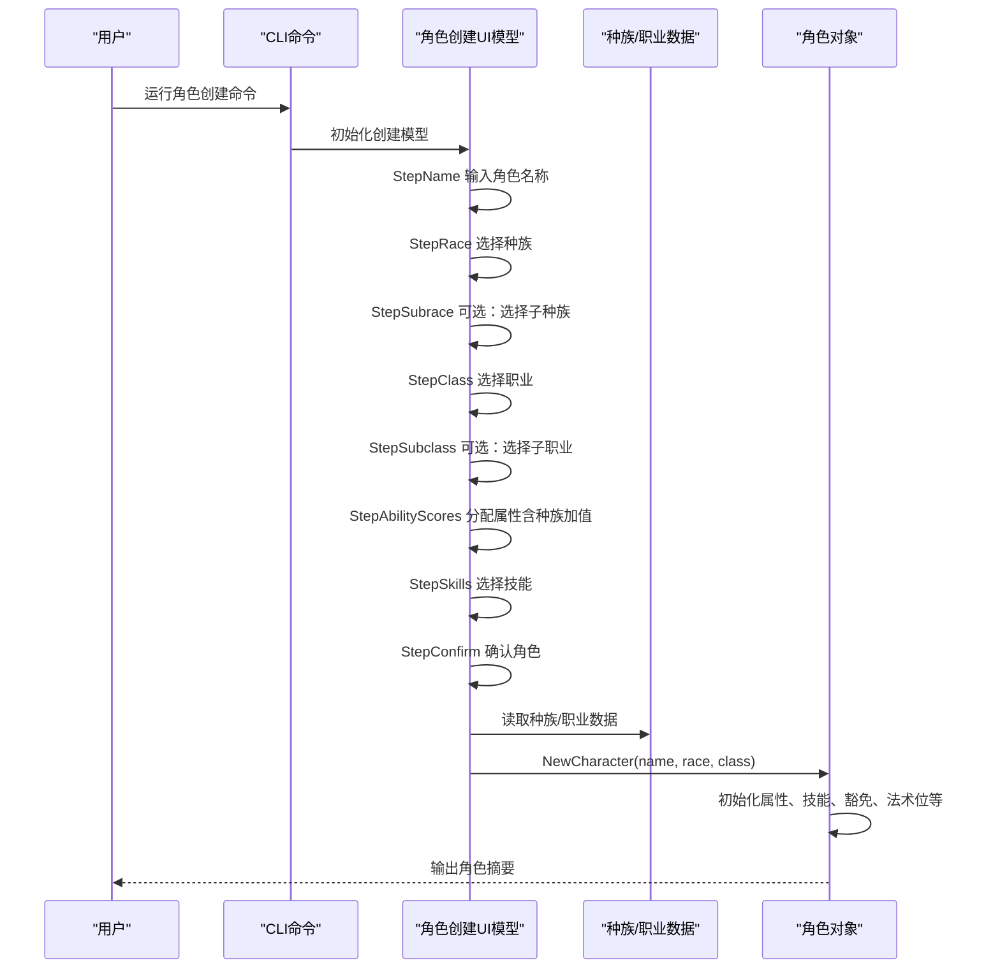
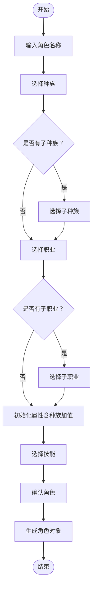
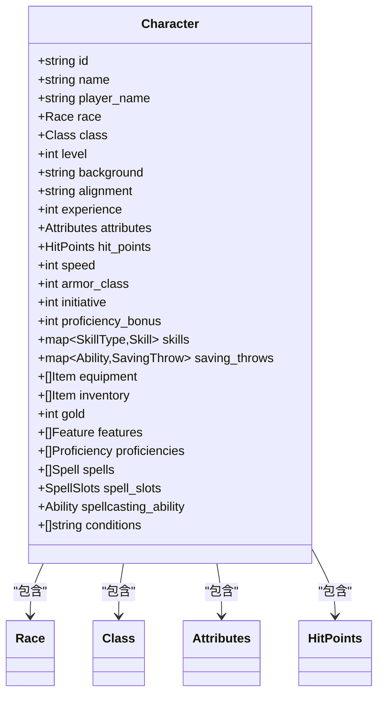
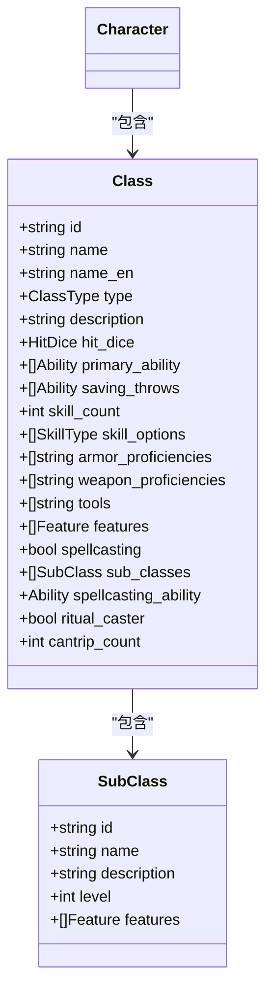
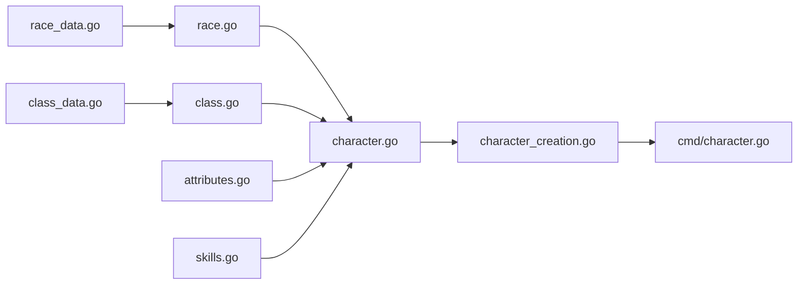

# 种族系统

<cite>
**本文引用的文件**
- [race.go](file://internal/character/race.go)
- [race_data.go](file://internal/character/race_data.go)
- [character.go](file://internal/character/character.go)
- [character_creation.go](file://internal/ui/character_creation.go)
- [character.go](file://cmd/character.go)
- [attributes.go](file://internal/character/attributes.go)
- [skills.go](file://internal/character/skills.go)
- [class.go](file://internal/character/class.go)
- [class_data.go](file://internal/character/class_data.go)
</cite>

## 目录
1. [简介](#简介)
2. [项目结构](#项目结构)
3. [核心组件](#核心组件)
4. [架构总览](#架构总览)
5. [详细组件分析](#详细组件分析)
6. [依赖分析](#依赖分析)
7. [性能考量](#性能考量)
8. [故障排除指南](#故障排除指南)
9. [结论](#结论)
10. [附录](#附录)

## 简介
本文件面向CDND项目的种族系统，系统化阐述D&D 5e种族体系在代码中的实现方式，涵盖种族选择、种族特性、移动速度、语言能力、年龄与体格范围、子种族与龙族血统等核心机制。文档同时给出数据结构设计、加载与应用流程、角色创建过程中的作用、平衡性考虑、工具函数与扩展指南，以及与职业、背景等其他角色要素的交互关系。

## 项目结构
种族系统主要由以下模块构成：
- 数据层：种族与子种族的数据定义与标准集合
- 角色层：角色对象及其与种族的绑定
- UI层：角色创建流程，支持种族与子种族选择
- 命令层：CLI入口，启动角色创建流程
- 支撑层：属性、技能、职业等基础数据结构



图表来源
- [race.go:44-93](file://internal/character/race.go#L44-L93)
- [race_data.go:3-373](file://internal/character/race_data.go#L3-L373)
- [character.go:8-61](file://internal/character/character.go#L8-L61)
- [class.go:47-118](file://internal/character/class.go#L47-L118)
- [class_data.go:3-677](file://internal/character/class_data.go#L3-L677)
- [character_creation.go:51-88](file://internal/ui/character_creation.go#L51-L88)
- [cmd/character.go:21-52](file://cmd/character.go#L21-L52)

章节来源
- [race.go:1-94](file://internal/character/race.go#L1-L94)
- [race_data.go:1-373](file://internal/character/race_data.go#L1-L373)
- [character.go:1-223](file://internal/character/character.go#L1-L223)
- [character_creation.go:1-537](file://internal/ui/character_creation.go#L1-L537)
- [cmd/character.go:1-99](file://cmd/character.go#L1-L99)

## 核心组件
- 种族数据结构：包含ID、名称、英文名、描述、体型、速度、属性加值、种族特性、语言、年龄范围、身高范围、体重范围、武器熟练、天生戏法等字段
- 子种族结构：包含ID、名称、描述、属性加值、特性列表
- 龙族血统：用于龙裔的吐息类型与伤害形态
- 角色结构：包含种族、职业、等级、背景、阵营、经验、属性、生命值、速度、防御等级、先攻、熟练加值、技能、豁免、装备与物品、特性与熟练、法术与法术位、状态效果等
- UI模型：角色创建流程，支持名称、种族、子种族、职业、子职业、属性分配、技能选择、确认等步骤
- CLI命令：提供角色创建、列表、删除、查看等命令入口

章节来源
- [race.go:44-93](file://internal/character/race.go#L44-L93)
- [race_data.go:345-373](file://internal/character/race_data.go#L345-L373)
- [character.go:8-61](file://internal/character/character.go#L8-L61)
- [character_creation.go:51-88](file://internal/ui/character_creation.go#L51-L88)
- [cmd/character.go:21-52](file://cmd/character.go#L21-L52)

## 架构总览
角色创建流程从CLI命令启动，进入UI模型，用户依次完成名称、种族、子种族、职业、子职业、属性分配、技能选择、确认等步骤。最终生成角色对象，其中包含种族与职业信息，并根据职业确定生命骰、法术位等。



图表来源
- [cmd/character.go:28-51](file://cmd/character.go#L28-L51)
- [character_creation.go:74-88](file://internal/ui/character_creation.go#L74-L88)
- [character_creation.go:140-202](file://internal/ui/character_creation.go#L140-L202)
- [character_creation.go:523-536](file://internal/ui/character_creation.go#L523-L536)
- [character.go:64-100](file://internal/character/character.go#L64-L100)

## 详细组件分析

### 种族数据结构与加载
- 种族结构包含：ID、中文名、英文名、描述、体型、速度、属性加值、种族特性、语言、年龄范围、身高范围、体重范围、武器熟练、天生戏法等
- 子种族结构包含：ID、中文名、英文名、描述、属性加值、特性列表
- 标准种族数据集中于标准集合，提供所有官方D&D 5e种族的完整定义
- 提供获取种族与所有种族的方法，便于UI与业务逻辑使用

```mermaid
classDiagram
class Size {
<<枚举>>
"微型"
"小型"
"中型"
"大型"
"巨型"
"超巨型"
}
class AgeRange {
+int adulthood
+int max_age
}
class HeightRange {
+int base_height
+int mod_dice
+int mod_count
}
class WeightRange {
+int base_weight
+int mod_dice
+int mod_count
}
class Trait {
+string name
+string description
}
class SubRace {
+string id
+string name
+string description
+map~Ability,int~ ability_bonuses
+[]Trait traits
}
class Race {
+string id
+string name
+string name_en
+string description
+Size size
+int speed
+map~Ability,int~ ability_bonuses
+[]Trait traits
+[]string languages
+[]SubRace sub_races
+AgeRange age_range
+HeightRange height_range
+WeightRange weight_range
+[]string weapon_training
+[]string cantrips
}
Race --> SubRace : "包含"
Race --> Trait : "包含"
Race --> AgeRange : "包含"
Race --> HeightRange : "包含"
Race --> WeightRange : "包含"
```

图表来源
- [race.go:3-68](file://internal/character/race.go#L3-L68)
- [race_data.go:3-326](file://internal/character/race_data.go#L3-L326)

章节来源
- [race.go:44-93](file://internal/character/race.go#L44-L93)
- [race_data.go:3-326](file://internal/character/race_data.go#L3-L326)

### 龙族血统与吐息形态
- 龙族血统用于龙裔，包含名称、吐息伤害类型、吐息形状（锥状/线状）
- 提供多种龙族血统选项，对应不同伤害类型与吐息形状

```mermaid
classDiagram
class DragonAncestry {
+string name
+string damage_type
+BreathShape breath_shape
}
class BreathShape {
<<枚举>>
"锥状"
"线状"
}
Race --> DragonAncestry : "可选"
```

图表来源
- [race_data.go:345-373](file://internal/character/race_data.go#L345-L373)

章节来源
- [race_data.go:345-373](file://internal/character/race_data.go#L345-L373)

### 角色创建流程与种族应用
- UI模型支持多步骤流程：名称、种族、子种族、职业、子职业、属性分配、技能选择、确认
- 当选择种族时，会根据种族的属性加值初始化角色的基础属性
- 若存在子种族，会在后续步骤中选择并应用其属性加值
- 最终生成角色对象，包含种族、职业、属性、生命值等



图表来源
- [character_creation.go:140-202](file://internal/ui/character_creation.go#L140-L202)
- [character_creation.go:231-259](file://internal/ui/character_creation.go#L231-L259)
- [character_creation.go:523-536](file://internal/ui/character_creation.go#L523-L536)

章节来源
- [character_creation.go:140-202](file://internal/ui/character_creation.go#L140-L202)
- [character_creation.go:231-259](file://internal/ui/character_creation.go#L231-L259)
- [character_creation.go:523-536](file://internal/ui/character_creation.go#L523-L536)

### 角色对象与种族绑定
- 角色结构包含种族字段，创建时传入种族数据
- 默认初始化时设置基础属性、技能、豁免、法术位等
- 生命值计算会结合职业生命骰与体质调整值



图表来源
- [character.go:8-61](file://internal/character/character.go#L8-L61)

章节来源
- [character.go:8-61](file://internal/character/character.go#L8-L61)
- [character.go:64-100](file://internal/character/character.go#L64-L100)

### 属性与技能系统
- 属性系统提供属性类型、默认值、调整值计算、点购成本与验证
- 技能系统提供技能类型、关联属性、熟练度与加值计算
- 角色创建时会根据种族加值调整初始属性

```mermaid
classDiagram
class Attributes {
+int strength
+int dexterity
+int constitution
+int intelligence
+int wisdom
+int charisma
+Modifier(ability) int
+ModifierString(ability) string
}
class Skill {
+SkillType type
+Ability ability
+bool proficient
+bool expertise
+int bonus
+Modifier(ability_mod, prof_bonus) int
}
class SkillType {
<<枚举>>
"运动"
"体操"
"手法"
"隐匿"
"奥秘"
"历史"
"调查"
"自然"
"宗教"
"驯兽"
"洞察"
"医药"
"察觉"
"求生"
"欺瞒"
"威吓"
"表演"
"说服"
}
Attributes <.. Character : "被使用"
Skill <.. Character : "被使用"
```

图表来源
- [attributes.go:22-96](file://internal/character/attributes.go#L22-L96)
- [skills.go:65-100](file://internal/character/skills.go#L65-L100)

章节来源
- [attributes.go:22-96](file://internal/character/attributes.go#L22-L96)
- [skills.go:65-100](file://internal/character/skills.go#L65-L100)

### 与职业的交互
- 职业决定生命骰、主要属性、豁免、技能选项、武器/护甲熟练、法术施放能力等
- 角色创建完成后，生命值上限基于职业生命骰与体质调整值计算
- 子职业提供特定特性与能力，进一步细化角色玩法



图表来源
- [class.go:47-118](file://internal/character/class.go#L47-L118)
- [class_data.go:3-677](file://internal/character/class_data.go#L3-L677)

章节来源
- [class.go:47-118](file://internal/character/class.go#L47-L118)
- [class_data.go:3-677](file://internal/character/class_data.go#L3-L677)

## 依赖分析
- 数据层依赖：种族与职业数据集中于各自的数据文件，提供静态标准集合
- 角色层依赖：角色对象依赖属性、技能、职业等基础数据结构
- UI层依赖：角色创建UI依赖角色与职业数据，动态渲染步骤与选项
- 命令层依赖：CLI命令启动UI模型并输出角色摘要



图表来源
- [race_data.go:3-373](file://internal/character/race_data.go#L3-L373)
- [race.go:44-93](file://internal/character/race.go#L44-L93)
- [class_data.go:3-677](file://internal/character/class_data.go#L3-L677)
- [class.go:47-118](file://internal/character/class.go#L47-L118)
- [attributes.go:22-96](file://internal/character/attributes.go#L22-L96)
- [skills.go:65-100](file://internal/character/skills.go#L65-L100)
- [character.go:8-61](file://internal/character/character.go#L8-L61)
- [character_creation.go:51-88](file://internal/ui/character_creation.go#L51-L88)
- [cmd/character.go:21-52](file://cmd/character.go#L21-L52)

章节来源
- [race_data.go:3-373](file://internal/character/race_data.go#L3-L373)
- [race.go:44-93](file://internal/character/race.go#L44-L93)
- [class_data.go:3-677](file://internal/character/class_data.go#L3-L677)
- [class.go:47-118](file://internal/character/class.go#L47-L118)
- [attributes.go:22-96](file://internal/character/attributes.go#L22-L96)
- [skills.go:65-100](file://internal/character/skills.go#L65-L100)
- [character.go:8-61](file://internal/character/character.go#L8-L61)
- [character_creation.go:51-88](file://internal/ui/character_creation.go#L51-L88)
- [cmd/character.go:21-52](file://cmd/character.go#L21-L52)

## 性能考量
- 数据加载：标准种族与职业数据为内存中的静态集合，访问复杂度低，适合频繁查询
- UI渲染：角色创建步骤采用状态机与列表渲染，避免重复计算
- 属性与技能：调整值计算为O(1)，点购成本与验证为固定循环，开销极小
- 建议：若扩展大量自定义种族，建议采用延迟加载或外部数据源缓存策略

## 故障排除指南
- 无法选择子种族：检查种族是否定义了子种族列表
- 属性点分配异常：确认种族加值正确叠加到初始属性
- 生命值计算错误：检查职业生命骰与体质调整值的组合
- 语言或特性缺失：确认种族/子种族数据中语言与特性字段是否正确填充

章节来源
- [race.go:70-83](file://internal/character/race.go#L70-L83)
- [character_creation.go:231-259](file://internal/ui/character_creation.go#L231-L259)
- [character.go:64-100](file://internal/character/character.go#L64-L100)

## 结论
CDND的种族系统以清晰的数据结构与标准集合为基础，结合UI驱动的角色创建流程，实现了D&D 5e种族体系的完整落地。系统支持种族与子种族的选择、属性加值的应用、语言与特性的加载，并与职业、背景等其他角色要素协同工作。通过合理的扩展接口与工具函数，游戏设计师可以便捷地添加自定义种族，同时保持良好的平衡性与可维护性。

## 附录

### 种族数据字段说明
- ID：种族唯一标识符
- 名称/英文名：中文与英文名称
- 描述：种族背景介绍
- 体型：微型/小型/中型/大型/巨型/超巨型
- 速度：移动速度（尺）
- 属性加值：地图形式的属性加值
- 种族特性：特性列表
- 语言：语言列表
- 年龄范围：成年年龄与最大寿命
- 身高范围：基础身高与身高变异骰
- 体重范围：基础体重与体重变异骰
- 武器熟练：武器熟练列表
- 天生戏法：天生戏法列表
- 子种族：子种族列表
- 龙族血统：吐息伤害类型与吐息形状

章节来源
- [race.go:44-68](file://internal/character/race.go#L44-L68)
- [race_data.go:3-326](file://internal/character/race_data.go#L3-L326)
- [race_data.go:345-373](file://internal/character/race_data.go#L345-L373)

### 种族扩展开发指南
- 新增种族：在标准集合中添加新的种族条目，包含ID、名称、英文名、描述、体型、速度、属性加值、种族特性、语言、年龄/身高/体重范围、武器熟练、天生戏法等字段
- 新增子种族：在现有种族下添加子种族条目，包含ID、名称、描述、属性加值、特性列表
- 新增龙族血统：在龙族血统集合中添加新的血统条目，包含名称、吐息伤害类型、吐息形状
- 应用扩展：确保UI与角色创建流程能够识别新增的种族/子种族/血统，并正确应用属性加值与特性
- 平衡性校验：通过属性加值、特性与职业的搭配进行平衡性评估，必要时调整数值或特性

章节来源
- [race_data.go:3-326](file://internal/character/race_data.go#L3-L326)
- [race_data.go:345-373](file://internal/character/race_data.go#L345-L373)
- [character_creation.go:83-87](file://internal/ui/character_creation.go#L83-L87)