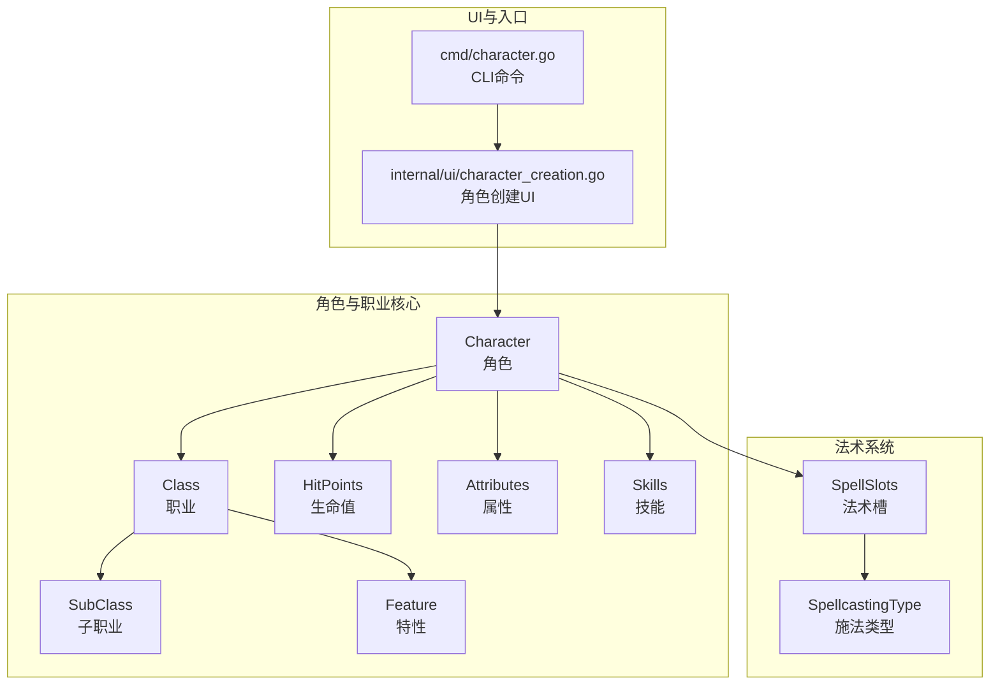
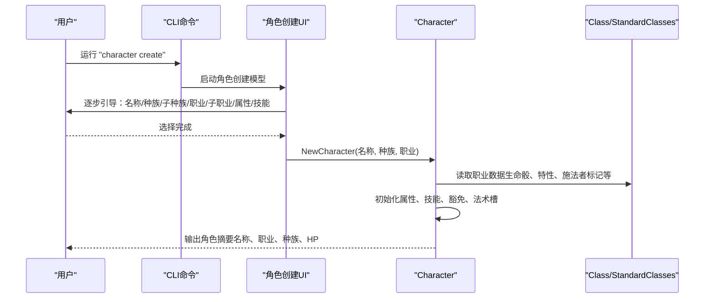
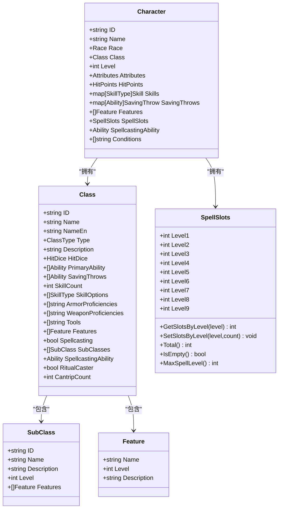
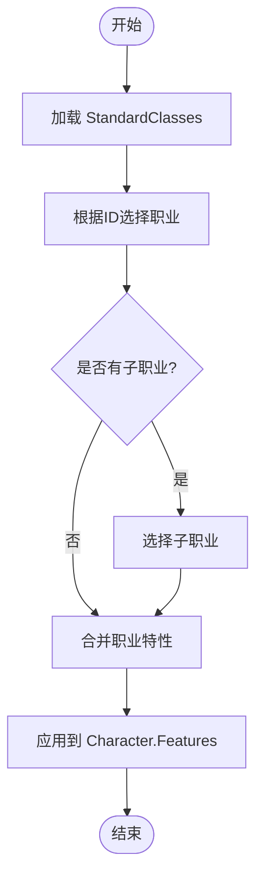
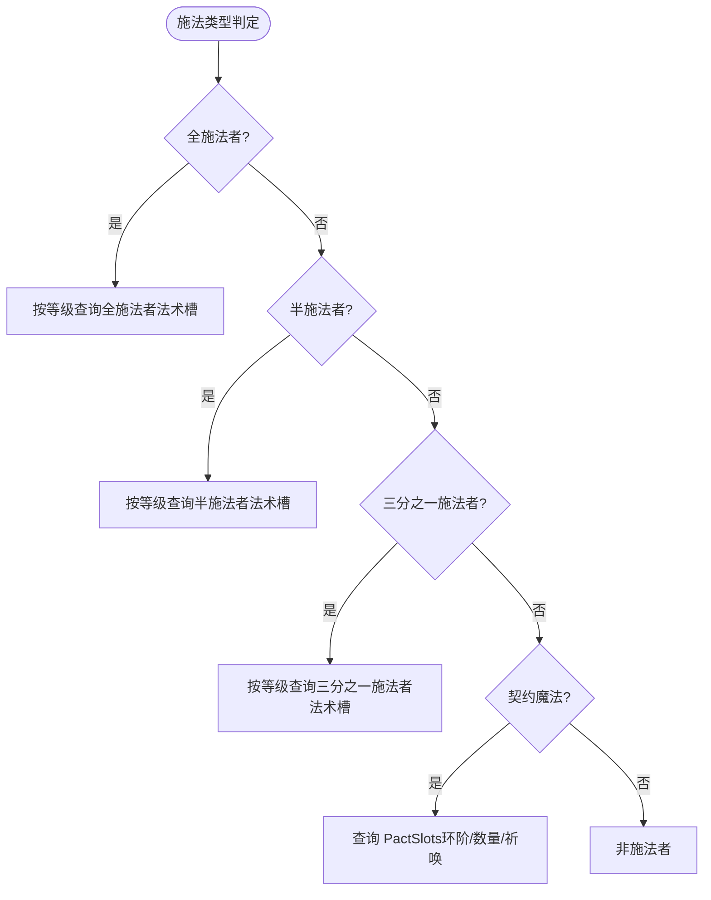
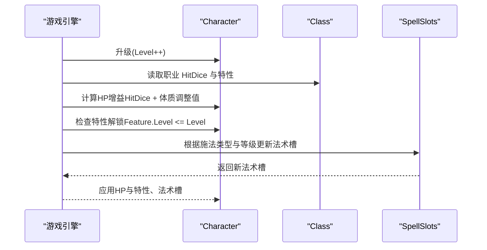
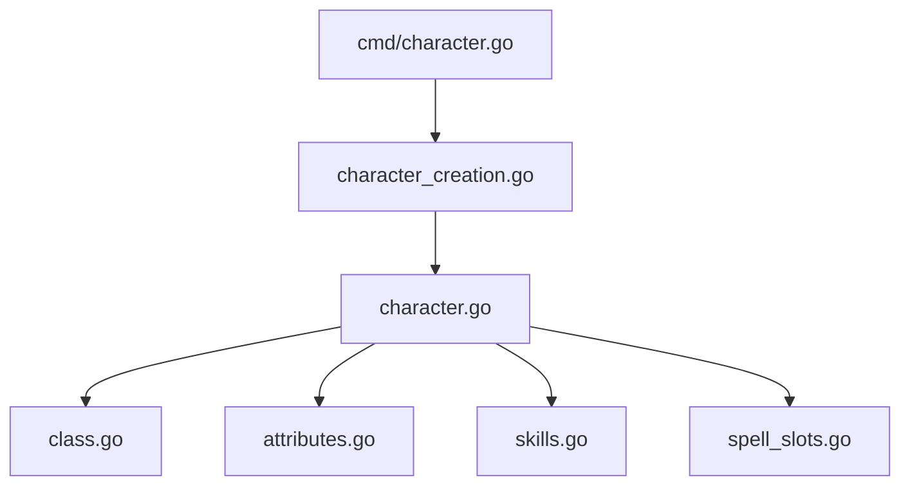

# 职业系统

<cite>
**本文引用的文件**
- [class.go](file://internal/character/class.go)
- [class_data.go](file://internal/character/class_data.go)
- [character.go](file://internal/character/character.go)
- [spell_slots.go](file://internal/character/spell_slots.go)
- [attributes.go](file://internal/character/attributes.go)
- [skills.go](file://internal/character/skills.go)
- [race.go](file://internal/character/race.go)
- [race_data.go](file://internal/character/race_data.go)
- [character.go](file://cmd/character.go)
- [character_creation.go](file://internal/ui/character_creation.go)
</cite>

## 目录
1. [简介](#简介)
2. [项目结构](#项目结构)
3. [核心组件](#核心组件)
4. [架构概览](#架构概览)
5. [详细组件分析](#详细组件分析)
6. [依赖分析](#依赖分析)
7. [性能考量](#性能考量)
8. [故障排查指南](#故障排查指南)
9. [结论](#结论)
10. [附录](#附录)

## 简介
本文件面向游戏设计师与开发者，系统化阐述 CDND 的 D&D 5e 职业系统实现，覆盖职业选择、职业等级、职业特性、法术位系统等核心机制。文档从数据结构设计、加载与应用机制、等级提升自动增益、平衡性与数值设计原则，到工具函数与扩展开发指南进行全面解析，帮助读者快速理解并高效扩展职业体系。

## 项目结构
职业系统主要位于 internal/character 目录，围绕角色（Character）、职业（Class）、子职业（SubClass）、特性（Feature）、法术位（SpellSlots）等核心实体构建。UI 层通过交互式角色创建流程引导用户完成职业选择与初始化。

**图表来源**
- [character.go:8-61](file://internal/character/character.go#L8-L61)
- [class.go:47-69](file://internal/character/class.go#L47-L69)
- [spell_slots.go:3-15](file://internal/character/spell_slots.go#L3-L15)
- [character.go:22-51](file://cmd/character.go#L22-L51)
- [character_creation.go:52-87](file://internal/ui/character_creation.go#L52-L87)

**章节来源**
- [character.go:8-61](file://internal/character/character.go#L8-L61)
- [class.go:47-69](file://internal/character/class.go#L47-L69)
- [spell_slots.go:3-15](file://internal/character/spell_slots.go#L3-L15)
- [character.go:22-51](file://cmd/character.go#L22-L51)
- [character_creation.go:52-87](file://internal/ui/character_creation.go#L52-L87)

## 核心组件
- 职业与子职业
  - 职业（Class）：包含职业ID、名称、英文名、类型、描述、生命骰、主属性、豁免、技能数量与选项、护甲/武器/工具熟练、特性、施法者标记及扩展字段（子职业、施法属性、仪式施法、戏法数量）。
  - 子职业（SubClass）：包含ID、名称、描述、开放等级、特性列表。
- 特性（Feature）：包含特性名称、获得等级、描述。
- 法术位系统（SpellSlots/PactSlots）：支持全施法者、半施法者、三分之一施法者与契约魔法（Warlock）四种施法类型，提供按等级查询、总量统计、最大可用环阶等能力。
- 角色（Character）：包含基础信息、属性、生命值、速度、AC、先攻、熟练加值、技能、豁免、装备与物品、特性与熟练、法术与法术槽、状态效果等。
- 属性与技能：提供属性值、调整值计算、技能与豁免的熟练与加值计算。
- 种族与子种族：提供种族基础属性加值、特性、子种族选项等，参与角色初始属性分配。

**章节来源**
- [class.go:31-69](file://internal/character/class.go#L31-L69)
- [class_data.go:3-637](file://internal/character/class_data.go#L3-L637)
- [spell_slots.go:3-332](file://internal/character/spell_slots.go#L3-L332)
- [character.go:8-61](file://internal/character/character.go#L8-L61)
- [attributes.go:22-87](file://internal/character/attributes.go#L22-L87)
- [skills.go:65-100](file://internal/character/skills.go#L65-L100)
- [race.go:35-62](file://internal/character/race.go#L35-L62)
- [race_data.go:3-373](file://internal/character/race_data.go#L3-L373)

## 架构概览
职业系统采用“数据驱动 + 结构化实体”的设计：标准职业与子职业数据集中于 class_data.go，运行时通过 class.go 定义的数据结构与工具函数进行访问与操作；角色创建 UI 通过交互流程选择种族、职业、子职业与属性，最终生成 Character 实例并初始化基础数值（如生命值）。

**图表来源**
- [character.go:28-51](file://cmd/character.go#L28-L51)
- [character_creation.go:74-87](file://internal/ui/character_creation.go#L74-L87)
- [character_creation.go:524-536](file://internal/ui/character_creation.go#L524-L536)
- [character.go:63-100](file://internal/character/character.go#L63-L100)
- [class_data.go:639-654](file://internal/character/class_data.go#L639-L654)

**章节来源**
- [character.go:28-51](file://cmd/character.go#L28-L51)
- [character_creation.go:74-87](file://internal/ui/character_creation.go#L74-L87)
- [character_creation.go:524-536](file://internal/ui/character_creation.go#L524-L536)
- [character.go:63-100](file://internal/character/character.go#L63-L100)
- [class_data.go:639-654](file://internal/character/class_data.go#L639-L654)

## 详细组件分析

### 数据结构与字段设计
- 职业（Class）
  - 关键字段：ID、Name、NameEn、Type、Description、HitDice、PrimaryAbility、SavingThrows、SkillCount、SkillOptions、ArmorProficiencies、WeaponProficiencies、Tools、Features、Spellcasting、SubClasses、SpellcastingAbility、RitualCaster、CantripCount。
  - 设计要点：统一使用中文命名与描述，便于本地化；通过枚举 ClassType 限定职业类型；Features 以“获得等级”组织，便于按等级解锁。
- 子职业（SubClass）
  - 关键字段：ID、Name、Description、Level、Features；Level 决定可选择的最低等级。
- 特性（Feature）
  - 关键字段：Name、Level、Description；用于描述职业/子职业随等级解锁的能力。
- 法术位（SpellSlots/PactSlots）
  - 全施法者：按等级提供不同环阶法术槽数量。
  - 半施法者：从2级起按“有效施法者等级”（等级/2 向下取整）获得法术槽。
  - 三分之一施法者：按“有效施法者等级”（等级/3 向下取整）获得法术槽。
  - 契约魔法（Warlock）：使用 PactSlots，包含槽环阶、槽数量、祈唤数量。
- 角色（Character）
  - 关键字段：ID、Name、PlayerName、Race、Class、Level、Background、Alignment、Experience、Attributes、HitPoints、Speed、ArmorClass、Initiative、ProficiencyBonus、Skills、SavingThrows、Equipment、Inventory、Gold、Features、Proficiencies、Spells、SpellSlots、SpellcastingAbility、Conditions。
  - 设计要点：将属性、技能、豁免、法术等模块化，便于扩展与维护。

**图表来源**
- [class.go:47-69](file://internal/character/class.go#L47-L69)
- [class.go:31-38](file://internal/character/class.go#L31-L38)
- [class.go:71-76](file://internal/character/class.go#L71-L76)
- [spell_slots.go:3-15](file://internal/character/spell_slots.go#L3-L15)
- [character.go:8-61](file://internal/character/character.go#L8-L61)

**章节来源**
- [class.go:47-69](file://internal/character/class.go#L47-L69)
- [class.go:31-38](file://internal/character/class.go#L31-L38)
- [class.go:71-76](file://internal/character/class.go#L71-L76)
- [spell_slots.go:3-15](file://internal/character/spell_slots.go#L3-L15)
- [character.go:8-61](file://internal/character/character.go#L8-L61)

### 职业数据加载与应用
- 标准职业数据集中于 StandardClasses，键为职业ID，值为 Class 对象。提供 GetClass/AllClasses 工具函数用于检索与遍历。
- 子职业数据嵌入 Class.SubClasses，通过 GetSubClass 判断是否存在子职业并按需选择。
- 特性加载：Class.Features 与 SubClass.Features 在角色创建后按等级合并至 Character.Features，用于后续 UI 展示与逻辑判定。

**图表来源**
- [class_data.go:639-654](file://internal/character/class_data.go#L639-L654)
- [class.go:94-107](file://internal/character/class.go#L94-L107)
- [character.go:51-57](file://internal/character/character.go#L51-L57)

**章节来源**
- [class_data.go:639-654](file://internal/character/class_data.go#L639-L654)
- [class.go:94-107](file://internal/character/class.go#L94-L107)
- [character.go:51-57](file://internal/character/character.go#L51-L57)

### 法术位系统与施法类型
- 施法类型（SpellcastingType）：全施法者（Wizard/Cleric/Druid/Bard/Sorcerer）、半施法者（Paladin/Ranger）、三分之一施法者（Fighter/Rogue 子职业如奥法骑士/诡术师）、契约魔法（Warlock）。
- 成长表：
  - 全施法者：按等级提供 Level1-Level9 法术槽。
  - 半施法者：从2级起按有效施法者等级（等级/2 向下取整）获得法术槽。
  - 三分之一施法者：按有效施法者等级（等级/3 向下取整）获得法术槽。
  - 契约魔法：PactSlots 包含 SlotLevel、SlotCount、Invocations，随等级递增。
- 查询与统计：SpellSlots 提供按环阶查询、总量统计、是否为空、最大可用环阶等方法；GetSpellSlotsByType 根据施法类型返回对应成长表。

**图表来源**
- [spell_slots.go:17-26](file://internal/character/spell_slots.go#L17-L26)
- [spell_slots.go:197-241](file://internal/character/spell_slots.go#L197-L241)
- [spell_slots.go:243-257](file://internal/character/spell_slots.go#L243-L257)

**章节来源**
- [spell_slots.go:17-26](file://internal/character/spell_slots.go#L17-L26)
- [spell_slots.go:197-241](file://internal/character/spell_slots.go#L197-L241)
- [spell_slots.go:243-257](file://internal/character/spell_slots.go#L243-L257)

### 职业等级提升与自动增益
- 生命骰（HitDice）：由职业决定，角色创建时按生命骰与体质调整值计算初始 HP；升级时按职业 HitDice 与体质调整值增加 HP。
- 新特性解锁：按 Feature.Level 与角色等级比较，符合条件时加入 Character.Features。
- 法术位增长：根据施法类型与等级查询对应成长表，更新 SpellSlots。
- 技能与熟练：职业提供的技能数量与选项在创建阶段确定，升级时可依据新特性或背景进行调整（具体逻辑可扩展）。

**图表来源**
- [character.go:102-133](file://internal/character/character.go#L102-L133)
- [class.go:78-92](file://internal/character/class.go#L78-L92)
- [spell_slots.go:229-241](file://internal/character/spell_slots.go#L229-L241)

**章节来源**
- [character.go:102-133](file://internal/character/character.go#L102-L133)
- [class.go:78-92](file://internal/character/class.go#L78-L92)
- [spell_slots.go:229-241](file://internal/character/spell_slots.go#L229-L241)

### 数值设计与平衡性考虑
- 生命骰与HP：不同职业的 HitDice 不同，直接影响生存能力；建议在职业设计时平衡 HitDice 与护甲/防护熟练带来的AC/抗性收益。
- 施法位成长：全施法者成长较快，半/三分之一施法者与契约魔法需通过独特机制（如祈唤、超魔、仪式施法）保持价值。
- 技能与熟练：职业技能数量与选项应与其定位一致（如战士侧重战斗技能，牧师侧重宗教/医疗等）。
- 特性解锁节奏：低等级提供实用能力（如野蛮人的狂暴、吟游诗人的激励），中高等级提供强力增益（如术士的超魔、圣武士的战斗风格）。
- 属性点与点购：提供点购成本与总预算限制，确保角色构建的多样性与平衡性。

**章节来源**
- [class_data.go:3-637](file://internal/character/class_data.go#L3-L637)
- [attributes.go:98-141](file://internal/character/attributes.go#L98-L141)

### 工具函数与辅助方法
- 职业与子职业：GetClass、AllClasses、GetSubClass、HasSubClasses。
- 法术位：GetFullCasterSlots、GetHalfCasterSlots、GetThirdCasterSlots、GetWarlockPactSlots、GetSpellSlotsByType、GetCasterType、MaxSpellLevel、GetSpellLevelName、GetSchoolName。
- 属性与技能：AllAbilities、Attributes.Modifier、Skill.Modifier、SavingThrow.Modifier、GetSkillInfo、GetSkillName、GetAbilityName。
- 角色：NewCharacter、HitPoints.TakeDamage、HitPoints.Heal、HasSkillProficiency、HasSavingThrowProficiency、GetSkillModifier、GetSavingThrowModifier、SetSkillProficiency、SetSavingThrowProficiency、HasClass、HasCondition、AddCondition、RemoveCondition、GetConditions。

**章节来源**
- [class.go:94-117](file://internal/character/class.go#L94-L117)
- [spell_slots.go:197-331](file://internal/character/spell_slots.go#L197-L331)
- [attributes.go:17-141](file://internal/character/attributes.go#L17-L141)
- [skills.go:36-172](file://internal/character/skills.go#L36-L172)
- [character.go:63-223](file://internal/character/character.go#L63-L223)

### 开发者指南：自定义职业扩展
- 新增职业
  - 在 StandardClasses 中添加新职业条目，填写 ID、名称、英文名、类型、描述、生命骰、主属性、豁免、技能数量与选项、护甲/武器/工具熟练、特性、施法者标记及相关扩展字段。
  - 若需要子职业，在 SubClasses 字段中添加子职业及其特性与开放等级。
- 新增法术位成长
  - 根据施法类型选择：全施法者、半施法者、三分之一施法者或契约魔法，分别在对应成长表数组中补充对应等级的数据。
  - 提供查询函数（如 GetXxxCasterSlots）与施法类型判定逻辑（GetCasterType）。
- 新增特性
  - 在职业或子职业的 Features 中添加新特性，按获得等级排序；在角色升级时按等级检查并解锁。
- UI 与命令行
  - 在角色创建 UI 中自动展示新增职业/子职业；CLI 命令 character create 会调用 UI 流程，无需额外改动。
- 平衡性验证
  - 通过点购成本与总预算校验（ValidatePointBuy）确保属性构建合理；对比不同职业的 HP、施法位、特性解锁节奏，避免过强/过弱。

**章节来源**
- [class_data.go:639-654](file://internal/character/class_data.go#L639-L654)
- [spell_slots.go:197-257](file://internal/character/spell_slots.go#L197-L257)
- [character_creation.go:80-87](file://internal/ui/character_creation.go#L80-L87)
- [character.go:28-51](file://cmd/character.go#L28-L51)

## 依赖分析
- 组件耦合
  - Character 依赖 Class、SpellSlots、Attributes、Skills 等模块，形成高内聚、低耦合的数据结构。
  - SpellSlots 与施法类型解耦，通过查询函数按类型返回对应成长表，便于扩展新施法类型。
- 外部依赖
  - UI 层依赖 Bubble Tea（tea）与 Lip Gloss（样式），用于交互与渲染；与职业系统核心解耦。
- 潜在循环依赖
  - 当前文件间无循环导入，结构清晰。

**图表来源**
- [character.go:4-6](file://internal/character/character.go#L4-L6)
- [class.go:1-3](file://internal/character/class.go#L1-L3)
- [attributes.go:1-3](file://internal/character/attributes.go#L1-L3)
- [skills.go:1-3](file://internal/character/skills.go#L1-L3)
- [spell_slots.go:1-3](file://internal/character/spell_slots.go#L1-L3)
- [character_creation.go:3-11](file://internal/ui/character_creation.go#L3-L11)
- [character.go:3-10](file://cmd/character.go#L3-L10)

**章节来源**
- [character.go:4-6](file://internal/character/character.go#L4-L6)
- [class.go:1-3](file://internal/character/class.go#L1-L3)
- [attributes.go:1-3](file://internal/character/attributes.go#L1-L3)
- [skills.go:1-3](file://internal/character/skills.go#L1-L3)
- [spell_slots.go:1-3](file://internal/character/spell_slots.go#L1-L3)
- [character_creation.go:3-11](file://internal/ui/character_creation.go#L3-L11)
- [character.go:3-10](file://cmd/character.go#L3-L10)

## 性能考量
- 数据结构
  - 使用 map 与切片组合存储职业与特性，查询复杂度为 O(1)/O(n)，满足交互式角色创建场景。
- 计算开销
  - 属性调整值、技能/豁免修正、法术槽查询均为常数时间操作，对实时性要求高的战斗场景影响可忽略。
- UI 渲染
  - UI 采用 Bubble Tea 的增量渲染模式，仅在状态变更时重绘，保证流畅性。

## 故障排查指南
- 职业/子职业未显示
  - 检查 StandardClasses 中是否存在对应 ID；确认 HasSubClasses/GetSubClass 的调用逻辑。
- 法术位异常
  - 确认施法类型判定（GetCasterType）与对应成长表（GetFullCasterSlots/GetHalfCasterSlots/GetThirdCasterSlots/GetWarlockPactSlots）是否正确。
- 角色创建失败
  - 检查 NewCharacter 初始化流程，确认属性、技能、豁免、法术槽是否正确赋值；查看 UI 的错误提示与光标位置。

**章节来源**
- [class.go:94-117](file://internal/character/class.go#L94-L117)
- [spell_slots.go:243-257](file://internal/character/spell_slots.go#L243-L257)
- [character_creation.go:140-202](file://internal/ui/character_creation.go#L140-L202)
- [character.go:63-100](file://internal/character/character.go#L63-L100)

## 结论
CDND 的职业系统以清晰的数据结构与模块化设计为基础，结合标准职业数据与交互式 UI，实现了 D&D 5e 职业选择、特性解锁与法术位管理等核心机制。通过工具函数与扩展指南，开发者可便捷地添加新职业与施法类型，同时保持数值平衡与用户体验的一致性。

## 附录
- 常用工具函数速览
  - 职业：GetClass、AllClasses、GetSubClass、HasSubClasses
  - 法术位：GetSpellSlotsByType、GetCasterType、GetFullCasterSlots、GetHalfCasterSlots、GetThirdCasterSlots、GetWarlockPactSlots、MaxSpellLevel
  - 属性与技能：AllAbilities、Attributes.Modifier、Skill.Modifier、SavingThrow.Modifier、GetSkillInfo、GetSkillName、GetAbilityName
  - 角色：NewCharacter、HitPoints.TakeDamage、HitPoints.Heal、HasSkillProficiency、HasSavingThrowProficiency、GetSkillModifier、GetSavingThrowModifier、SetSkillProficiency、SetSavingThrowProficiency、HasClass、HasCondition、AddCondition、RemoveCondition、GetConditions