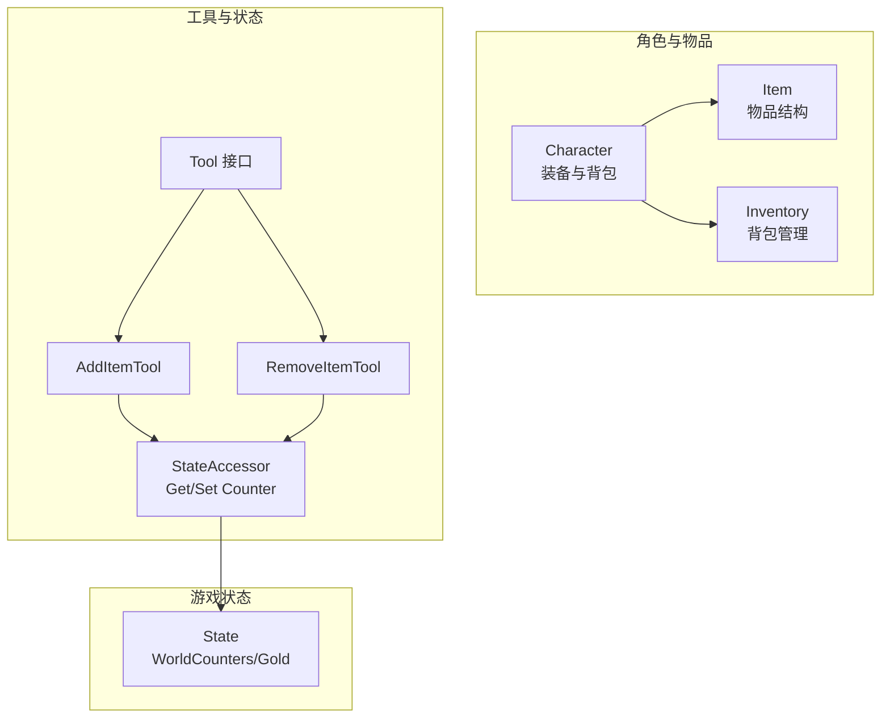
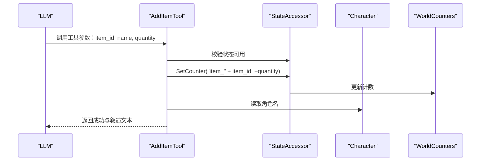
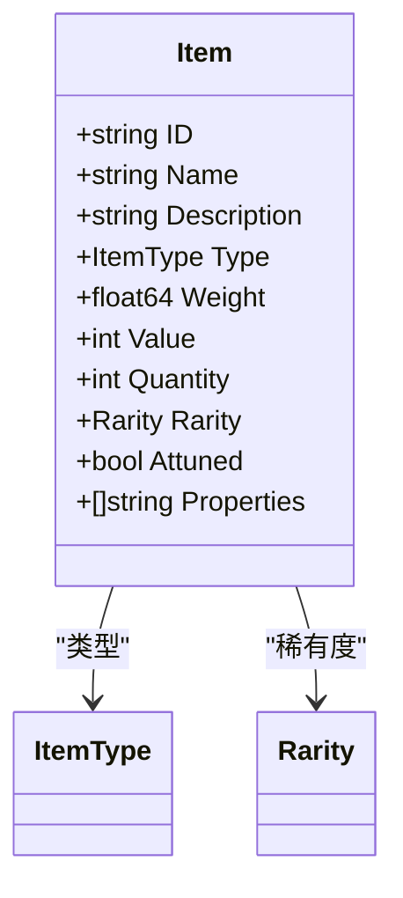
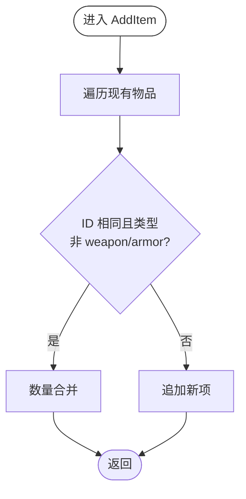
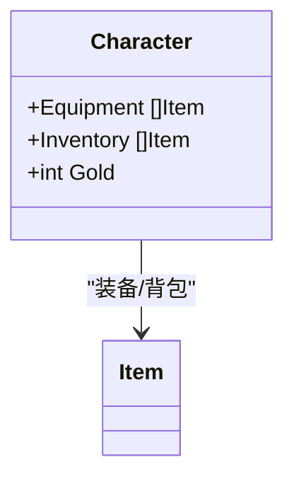
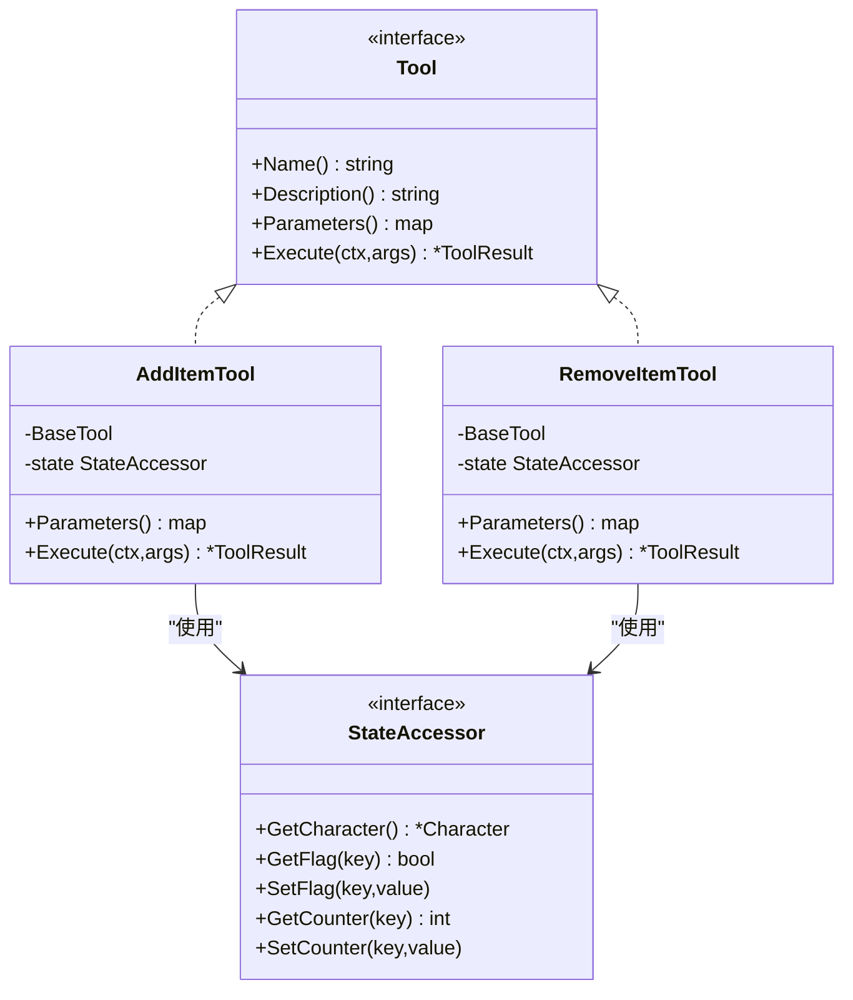
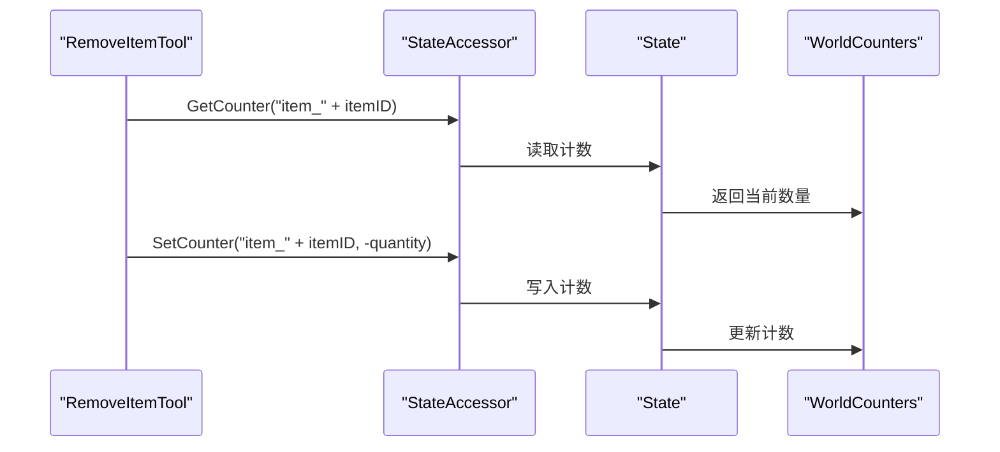
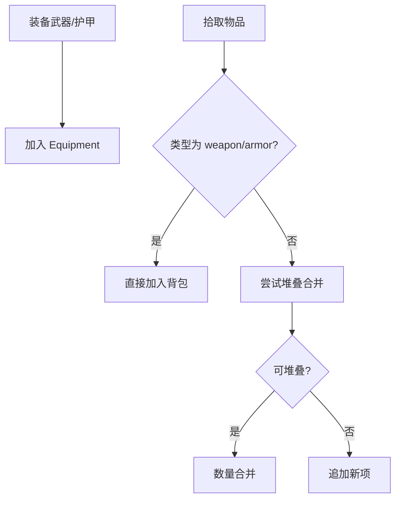
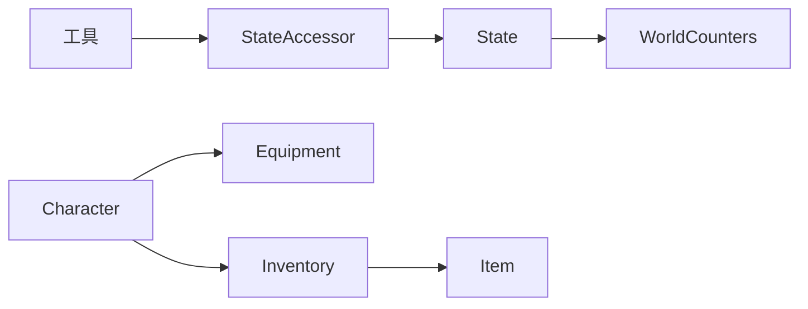

# 装备与物品系统

<cite>
**本文引用的文件**
- [internal/character/inventory.go](file://internal/character/inventory.go)
- [internal/character/character.go](file://internal/character/character.go)
- [internal/tools/item_tools.go](file://internal/tools/item_tools.go)
- [internal/tools/types.go](file://internal/tools/types.go)
- [internal/game/state.go](file://internal/game/state.go)
- [internal/character/skills.go](file://internal/character/skills.go)
- [internal/character/attributes.go](file://internal/character/attributes.go)
- [internal/character/spell_slots.go](file://internal/character/spell_slots.go)
- [config.example.yaml](file://config.example.yaml)
</cite>

## 目录
1. [简介](#简介)
2. [项目结构](#项目结构)
3. [核心组件](#核心组件)
4. [架构总览](#架构总览)
5. [详细组件分析](#详细组件分析)
6. [依赖分析](#依赖分析)
7. [性能考量](#性能考量)
8. [故障排查指南](#故障排查指南)
9. [结论](#结论)
10. [附录](#附录)

## 简介
本文件面向游戏设计师与开发者，系统化阐述 CDND 的 D&D 5e 装备与物品系统。内容涵盖：
- 物品数据结构与字段设计（ID、名称、描述、类型、数量、重量、价值、稀有度、附魔、属性加值等）
- 背包与装备的管理机制（堆叠规则、负重计算、容量上限）
- 物品在战斗与日常活动中的应用（武器伤害、护甲加值、魔法物品效果）
- 物品平衡性与价值设计原则
- 工具函数与辅助方法的实现细节
- 扩展开发指南（自定义物品的添加与配置）
- 物品与其他系统（角色属性、技能、法术槽、战斗）的交互关系

## 项目结构
围绕“物品”这一核心实体，系统的关键模块如下：
- 角色与物品：角色结构包含“装备”和“背包”，物品类型与稀有度定义集中于角色包
- 工具与状态：通过工具接口与状态访问器，实现物品增删与金币收支的叙事化执行
- 游戏状态：统一持有角色与世界计数器，支撑物品与金币的持久化与回放

**图表来源**
- [internal/character/character.go:45-48](file://internal/character/character.go#L45-L48)
- [internal/character/inventory.go:96-100](file://internal/character/inventory.go#L96-L100)
- [internal/tools/types.go:10-22](file://internal/tools/types.go#L10-L22)
- [internal/tools/item_tools.go:47-88](file://internal/tools/item_tools.go#L47-L88)
- [internal/game/state.go:14-42](file://internal/game/state.go#L14-L42)

**章节来源**
- [internal/character/character.go:45-48](file://internal/character/character.go#L45-L48)
- [internal/character/inventory.go:96-100](file://internal/character/inventory.go#L96-L100)
- [internal/tools/types.go:10-22](file://internal/tools/types.go#L10-L22)
- [internal/tools/item_tools.go:47-88](file://internal/tools/item_tools.go#L47-L88)
- [internal/game/state.go:14-42](file://internal/game/state.go#L14-L42)

## 核心组件
- Item（物品）：承载物品的标识、名称、描述、类型、数量、重量、价值、稀有度、附魔、属性加值等字段
- Inventory（背包）：管理物品集合、容量上限、堆叠合并、移除与负重计算
- Character（角色）：持有 Equipment（已装备）与 Inventory（背包），并包含金币字段
- 工具（AddItemTool/RemoveItemTool/SpendGoldTool/GainGoldTool）：以 LLM 友好的 JSON Schema 描述参数，执行物品与金币操作并生成叙述文本
- StateAccessor（状态访问器）：抽象出对角色与世界计数器的访问，便于工具与游戏引擎解耦
- State（游戏状态）：持有 WorldCounters（世界计数器），用于物品与金币的持久化存储

**章节来源**
- [internal/character/inventory.go:3-15](file://internal/character/inventory.go#L3-L15)
- [internal/character/inventory.go:96-100](file://internal/character/inventory.go#L96-L100)
- [internal/character/character.go:45-48](file://internal/character/character.go#L45-L48)
- [internal/tools/types.go:10-22](file://internal/tools/types.go#L10-L22)
- [internal/tools/item_tools.go:47-88](file://internal/tools/item_tools.go#L47-L88)
- [internal/game/state.go:14-42](file://internal/game/state.go#L14-L42)

## 架构总览
物品系统围绕“角色-物品-工具-状态”的链路工作：
- 角色拥有“装备”和“背包”，物品由 Item 结构体表示
- 工具通过 StateAccessor 读写角色与世界计数器，完成物品增删与金币收支
- State 统一管理 WorldCounters 与 Gold，确保物品与金币的持久化

**图表来源**
- [internal/tools/item_tools.go:47-88](file://internal/tools/item_tools.go#L47-L88)
- [internal/tools/types.go:10-22](file://internal/tools/types.go#L10-L22)
- [internal/game/state.go:110-134](file://internal/game/state.go#L110-L134)

**章节来源**
- [internal/tools/item_tools.go:47-88](file://internal/tools/item_tools.go#L47-L88)
- [internal/tools/types.go:10-22](file://internal/tools/types.go#L10-L22)
- [internal/game/state.go:110-134](file://internal/game/state.go#L110-L134)

## 详细组件分析

### 物品数据结构与分类
- 字段设计
  - 标识与描述：ID、Name、Description
  - 分类与稀有度：Type（ItemType）、Rarity（Rarity）
  - 数量与重量：Quantity、Weight
  - 价值与附魔：Value（金币）、Attuned（附魔）
  - 属性加值与属性：Properties（字符串列表，用于描述特殊属性）
- 物品类型（ItemType）
  - 武器、护甲、盾牌、药水、卷轴、法杖、戒指、金属棒、法器、奇物、弹药、工具、杂项、宝藏等
- 稀有度（Rarity）
  - 普通、不常见、稀有、非常稀有、传奇、神器

**图表来源**
- [internal/character/inventory.go:3-15](file://internal/character/inventory.go#L3-L15)
- [internal/character/inventory.go:17-35](file://internal/character/inventory.go#L17-L35)
- [internal/character/inventory.go:37-47](file://internal/character/inventory.go#L37-L47)

**章节来源**
- [internal/character/inventory.go:3-15](file://internal/character/inventory.go#L3-L15)
- [internal/character/inventory.go:17-35](file://internal/character/inventory.go#L17-L35)
- [internal/character/inventory.go:37-47](file://internal/character/inventory.go#L37-L47)

### 背包与负重管理
- 背包结构（Inventory）
  - Items：物品数组
  - Capacity：容量上限（重量或数量）
- 堆叠与合并
  - AddItem：当物品 ID 相同且非武器/护甲时进行数量合并；否则追加新项
- 移除逻辑
  - RemoveItem：按 ID 查找，若数量不足则整体移除，否则减少数量
- 负重计算
  - GetTotalWeight：按物品重量 × 数量累加

**图表来源**
- [internal/character/inventory.go:102-112](file://internal/character/inventory.go#L102-L112)

**章节来源**
- [internal/character/inventory.go:96-100](file://internal/character/inventory.go#L96-L100)
- [internal/character/inventory.go:102-112](file://internal/character/inventory.go#L102-L112)
- [internal/character/inventory.go:114-128](file://internal/character/inventory.go#L114-L128)
- [internal/character/inventory.go:130-137](file://internal/character/inventory.go#L130-L137)

### 角色的装备与背包
- 角色结构包含：
  - Equipment：已装备物品数组
  - Inventory：背包物品数组
  - Gold：金币
- 背包与装备的职责分离：装备用于战斗与属性加成，背包用于存储与负重

**图表来源**
- [internal/character/character.go:45-48](file://internal/character/character.go#L45-L48)

**章节来源**
- [internal/character/character.go:45-48](file://internal/character/character.go#L45-L48)

### 工具与状态访问器
- 工具接口（Tool）
  - Name/Description/Parameters/Execute
- 状态访问器（StateAccessor）
  - GetCharacter
  - GetFlag/SetFlag
  - GetCounter/SetCounter
- 物品工具
  - AddItemTool：获得物品（记录 WorldCounters）
  - RemoveItemTool：失去物品（校验数量）
  - SpendGoldTool/GainGoldTool：金币收支（更新角色金币）

**图表来源**
- [internal/tools/types.go:24-42](file://internal/tools/types.go#L24-L42)
- [internal/tools/types.go:10-22](file://internal/tools/types.go#L10-L22)
- [internal/tools/item_tools.go:8-88](file://internal/tools/item_tools.go#L8-L88)
- [internal/tools/item_tools.go:90-162](file://internal/tools/item_tools.go#L90-L162)

**章节来源**
- [internal/tools/types.go:24-42](file://internal/tools/types.go#L24-L42)
- [internal/tools/types.go:10-22](file://internal/tools/types.go#L10-L22)
- [internal/tools/item_tools.go:8-88](file://internal/tools/item_tools.go#L8-L88)
- [internal/tools/item_tools.go:90-162](file://internal/tools/item_tools.go#L90-L162)

### 游戏状态与持久化
- State 持有 WorldCounters（世界计数器）与 Gold（金币）
- 工具通过 StateAccessor.SetCounter/SetFlag 与 State 交互
- 配置文件支持日志级别、缓存、显示等高级设置

**图表来源**
- [internal/tools/item_tools.go:124-162](file://internal/tools/item_tools.go#L124-L162)
- [internal/tools/types.go:10-22](file://internal/tools/types.go#L10-L22)
- [internal/game/state.go:120-134](file://internal/game/state.go#L120-L134)

**章节来源**
- [internal/tools/item_tools.go:124-162](file://internal/tools/item_tools.go#L124-L162)
- [internal/tools/types.go:10-22](file://internal/tools/types.go#L10-L22)
- [internal/game/state.go:120-134](file://internal/game/state.go#L120-L134)
- [config.example.yaml:62-72](file://config.example.yaml#L62-L72)

### 物品在战斗与日常活动中的应用
- 武器与护甲
  - 武器与护甲通常不参与堆叠（AddItem 对 weapon/armor 类型不做合并）
  - 装备槽位：由角色的“装备”数组承载
- 负重与移动
  - 背包负重由 GetTotalWeight 计算，结合角色属性与能力影响移动速度与负重承受
- 法术与物品
  - 法术槽与物品互不影响，但可通过工具与状态访问器实现“消耗物品”等叙事化行为

**图表来源**
- [internal/character/inventory.go:102-112](file://internal/character/inventory.go#L102-L112)
- [internal/character/inventory.go:130-137](file://internal/character/inventory.go#L130-L137)

**章节来源**
- [internal/character/inventory.go:102-112](file://internal/character/inventory.go#L102-L112)
- [internal/character/inventory.go:130-137](file://internal/character/inventory.go#L130-L137)

### 物品平衡性与价值设计原则
- 价值与重量
  - 价值以金币计，重量以合理单位计量，避免出现“高价值低重量”或“低价值高重量”的极端
- 稀有度与获取难度
  - 稀有度越高，获取难度越大，建议通过任务或探索事件限定来源
- 堆叠策略
  - 可堆叠物品（非武器/护甲）允许数量合并，降低背包占用与 UI 复杂度
- 负重与移动
  - 负重过高会显著影响角色移动速度与战斗表现，需在设计上保持平衡

[本节为通用设计指导，无需特定文件引用]

### 扩展开发指南：自定义物品
- 新增物品类型
  - 在 ItemType 常量中添加新类型
  - 在 AddItem 中根据类型决定是否堆叠
- 新增物品属性
  - 在 Item 结构体中增加字段，并在工具与状态访问器中处理
- 新增物品交互
  - 通过工具接口扩展新的物品操作（如“使用物品”、“分解物品”）
- 数据加载与配置
  - 建议将物品数据以 YAML/JSON 形式存放于 data/items 目录，配合加载器解析
  - 在初始化阶段注入物品清单，供工具与状态访问器使用

[本节为通用开发指导，无需特定文件引用]

## 依赖分析
- 组件耦合
  - 工具依赖 StateAccessor，后者依赖 State，形成清晰的抽象层
  - 角色与物品结构相互独立，通过数组字段连接
- 外部依赖
  - 配置文件支持日志、缓存、显示等高级设置，间接影响物品系统的可观测性与性能

**图表来源**
- [internal/tools/types.go:10-22](file://internal/tools/types.go#L10-L22)
- [internal/game/state.go:14-42](file://internal/game/state.go#L14-L42)
- [internal/character/character.go:45-48](file://internal/character/character.go#L45-L48)
- [internal/character/inventory.go:96-100](file://internal/character/inventory.go#L96-L100)

**章节来源**
- [internal/tools/types.go:10-22](file://internal/tools/types.go#L10-L22)
- [internal/game/state.go:14-42](file://internal/game/state.go#L14-L42)
- [internal/character/character.go:45-48](file://internal/character/character.go#L45-L48)
- [internal/character/inventory.go:96-100](file://internal/character/inventory.go#L96-L100)

## 性能考量
- 背包操作复杂度
  - AddItem/RemoveItem 采用线性扫描，适合中小规模背包；大规模背包可考虑索引优化
- 负重计算
  - GetTotalWeight 为 O(n)，在频繁变动时可考虑增量维护
- 工具执行
  - 工具执行主要为状态读写与字符串拼接，开销较小；注意 Narratives 的长度控制

[本节为通用性能指导，无需特定文件引用]

## 故障排查指南
- 工具参数错误
  - ErrInvalidArguments：检查工具参数的类型与必填项
- 状态不可用
  - ErrStateNotAvailable：确认 StateAccessor 与角色实例已正确初始化
- 物品数量不足
  - RemoveItemTool：当 WorldCounters 中的数量小于请求数量时返回失败
- 金币不足
  - SpendGoldTool：当角色金币小于花费金额时返回失败

**章节来源**
- [internal/tools/types.go:110-118](file://internal/tools/types.go#L110-L118)
- [internal/tools/item_tools.go:124-162](file://internal/tools/item_tools.go#L124-L162)
- [internal/tools/item_tools.go:193-228](file://internal/tools/item_tools.go#L193-L228)

## 结论
CDND 的物品系统以简洁的数据结构与清晰的职责划分为基础，结合工具与状态访问器实现了可扩展的物品与金币管理。通过合理的堆叠策略、负重计算与状态持久化，系统能够满足 D&D 5e 的典型需求。建议在后续迭代中引入物品索引、增量负重维护与更丰富的物品交互（如使用、分解），以进一步提升性能与可玩性。

## 附录
- 相关系统参考
  - 技能与属性：用于计算物品带来的加值与影响
  - 法术槽：与物品无直接耦合，但可通过工具实现“消耗物品施法”等叙事

**章节来源**
- [internal/character/skills.go:65-85](file://internal/character/skills.go#L65-L85)
- [internal/character/attributes.go:82-96](file://internal/character/attributes.go#L82-L96)
- [internal/character/spell_slots.go:28-52](file://internal/character/spell_slots.go#L28-L52)