# 角色核心数据结构

<cite>
**本文档引用的文件**
- [character.go](file://internal/character/character.go)
- [attributes.go](file://internal/character/attributes.go)
- [skills.go](file://internal/character/skills.go)
- [class.go](file://internal/character/class.go)
- [race.go](file://internal/character/race.go)
- [class_data.go](file://internal/character/class_data.go)
- [race_data.go](file://internal/character/race_data.go)
- [spell_slots.go](file://internal/character/spell_slots.go)
- [inventory.go](file://internal/character/inventory.go)
- [character_creation.go](file://internal/ui/character_creation.go)
- [character_tools.go](file://internal/tools/character_tools.go)
</cite>

## 目录
1. [简介](#简介)
2. [项目结构](#项目结构)
3. [核心组件](#核心组件)
4. [架构概览](#架构概览)
5. [详细组件分析](#详细组件分析)
6. [依赖分析](#依赖分析)
7. [性能考虑](#性能考虑)
8. [故障排除指南](#故障排除指南)
9. [结论](#结论)
10. [附录](#附录)

## 简介

CDND项目中的角色核心数据结构是整个游戏系统的基础，它实现了D&D 5E标准的角色构建和管理功能。本文档深入解析了Character结构体的设计理念、字段含义以及相关的工具函数，为开发者提供了完整的技术文档。

## 项目结构

角色系统位于`internal/character`目录下，采用模块化设计，每个功能模块都有独立的文件：

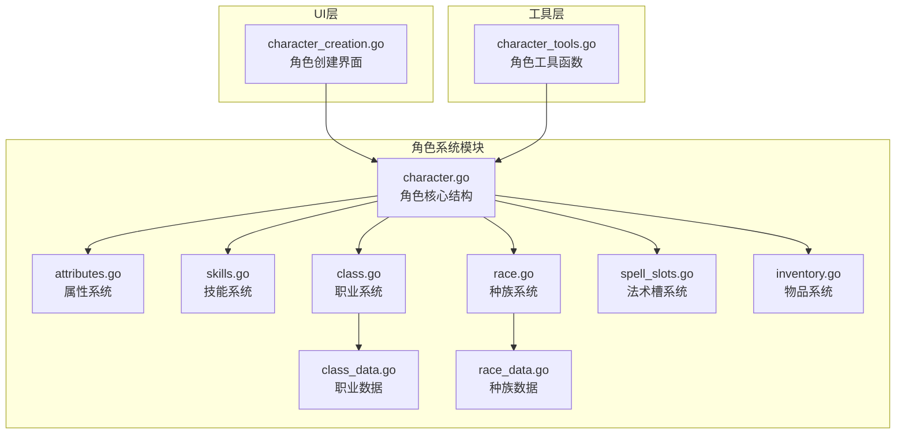

**图表来源**
- [character.go:1-223](file://internal/character/character.go#L1-L223)
- [attributes.go:1-142](file://internal/character/attributes.go#L1-L142)
- [skills.go:1-172](file://internal/character/skills.go#L1-L172)
- [class.go:1-118](file://internal/character/class.go#L1-L118)
- [race.go:1-94](file://internal/character/race.go#L1-L94)

**章节来源**
- [character.go:1-223](file://internal/character/character.go#L1-L223)
- [attributes.go:1-142](file://internal/character/attributes.go#L1-L142)

## 核心组件

### Character结构体设计

Character结构体是角色系统的核心，包含了D&D 5E角色的所有关键信息：

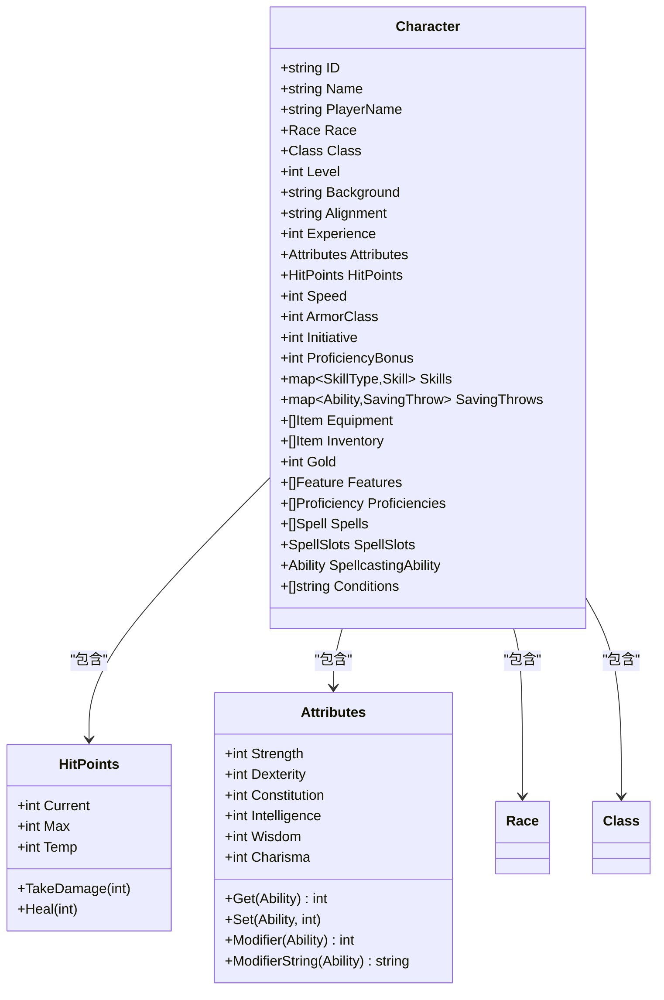

**图表来源**
- [character.go:8-61](file://internal/character/character.go#L8-L61)
- [character.go:102-107](file://internal/character/character.go#L102-L107)
- [attributes.go:22-30](file://internal/character/attributes.go#L22-L30)

### 基本信息字段

角色的基本信息字段提供了角色的标识和背景信息：

- **ID**: 唯一标识符，使用UUID生成
- **Name**: 角色名称
- **PlayerName**: 玩家名称（可选）
- **Race**: 种族信息
- **Class**: 职业信息
- **Level**: 角色等级，默认1级
- **Background**: 背景故事
- **Alignment**: 道德阵营
- **Experience**: 经验值

### 属性系统

属性系统实现了D&D 5E的标准属性计算：

```mermaid
flowchart TD
A[属性值输入] --> B[计算调整值]
B --> C[公式: floor((属性值-10)/2)]
C --> D[调整值显示]
E[点数购买验证] --> F[检查属性范围8-15]
F --> G[计算点数花费]
G --> H[验证总花费<=27]
H --> I[返回验证结果]
```

**图表来源**
- [attributes.go:82-96](file://internal/character/attributes.go#L82-L96)
- [attributes.go:126-141](file://internal/character/attributes.go#L126-L141)

**章节来源**
- [character.go:9-61](file://internal/character/character.go#L9-L61)
- [attributes.go:1-142](file://internal/character/attributes.go#L1-L142)

## 架构概览

角色系统的整体架构采用了分层设计，确保了模块间的低耦合和高内聚：

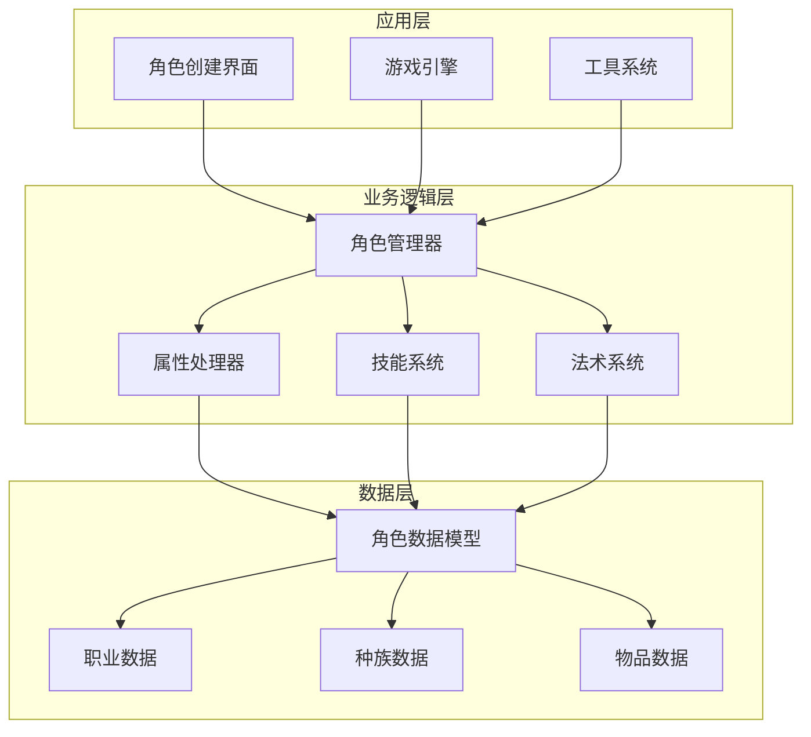

**图表来源**
- [character_creation.go:524-536](file://internal/ui/character_creation.go#L524-L536)
- [character.go:63-100](file://internal/character/character.go#L63-L100)

## 详细组件分析

### HitPoints结构体实现

HitPoints结构体专门负责角色生命值的管理，实现了复杂的伤害计算逻辑：

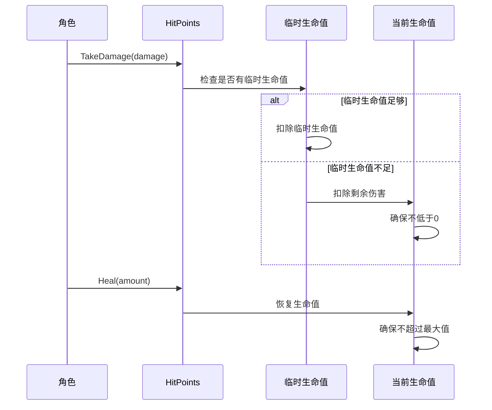

**图表来源**
- [character.go:109-133](file://internal/character/character.go#L109-L133)

#### 伤害处理机制

HitPoints的伤害处理遵循以下优先级：
1. **临时生命值优先**：总是先扣除临时生命值
2. **当前生命值**：临时生命值不足时扣除当前生命值
3. **最小值保护**：确保当前生命值不低于0

#### 恢复机制

生命值恢复时的限制：
- 恢复后的生命值不能超过最大生命值
- 临时生命值不会被恢复

**章节来源**
- [character.go:102-133](file://internal/character/character.go#L102-L133)

### 角色状态效果系统

角色状态效果系统提供了完整的条件状态管理功能：

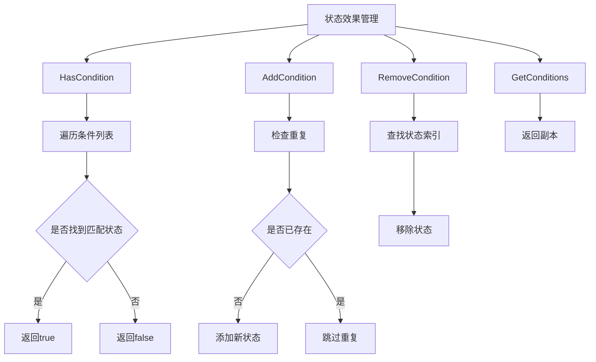

**图表来源**
- [character.go:190-222](file://internal/character/character.go#L190-L222)

#### 状态效果管理

状态效果系统支持的操作：
- **HasCondition**: 检查角色是否具有特定状态
- **AddCondition**: 添加新的状态效果（自动去重）
- **RemoveCondition**: 移除指定状态效果
- **GetConditions**: 获取状态效果的副本（避免外部修改）

**章节来源**
- [character.go:190-222](file://internal/character/character.go#L190-L222)

### 技能和熟练系统

技能系统实现了D&D 5E的复杂熟练机制：

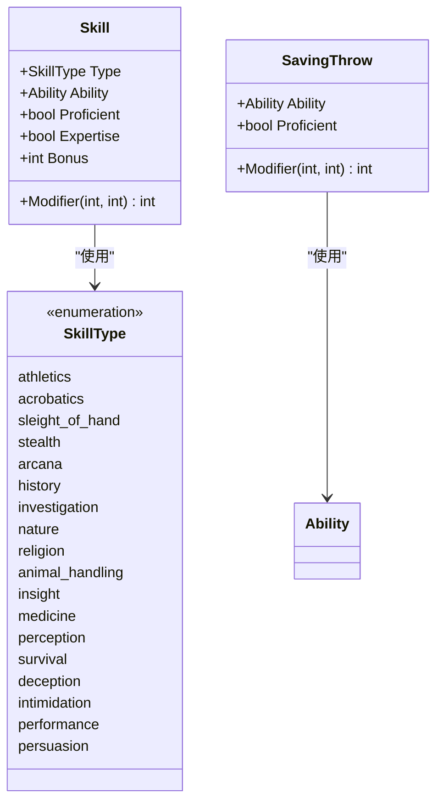

**图表来源**
- [skills.go:65-100](file://internal/character/skills.go#L65-L100)

#### 技能调整值计算

技能调整值的计算公式：
```
技能调整值 = 属性调整值 + 熟练加值 + 双倍熟练加值 + 杂项加值
```

其中：
- **属性调整值**: 基于相关属性计算
- **熟练加值**: 当角色具备熟练时生效
- **双倍熟练加值**: 当角色具备专精时生效
- **杂项加值**: 其他来源的加值

**章节来源**
- [skills.go:65-100](file://internal/character/skills.go#L65-L100)

### 职业系统

职业系统提供了完整的D&D 5E职业数据结构：

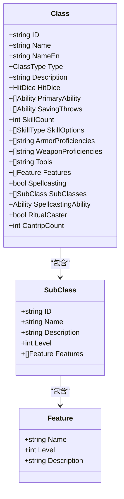

**图表来源**
- [class.go:47-69](file://internal/character/class.go#L47-L69)

#### 职业类型

系统支持的标准职业类型：
- **Barbarian**: 野蛮人
- **Bard**: 吟游诗人
- **Cleric**: 牧师
- **Druid**: 德鲁伊
- **Fighter**: 战士
- **Monk**: 武僧
- **Paladin**: 圣武士
- **Ranger**: 游侠
- **Rogue**: 游荡者
- **Sorcerer**: 术士
- **Warlock**: 邪术师
- **Wizard**: 法师

**章节来源**
- [class.go:13-29](file://internal/character/class.go#L13-L29)
- [class_data.go:3-637](file://internal/character/class_data.go#L3-L637)

### 种族系统

种族系统实现了详细的D&D 5E种族数据：

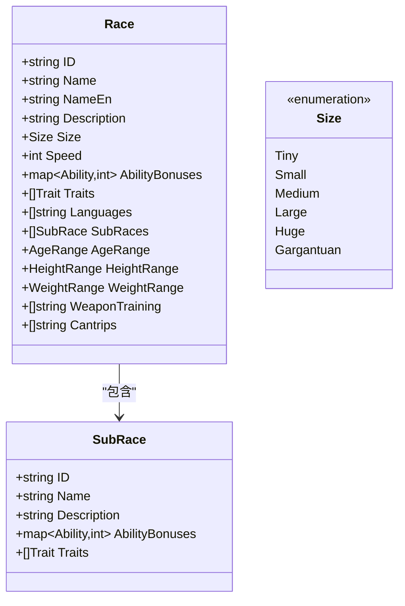

**图表来源**
- [race.go:44-62](file://internal/character/race.go#L44-L62)

#### 种族特性

系统支持的标准种族：
- **Human**: 人类（所有属性+1）
- **Elf**: 精灵（敏捷+2，黑暗视觉）
- **Dwarf**: 矮人（体质+2，矮人韧性）
- **Halfling**: 半身人（敏捷+2，幸运）
- **Dragonborn**: 龙裔（力量+2，魅力+1）
- **Gnome**: 侏儒（智力+2）
- **Half-Elf**: 半精灵（魅力+2）
- **Half-Orc**: 半兽人（力量+2，体质+1）
- **Tiefling**: 提夫林（智力+1，魅力+2）

**章节来源**
- [race.go:44-62](file://internal/character/race.go#L44-L62)
- [race_data.go:3-326](file://internal/character/race_data.go#L3-L326)

### 法术槽系统

法术槽系统根据不同的施法类型提供相应的法术位管理：

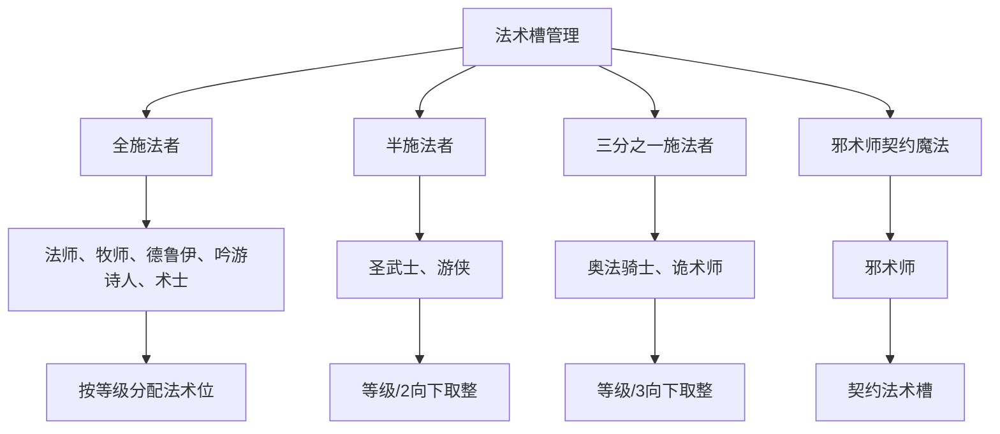

**图表来源**
- [spell_slots.go:89-195](file://internal/character/spell_slots.go#L89-L195)

**章节来源**
- [spell_slots.go:1-332](file://internal/character/spell_slots.go#L1-L332)

## 依赖分析

角色系统内部的依赖关系相对简单，主要通过组合关系连接各个组件：

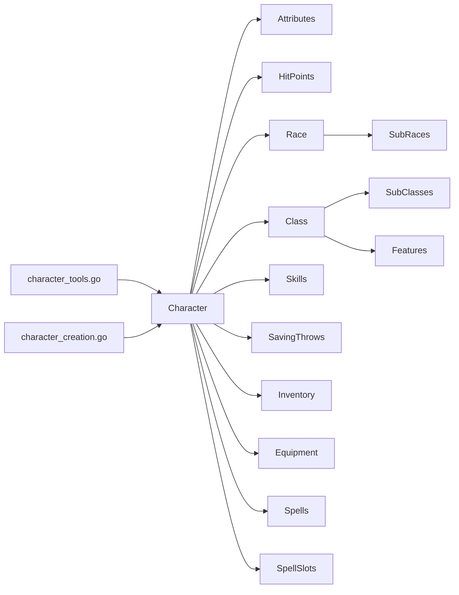

**图表来源**
- [character.go:8-61](file://internal/character/character.go#L8-L61)
- [character_tools.go:1-321](file://internal/tools/character_tools.go#L1-L321)

**章节来源**
- [character.go:1-223](file://internal/character/character.go#L1-L223)
- [character_tools.go:1-321](file://internal/tools/character_tools.go#L1-L321)

## 性能考虑

角色系统在设计时充分考虑了性能优化：

### 内存使用优化
- **结构体对齐**: 所有结构体字段经过精心排列以减少内存浪费
- **指针使用**: 大型数据结构（如切片）使用指针传递
- **字符串优化**: 常用字符串使用常量池存储

### 计算效率
- **属性调整值缓存**: 属性调整值计算使用高效的数学公式
- **技能计算优化**: 技能调整值计算避免不必要的重复计算
- **状态效果查找**: 使用线性搜索，对于一般情况足够高效

### 数据访问模式
- **局部性原则**: 相关数据字段尽量相邻存储
- **批量操作**: 提供批量初始化和更新功能

## 故障排除指南

### 常见问题及解决方案

#### 角色初始化失败
**问题**: NewCharacter函数创建的角色属性异常
**解决方案**: 
1. 检查DefaultAttributes函数的返回值
2. 确认属性值在8-15范围内
3. 验证点数购买总花费不超过27

#### 伤害计算错误
**问题**: TakeDamage函数导致生命值异常
**解决方案**:
1. 检查临时生命值是否正确扣除
2. 确认当前生命值不会低于0
3. 验证伤害值为正数

#### 技能熟练度问题
**问题**: HasSkillProficiency返回意外结果
**解决方案**:
1. 检查技能类型是否正确
2. 确认技能映射表完整性
3. 验证熟练标记设置

#### 法术槽计算错误
**问题**: GetSpellSlotsByType返回错误的法术位数量
**解决方案**:
1. 检查职业类型识别
2. 验证等级参数范围
3. 确认施法类型映射正确

**章节来源**
- [character.go:63-100](file://internal/character/character.go#L63-L100)
- [character.go:109-133](file://internal/character/character.go#L109-L133)

## 结论

CDND项目中的角色核心数据结构展现了优秀的软件工程实践，通过模块化设计、清晰的数据结构和完善的工具函数，为D&D 5E角色扮演提供了坚实的技术基础。系统的设计既满足了游戏性的需求，又保持了良好的可维护性和扩展性。

## 附录

### 角色数据初始化流程

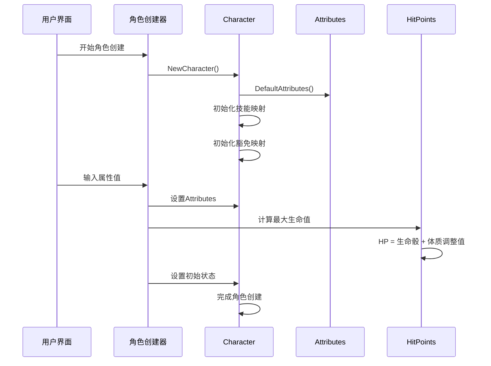

**图表来源**
- [character_creation.go:524-536](file://internal/ui/character_creation.go#L524-L536)
- [character.go:63-100](file://internal/character/character.go#L63-L100)

### 扩展指南

#### 新增职业类型
1. 在class.go中添加新的ClassType常量
2. 在class_data.go中添加职业数据
3. 更新NewCharacter函数以支持新职业
4. 添加相应的工具函数

#### 新增技能类型
1. 在skills.go中添加新的SkillType常量
2. 更新SkillAbility映射
3. 在NewCharacter函数中初始化新技能
4. 添加相应的工具函数

#### 新增状态效果
1. 在character.go中添加状态效果常量
2. 更新HasCondition、AddCondition等函数
3. 添加状态效果的可视化支持

#### 最佳实践
- **保持向后兼容**: 新增字段时提供默认值
- **数据验证**: 所有输入数据都要进行验证
- **错误处理**: 提供清晰的错误信息
- **文档更新**: 修改代码时同步更新文档
- **测试覆盖**: 为新功能编写单元测试