# 角色管理系统

<cite>
**本文档引用的文件**
- [internal/character/character.go](file://internal/character/character.go)
- [internal/character/attributes.go](file://internal/character/attributes.go)
- [internal/character/class.go](file://internal/character/class.go)
- [internal/character/class_data.go](file://internal/character/class_data.go)
- [internal/character/race.go](file://internal/character/race.go)
- [internal/character/race_data.go](file://internal/character/race_data.go)
- [internal/character/skills.go](file://internal/character/skills.go)
- [internal/character/inventory.go](file://internal/character/inventory.go)
- [internal/character/spell_slots.go](file://internal/character/spell_slots.go)
- [cmd/character.go](file://cmd/character.go)
- [internal/ui/character_creation.go](file://internal/ui/character_creation.go)
- [internal/tools/character_tools.go](file://internal/tools/character_tools.go)
- [internal/save/types.go](file://internal/save/types.go)
- [go.mod](file://go.mod)
</cite>

## 目录
1. [简介](#简介)
2. [项目结构](#项目结构)
3. [核心组件](#核心组件)
4. [架构概览](#架构概览)
5. [详细组件分析](#详细组件分析)
6. [依赖关系分析](#依赖关系分析)
7. [性能考量](#性能考量)
8. [故障排除指南](#故障排除指南)
9. [结论](#结论)
10. [附录](#附录)

## 简介
本文件为 CDND 项目中的角色管理系统技术文档，面向游戏设计师与开发者，系统性阐述 D&D 5e 角色系统的完整实现。内容涵盖角色属性计算、职业与子职业选择、种族与子种族特性、技能系统、装备与物品管理、法术系统、角色状态管理、角色创建与编辑流程、数据序列化与反序列化机制，以及角色平衡性考虑与扩展指南。

## 项目结构
角色管理相关代码主要位于 internal/character 目录，配合 CLI 命令、终端 UI、工具函数与存档系统协同工作：

- 角色核心数据结构与逻辑：internal/character/*.go
- 职业与子职业数据：internal/character/class_data.go
- 种族与子种族数据：internal/character/race_data.go
- CLI 角色命令：cmd/character.go
- 角色创建 UI：internal/ui/character_creation.go
- 角色工具函数（伤害、治疗、状态）：internal/tools/character_tools.go
- 存档与角色持久化：internal/save/types.go
- 依赖声明：go.mod

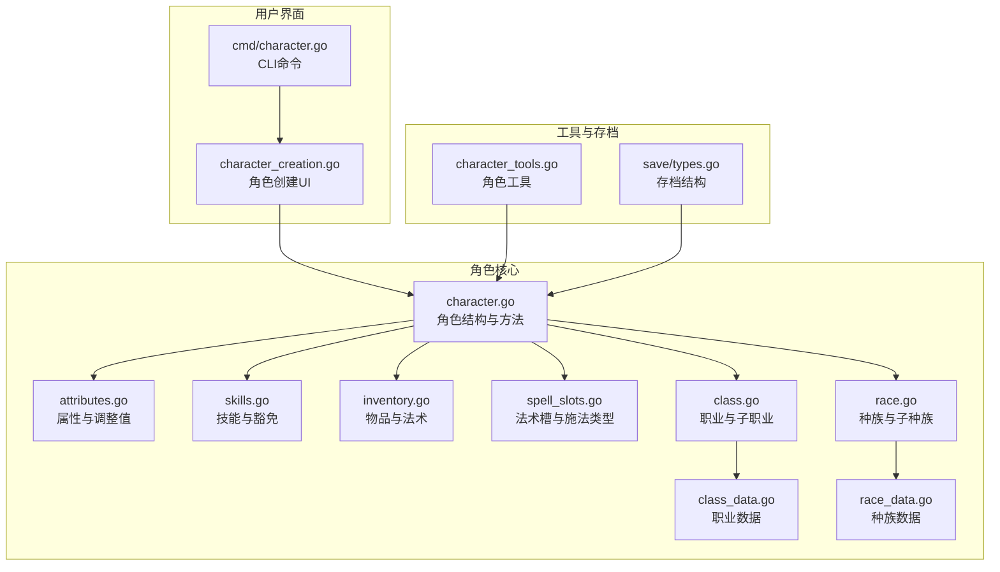

**图表来源**
- [internal/character/character.go:1-223](file://internal/character/character.go#L1-L223)
- [internal/character/attributes.go:1-142](file://internal/character/attributes.go#L1-L142)
- [internal/character/skills.go:1-172](file://internal/character/skills.go#L1-L172)
- [internal/character/inventory.go:1-138](file://internal/character/inventory.go#L1-L138)
- [internal/character/spell_slots.go:1-332](file://internal/character/spell_slots.go#L1-L332)
- [internal/character/race.go:1-94](file://internal/character/race.go#L1-L94)
- [internal/character/class.go:1-118](file://internal/character/class.go#L1-L118)
- [internal/character/class_data.go:1-677](file://internal/character/class_data.go#L1-L677)
- [internal/character/race_data.go:1-373](file://internal/character/race_data.go#L1-L373)
- [internal/ui/character_creation.go:1-537](file://internal/ui/character_creation.go#L1-L537)
- [cmd/character.go:1-99](file://cmd/character.go#L1-L99)
- [internal/tools/character_tools.go:1-321](file://internal/tools/character_tools.go#L1-L321)
- [internal/save/types.go:1-217](file://internal/save/types.go#L1-L217)

**章节来源**
- [internal/character/character.go:1-223](file://internal/character/character.go#L1-L223)
- [internal/character/attributes.go:1-142](file://internal/character/attributes.go#L1-L142)
- [internal/character/skills.go:1-172](file://internal/character/skills.go#L1-L172)
- [internal/character/inventory.go:1-138](file://internal/character/inventory.go#L1-L138)
- [internal/character/spell_slots.go:1-332](file://internal/character/spell_slots.go#L1-L332)
- [internal/character/race.go:1-94](file://internal/character/race.go#L1-L94)
- [internal/character/class.go:1-118](file://internal/character/class.go#L1-L118)
- [internal/character/class_data.go:1-677](file://internal/character/class_data.go#L1-L677)
- [internal/character/race_data.go:1-373](file://internal/character/race_data.go#L1-L373)
- [internal/ui/character_creation.go:1-537](file://internal/ui/character_creation.go#L1-L537)
- [cmd/character.go:1-99](file://cmd/character.go#L1-L99)
- [internal/tools/character_tools.go:1-321](file://internal/tools/character_tools.go#L1-L321)
- [internal/save/types.go:1-217](file://internal/save/types.go#L1-L217)

## 核心组件
本节概述角色系统的关键数据结构与方法，帮助快速理解角色数据模型与行为。

- 角色结构（Character）
  - 基本信息：ID、姓名、玩家名、种族、职业、等级、背景、阵营、经验值
  - 属性与调整值：Attributes、Modifier、ModifierString
  - 生命值：HitPoints（当前值、最大值、临时值）
  - 防御与先攻：ArmorClass、Initiative、Speed
  - 熟练度：ProficiencyBonus
  - 技能与豁免：Skills（含熟练与专精）、SavingThrows
  - 装备与物品：Equipment、Inventory、Gold
  - 特性与熟练：Features、Proficiencies
  - 法术系统：Spells、SpellSlots、SpellcastingAbility
  - 状态效果：Conditions
  - 关键方法：NewCharacter、TakeDamage、Heal、HasSkillProficiency、HasSavingThrowProficiency、GetSkillModifier、GetSavingThrowModifier、SetSkillProficiency、SetSavingThrowProficiency、HasClass、HasCondition、AddCondition、RemoveCondition、GetConditions

- 属性系统（Attributes）
  - 六项属性：Strength、Dexterity、Constitution、Intelligence、Wisdom、Charisma
  - 默认值：全部为 10
  - 调整值计算：(属性值 - 10) / 2 下取整
  - 点数购买成本与验证：PointBuyCost、StandardPointBuyTotal、ValidatePointBuy

- 技能与豁免（Skills）
  - 技能类型：14 种技能，对应不同属性
  - 豁免类型：6 种属性豁免
  - 技能结构：Skill（熟练、专精、杂项加值）
  - 豁免结构：SavingThrow（熟练）
  - 计算公式：技能调整值 = 属性调整值 + 熟练加值（若熟练）+ 专精加值（若专精）+ 杂项加值；豁免调整值 = 属性调整值 + 熟练加值（若熟练）

- 装备与物品（Inventory）
  - 物品结构：Item（ID、名称、描述、类型、重量、价值、数量、稀有度、附灵、属性）
  - 物品类型：武器、护甲、盾牌、药水、卷轴、法器、戒指、杆、杖、异珍、弹药、工具、杂项、宝藏
  - 稀有度：常见、罕见、稀有、极稀有、传奇、神器
  - 背包容量与总重量：Inventory（Items、Capacity）、GetTotalWeight
  - 物品操作：AddItem（支持堆叠）、RemoveItem

- 法术系统（SpellSlots）
  - 法术槽结构：SpellSlots（1-9环槽位）
  - 施法类型：全施法者、半施法者、契约魔法（邪术师）、三分之一施法者
  - 成长表：全施法者、半施法者、三分之一施法者、邪术师契约魔法
  - 辅助函数：GetFullCasterSlots、GetHalfCasterSlots、GetThirdCasterSlots、GetWarlockPactSlots、GetSpellSlotsByType、GetCasterType、MaxSpellLevel、GetSpellLevelName、GetSchoolName

- 种族与子种族（Race/SubRace）
  - 种族结构：Race（ID、名称、英文名、描述、体型、速度、属性加值、特性、语言、子种族、年龄/身高/体重范围、武器训练、天生戏法）
  - 子种族结构：SubRace（ID、名称、描述、属性加值、特性）
  - 数据来源：StandardRaces（包含人类至提夫林等 9 个基础种族及其子种族）

- 职业与子职业（Class/SubClass）
  - 职业结构：Class（ID、名称、英文名、类型、描述、生命骰、主属性、豁免、技能数量、技能选项、护甲/武器/工具熟练、特性、施法能力、子职业、施法属性、仪式施法、戏法数量）
  - 子职业结构：SubClass（ID、名称、描述、可选等级、特性）
  - 数据来源：StandardClasses（包含 12 个官方职业及其子职业）

- 角色创建与编辑
  - CLI 命令：character create/list/delete/show
  - 终端 UI：CharacterCreationModel（步骤化创建：名称、种族、子种族、职业、子职业、属性、技能、确认）
  - 创建流程：NewCharacter 初始化默认值，UI 收集输入后生成角色对象

- 角色工具与状态
  - 工具：伤害、治疗、添加/移除状态
  - 状态：Conditions 列表（失明、魅惑、耳聋、恐惧、擒抱、束缚、失能、隐形、中毒、倒地、震慑、昏迷）

- 存档与序列化
  - 存档结构：SaveData（包含角色、场景、NPC、任务、对话历史、战斗状态等）
  - 角色持久化：SaveData 中的 Character 字段

**章节来源**
- [internal/character/character.go:1-223](file://internal/character/character.go#L1-L223)
- [internal/character/attributes.go:1-142](file://internal/character/attributes.go#L1-L142)
- [internal/character/skills.go:1-172](file://internal/character/skills.go#L1-L172)
- [internal/character/inventory.go:1-138](file://internal/character/inventory.go#L1-L138)
- [internal/character/spell_slots.go:1-332](file://internal/character/spell_slots.go#L1-L332)
- [internal/character/race.go:1-94](file://internal/character/race.go#L1-L94)
- [internal/character/class.go:1-118](file://internal/character/class.go#L1-L118)
- [internal/character/class_data.go:1-677](file://internal/character/class_data.go#L1-L677)
- [internal/character/race_data.go:1-373](file://internal/character/race_data.go#L1-L373)
- [cmd/character.go:1-99](file://cmd/character.go#L1-L99)
- [internal/ui/character_creation.go:1-537](file://internal/ui/character_creation.go#L1-L537)
- [internal/tools/character_tools.go:1-321](file://internal/tools/character_tools.go#L1-L321)
- [internal/save/types.go:1-217](file://internal/save/types.go#L1-L217)

## 架构概览
角色系统采用分层设计，核心数据结构位于 internal/character，UI 与命令层负责交互，工具层提供运行时操作，存档层负责持久化。

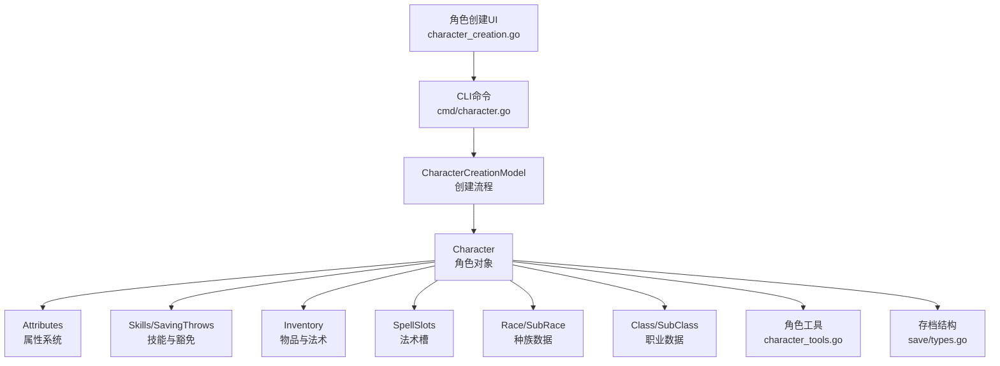

**图表来源**
- [internal/ui/character_creation.go:1-537](file://internal/ui/character_creation.go#L1-L537)
- [cmd/character.go:1-99](file://cmd/character.go#L1-L99)
- [internal/character/character.go:1-223](file://internal/character/character.go#L1-L223)
- [internal/character/attributes.go:1-142](file://internal/character/attributes.go#L1-L142)
- [internal/character/skills.go:1-172](file://internal/character/skills.go#L1-L172)
- [internal/character/inventory.go:1-138](file://internal/character/inventory.go#L1-L138)
- [internal/character/spell_slots.go:1-332](file://internal/character/spell_slots.go#L1-L332)
- [internal/character/race.go:1-94](file://internal/character/race.go#L1-L94)
- [internal/character/class.go:1-118](file://internal/character/class.go#L1-L118)
- [internal/tools/character_tools.go:1-321](file://internal/tools/character_tools.go#L1-L321)
- [internal/save/types.go:1-217](file://internal/save/types.go#L1-L217)

## 详细组件分析

### 角色数据结构与字段含义
- 基本信息字段：ID（唯一标识）、Name（角色名）、PlayerName（玩家名）、Race（种族）、Class（职业）、Level（等级）、Background（背景）、Alignment（阵营）、Experience（经验值）
- 属性与调整值：Attributes（六项属性值）、Modifier（属性调整值）、ModifierString（带符号字符串）
- 生命值：HitPoints（Current、Max、Temp），支持 TakeDamage 与 Heal
- 防御与先攻：ArmorClass、Initiative、Speed
- 熟练度：ProficiencyBonus（熟练加值）
- 技能与豁免：Skills（Skill 结构，含熟练、专精、杂项加值）、SavingThrows（SavingThrow 结构，含熟练）
- 装备与物品：Equipment（已装备物品）、Inventory（背包物品）、Gold（金币）
- 特性与熟练：Features（职业/子职业特性）、Proficiencies（护甲/武器/工具/语言/技能/豁免熟练）
- 法术系统：Spells（法术列表）、SpellSlots（法术槽）、SpellcastingAbility（施法属性）
- 状态效果：Conditions（状态列表）

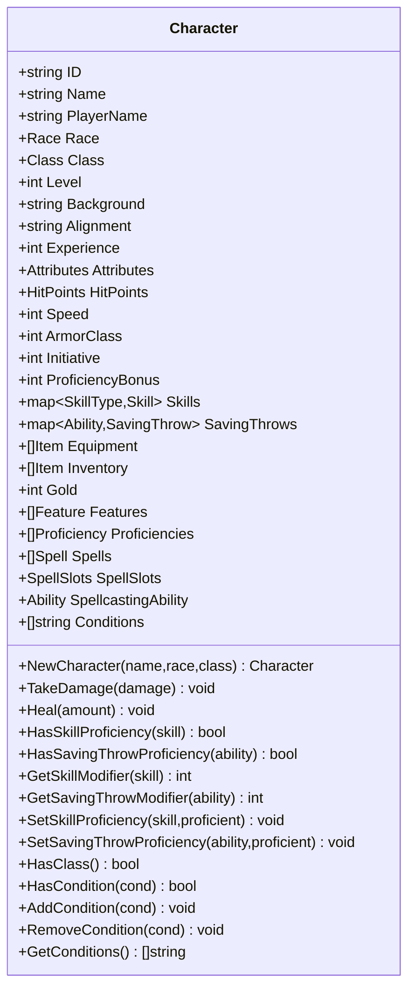

**图表来源**
- [internal/character/character.go:1-223](file://internal/character/character.go#L1-L223)

**章节来源**
- [internal/character/character.go:1-223](file://internal/character/character.go#L1-L223)

### 属性系统与点数购买
- 属性值范围：8-15
- 点数购买成本：8=0、9=1、10=2、11=3、12=4、13=5、14=7、15=9
- 总预算：27 点
- 验证：ValidatePointBuy 返回是否符合规则及总花费

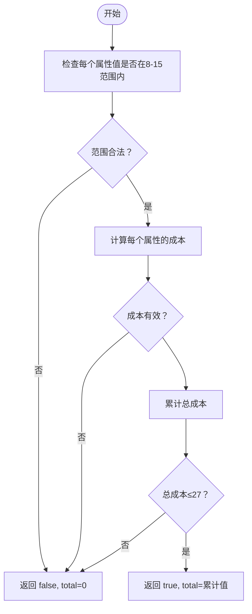

**图表来源**
- [internal/character/attributes.go:126-141](file://internal/character/attributes.go#L126-L141)

**章节来源**
- [internal/character/attributes.go:1-142](file://internal/character/attributes.go#L1-L142)

### 技能系统与熟练机制
- 技能类型与对应属性：力量（运动）、敏捷（体操、手法、隐匿）、智力（奥秘、历史、调查、自然、宗教）、感知（驯兽、洞察、医药、察觉、求生）、魅力（欺瞒、威吓、表演、说服）
- 技能结构：Skill（Type、Ability、Proficient、Expertise、Bonus）
- 豁免结构：SavingThrow（Ability、Proficient）
- 计算公式：
  - 技能调整值 = 属性调整值 + 熟练加值（熟练）+ 专精加值（专精）+ 杂项加值
  - 豁免调整值 = 属性调整值 + 熟练加值（熟练）

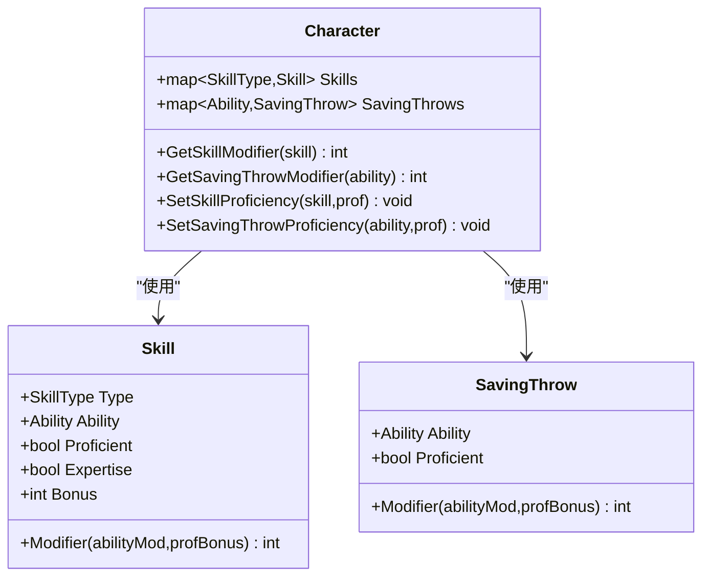

**图表来源**
- [internal/character/skills.go:65-100](file://internal/character/skills.go#L65-L100)
- [internal/character/character.go:151-183](file://internal/character/character.go#L151-L183)

**章节来源**
- [internal/character/skills.go:1-172](file://internal/character/skills.go#L1-L172)
- [internal/character/character.go:151-183](file://internal/character/character.go#L151-L183)

### 装备与物品管理
- 物品结构：Item（ID、名称、描述、类型、重量、价值、数量、稀有度、附灵、属性）
- 物品类型覆盖武器、护甲、饰品、药水、卷轴、法器、弹药、工具、杂项、宝藏
- 背包装载：Inventory（Items、Capacity），支持按 ID 堆叠（除武器/护甲外）
- 物品操作：AddItem（合并堆叠）、RemoveItem（移除整堆或减少数量）、GetTotalWeight（总重量）

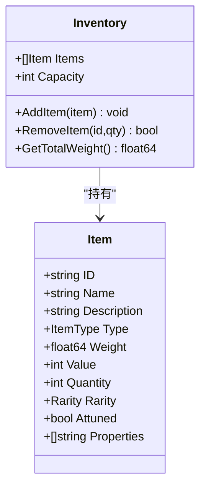

**图表来源**
- [internal/character/inventory.go:3-100](file://internal/character/inventory.go#L3-L100)

**章节来源**
- [internal/character/inventory.go:1-138](file://internal/character/inventory.go#L1-L138)

### 法术系统与施法类型
- 法术槽结构：SpellSlots（1-9环槽位）
- 施法类型：
  - 全施法者：法师、牧师、德鲁伊、吟游诗人、术士
  - 半施法者：圣武士、游侠（等级/2 向下取整）
  - 契约魔法：邪术师（PactSlots）
  - 三分之一施法者：奥法骑士、诡术师（等级/3 向下取整）
- 成长表：提供各等级对应的法术槽数量
- 辅助函数：根据职业 ID 获取施法类型、查询指定等级的法术槽、计算最高可用环阶

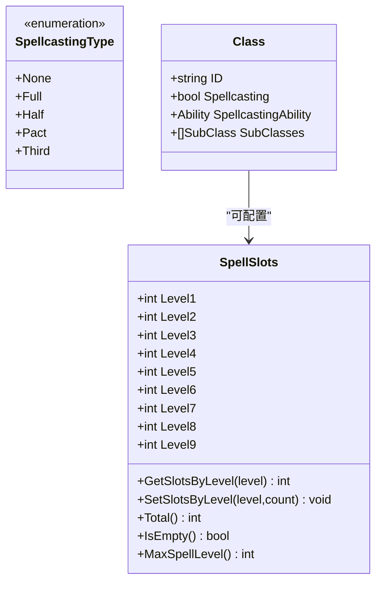

**图表来源**
- [internal/character/spell_slots.go:3-82](file://internal/character/spell_slots.go#L3-L82)
- [internal/character/spell_slots.go:197-257](file://internal/character/spell_slots.go#L197-L257)
- [internal/character/class.go:47-69](file://internal/character/class.go#L47-L69)

**章节来源**
- [internal/character/spell_slots.go:1-332](file://internal/character/spell_slots.go#L1-L332)
- [internal/character/class.go:1-118](file://internal/character/class.go#L1-L118)

### 种族与子种族系统
- 种族结构：Race（ID、名称、英文名、描述、体型、速度、属性加值、特性、语言、子种族、年龄/身高/体重范围、武器训练、天生戏法）
- 子种族结构：SubRace（ID、名称、描述、属性加值、特性）
- 数据来源：StandardRaces（人类至提夫林，含子种族与特性）
- 选择流程：种族 → 子种族（可选）→ 职业 → 子职业（可选）

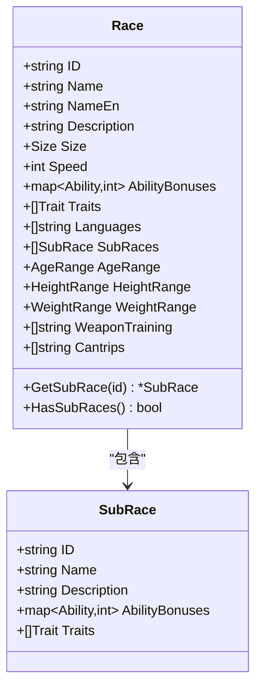

**图表来源**
- [internal/character/race.go:44-94](file://internal/character/race.go#L44-L94)
- [internal/character/race_data.go:5-343](file://internal/character/race_data.go#L5-L343)

**章节来源**
- [internal/character/race.go:1-94](file://internal/character/race.go#L1-L94)
- [internal/character/race_data.go:1-373](file://internal/character/race_data.go#L1-L373)

### 职业与子职业系统
- 职业结构：Class（ID、名称、英文名、类型、描述、生命骰、主属性、豁免、技能数量、技能选项、护甲/武器/工具熟练、特性、施法能力、子职业、施法属性、仪式施法、戏法数量）
- 子职业结构：SubClass（ID、名称、描述、可选等级、特性）
- 数据来源：StandardClasses（12 个官方职业及其子职业）
- 选择流程：职业 → 子职业（可选）→ 属性分配 → 技能选择

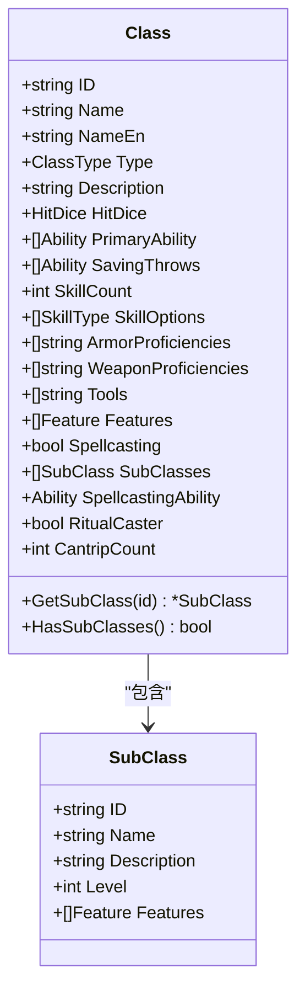

**图表来源**
- [internal/character/class.go:47-118](file://internal/character/class.go#L47-L118)
- [internal/character/class_data.go:3-677](file://internal/character/class_data.go#L3-L677)

**章节来源**
- [internal/character/class.go:1-118](file://internal/character/class.go#L1-L118)
- [internal/character/class_data.go:1-677](file://internal/character/class_data.go#L1-L677)

### 角色创建流程与编辑功能
- CLI 命令：character create（交互式创建）、character list（列出角色）、character delete（删除角色）、character show（显示详情）
- 终端 UI：CharacterCreationModel（步骤化界面）
  - 步骤：名称 → 种族 → 子种族（可选）→ 职业 → 子职业（可选）→ 属性 → 技能 → 确认
  - 名称校验：非空
  - 属性初始化：基于种族加值，默认 10
  - HP 计算：生命骰 + 体质调整值
- 创建完成：NewCharacter 初始化默认值，UI 收集输入后生成角色对象

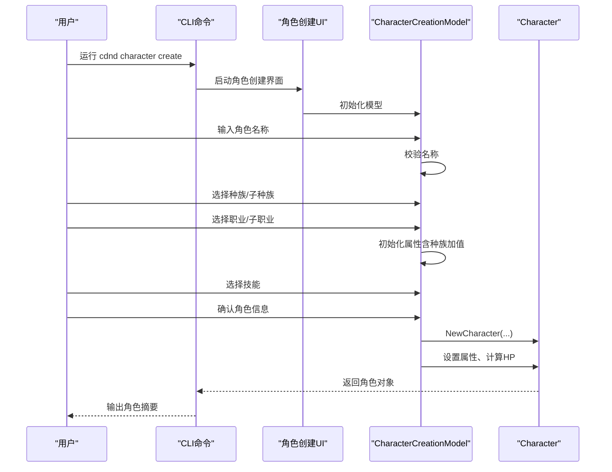

**图表来源**
- [cmd/character.go:21-52](file://cmd/character.go#L21-L52)
- [internal/ui/character_creation.go:74-88](file://internal/ui/character_creation.go#L74-L88)
- [internal/ui/character_creation.go:524-537](file://internal/ui/character_creation.go#L524-L537)
- [internal/character/character.go:63-100](file://internal/character/character.go#L63-L100)

**章节来源**
- [cmd/character.go:1-99](file://cmd/character.go#L1-L99)
- [internal/ui/character_creation.go:1-537](file://internal/ui/character_creation.go#L1-L537)
- [internal/character/character.go:63-100](file://internal/character/character.go#L63-L100)

### 角色状态管理（当前生命值、临时生命值、条件状态）
- 当前生命值与临时生命值：HitPoints（Current、Max、Temp）
  - TakeDamage：优先扣除 Temp，不足再扣 Current，Current 不得小于 0
  - Heal：恢复 Current，不超过 Max
- 条件状态：Conditions（字符串列表）
  - HasCondition、AddCondition、RemoveCondition、GetConditions

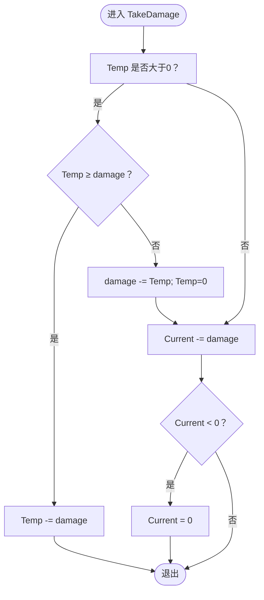

**图表来源**
- [internal/character/character.go:109-125](file://internal/character/character.go#L109-L125)

**章节来源**
- [internal/character/character.go:102-223](file://internal/character/character.go#L102-L223)

### 角色数据的序列化与反序列化机制
- 角色结构使用 JSON 标签，便于序列化与反序列化
- 存档结构 SaveData 包含角色、场景、NPC、任务、对话历史、战斗状态等
- 依赖库：go.mod 中包含 github.com/google/uuid（用于角色 ID）

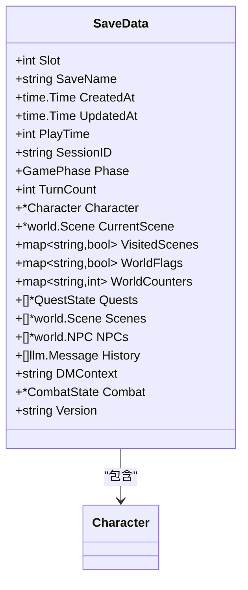

**图表来源**
- [internal/save/types.go:110-147](file://internal/save/types.go#L110-L147)
- [internal/character/character.go:8-61](file://internal/character/character.go#L8-L61)

**章节来源**
- [internal/save/types.go:1-217](file://internal/save/types.go#L1-L217)
- [go.mod:1-55](file://go.mod#L1-L55)

### 角色平衡性考虑与规则实现细节
- 熟练加值：固定为 2（第 1 级），随等级提升由规则决定（当前实现固定）
- 点数购买：限制属性范围与总预算，确保平衡
- 施法类型：按职业类型分配法术槽成长表，避免过强或过弱
- 技能与豁免：技能数量与选项由职业决定，保证多样性与策略性
- 装备与护甲：护甲/武器/工具熟练限制，避免过度泛用

**章节来源**
- [internal/character/character.go:63-100](file://internal/character/character.go#L63-L100)
- [internal/character/attributes.go:123-141](file://internal/character/attributes.go#L123-L141)
- [internal/character/spell_slots.go:197-257](file://internal/character/spell_slots.go#L197-L257)
- [internal/character/class.go:56-68](file://internal/character/class.go#L56-L68)

### 角色相关的工具函数与辅助方法
- 伤害工具：DealDamageTool（对玩家或 NPC 造成伤害，更新 HP 与叙述）
- 治疗工具：HealCharacterTool（治疗玩家，更新 HP 与叙述）
- 状态工具：AddConditionTool、RemoveConditionTool（添加/移除状态，支持持续时间）
- 辅助函数：GetSkillName、GetAbilityName、GetSpellLevelName、GetSchoolName

**章节来源**
- [internal/tools/character_tools.go:1-321](file://internal/tools/character_tools.go#L1-L321)
- [internal/character/skills.go:142-172](file://internal/character/skills.go#L142-L172)
- [internal/character/spell_slots.go:291-332](file://internal/character/spell_slots.go#L291-L332)

### 扩展指南（面向游戏设计师与开发者）
- 新增职业：在 StandardClasses 中添加 Class 定义，包含子职业、施法属性、戏法数量等
- 新增种族：在 StandardRaces 中添加 Race 定义，包含子种族与特性
- 新增技能：在技能枚举中添加新技能，完善 SkillAbility 映射与中文名称
- 新增物品：在物品类型枚举中添加新类型，完善物品属性与处理逻辑
- 新增法术：在 Spell 结构中扩展字段，完善法术系统与施法类型
- 新增状态：在 AddConditionTool/RemoveConditionTool 中扩展状态枚举
- 新增存档字段：在 SaveData 中添加新字段，注意版本兼容性

**章节来源**
- [internal/character/class_data.go:1-677](file://internal/character/class_data.go#L1-L677)
- [internal/character/race_data.go:1-373](file://internal/character/race_data.go#L1-L373)
- [internal/character/skills.go:1-172](file://internal/character/skills.go#L1-L172)
- [internal/character/inventory.go:1-138](file://internal/character/inventory.go#L1-L138)
- [internal/character/spell_slots.go:1-332](file://internal/character/spell_slots.go#L1-L332)
- [internal/tools/character_tools.go:1-321](file://internal/tools/character_tools.go#L1-L321)
- [internal/save/types.go:1-217](file://internal/save/types.go#L1-L217)

## 依赖关系分析
角色系统依赖关系清晰，核心模块之间耦合度低，职责明确。

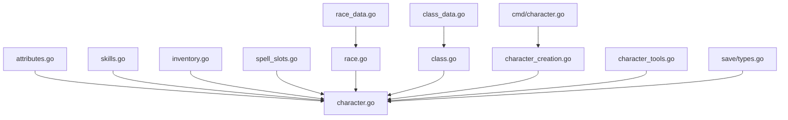

**图表来源**
- [internal/character/character.go:1-223](file://internal/character/character.go#L1-L223)
- [internal/character/attributes.go:1-142](file://internal/character/attributes.go#L1-L142)
- [internal/character/skills.go:1-172](file://internal/character/skills.go#L1-L172)
- [internal/character/inventory.go:1-138](file://internal/character/inventory.go#L1-L138)
- [internal/character/spell_slots.go:1-332](file://internal/character/spell_slots.go#L1-L332)
- [internal/character/race.go:1-94](file://internal/character/race.go#L1-L94)
- [internal/character/class.go:1-118](file://internal/character/class.go#L1-L118)
- [internal/character/class_data.go:1-677](file://internal/character/class_data.go#L1-L677)
- [internal/character/race_data.go:1-373](file://internal/character/race_data.go#L1-L373)
- [internal/ui/character_creation.go:1-537](file://internal/ui/character_creation.go#L1-L537)
- [cmd/character.go:1-99](file://cmd/character.go#L1-L99)
- [internal/tools/character_tools.go:1-321](file://internal/tools/character_tools.go#L1-L321)
- [internal/save/types.go:1-217](file://internal/save/types.go#L1-L217)

**章节来源**
- [internal/character/character.go:1-223](file://internal/character/character.go#L1-L223)
- [internal/character/attributes.go:1-142](file://internal/character/attributes.go#L1-L142)
- [internal/character/skills.go:1-172](file://internal/character/skills.go#L1-L172)
- [internal/character/inventory.go:1-138](file://internal/character/inventory.go#L1-L138)
- [internal/character/spell_slots.go:1-332](file://internal/character/spell_slots.go#L1-L332)
- [internal/character/race.go:1-94](file://internal/character/race.go#L1-L94)
- [internal/character/class.go:1-118](file://internal/character/class.go#L1-L118)
- [internal/character/class_data.go:1-677](file://internal/character/class_data.go#L1-L677)
- [internal/character/race_data.go:1-373](file://internal/character/race_data.go#L1-L373)
- [internal/ui/character_creation.go:1-537](file://internal/ui/character_creation.go#L1-L537)
- [cmd/character.go:1-99](file://cmd/character.go#L1-L99)
- [internal/tools/character_tools.go:1-321](file://internal/tools/character_tools.go#L1-L321)
- [internal/save/types.go:1-217](file://internal/save/types.go#L1-L217)

## 性能考量
- 属性与技能计算：O(1)，调用频繁但开销极小
- 法术槽查询：按等级查表 O(1)
- 背包物品操作：AddItem/RemoveItem 需遍历 Items，建议在大量物品时优化为哈希索引
- 序列化：JSON 标签简单，建议在高频写入时考虑二进制格式（如 CBOR/Protobuf）以降低体积与 CPU 开销

## 故障排除指南
- 角色创建失败
  - 检查名称是否为空
  - 检查种族/职业选择是否正确
  - 检查属性分配是否符合点数购买规则
- 生命值异常
  - 确认 TakeDamage/Heal 调用顺序与参数
  - 检查临时生命值是否正确扣除
- 法术槽不正确
  - 确认职业类型与施法类型匹配
  - 检查等级对应的法术槽成长表
- 状态管理问题
  - 检查状态名称是否在允许列表中
  - 检查状态添加/移除逻辑

**章节来源**
- [internal/ui/character_creation.go:142-202](file://internal/ui/character_creation.go#L142-L202)
- [internal/character/character.go:109-133](file://internal/character/character.go#L109-L133)
- [internal/character/attributes.go:126-141](file://internal/character/attributes.go#L126-L141)
- [internal/character/spell_slots.go:229-257](file://internal/character/spell_slots.go#L229-L257)
- [internal/tools/character_tools.go:200-261](file://internal/tools/character_tools.go#L200-L261)

## 结论
CDND 的角色管理系统以清晰的数据结构与模块化设计为基础，完整实现了 D&D 5e 的角色属性、技能、装备、法术与状态管理，并提供了直观的 CLI 与终端 UI 交互方式。通过标准化的职业与种族数据、严格的点数购买规则与施法类型表，系统在可玩性与平衡性之间取得了良好折中。建议在未来版本中进一步优化大规模物品操作性能，并引入更丰富的扩展接口以支持自定义内容与规则变体。

## 附录
- 术语对照
  - 属性：Strength、Dexterity、Constitution、Intelligence、Wisdom、Charisma
  - 技能：Athletics、Acrobatics、SleightOfHand、Stealth、Arcana、History、Investigation、Nature、Religion、AnimalHandling、Insight、Medicine、Perception、Survival、Deception、Intimidation、Performance、Persuasion
  - 法术学派：Abjuration、Conjuration、Divination、Enchantment、Evocation、Illusion、Necromancy、Transmutation
  - 施法类型：Full、Half、Pact、Third
  - 物品类型：Weapon、Armor、Shield、Potion、Scroll、Wand、Ring、Rod、Staff、WondrousItem、Ammunition、Tool、Gear、Treasure
  - 稀有度：Common、Uncommon、Rare、VeryRare、Legendary、Artifact
  - 状态：Blinded、Charmed、Deafened、Frightened、Grappled、Restrained、Unconscious、Poisoned、Invisible、Paralyzed、Stunned、KnockedDown