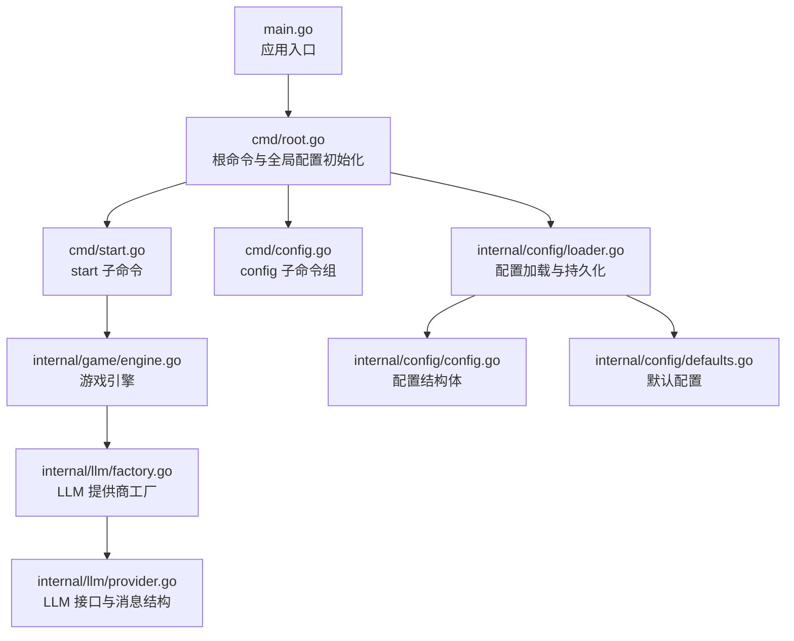
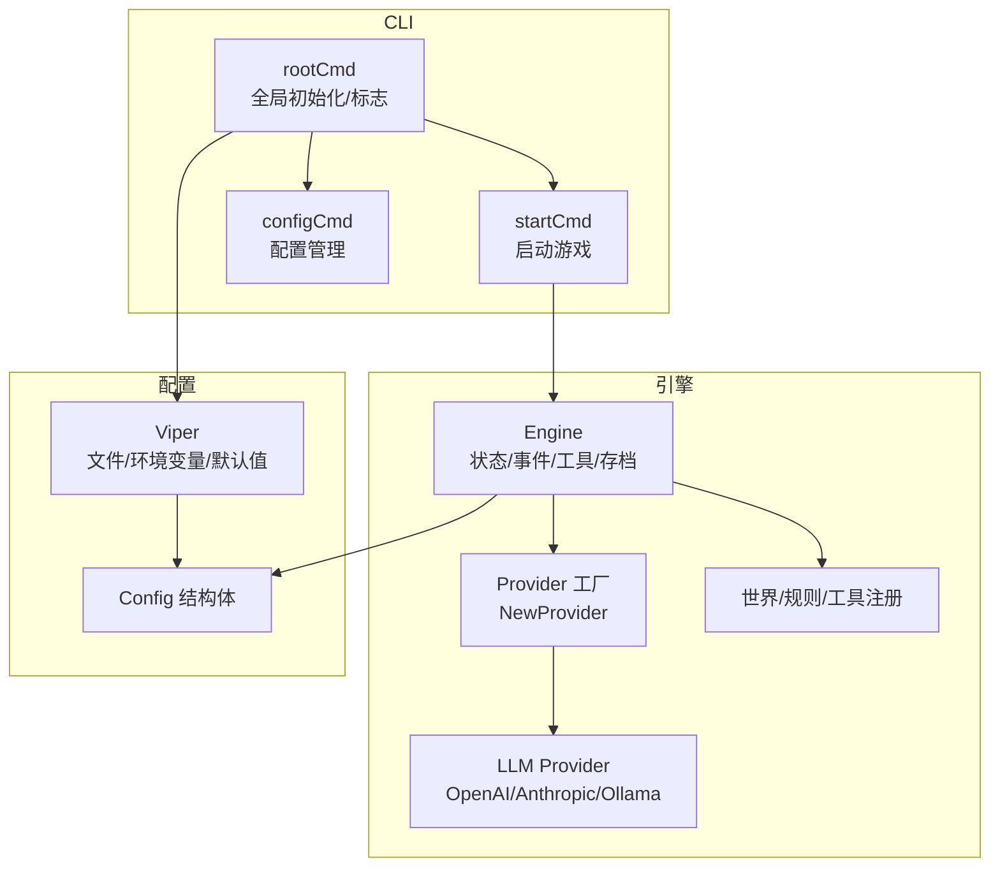
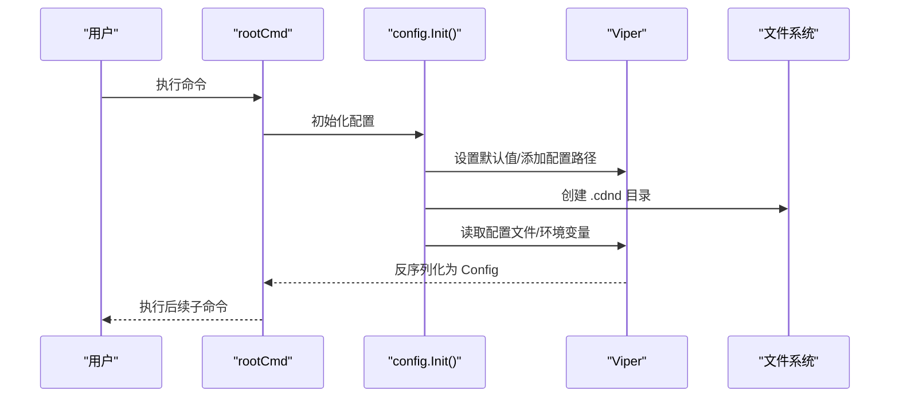
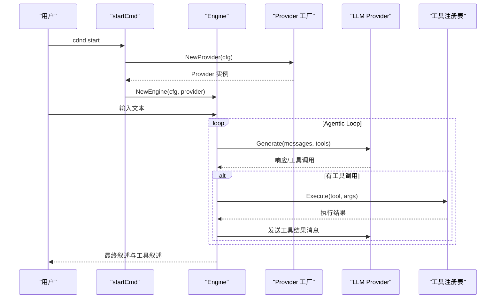
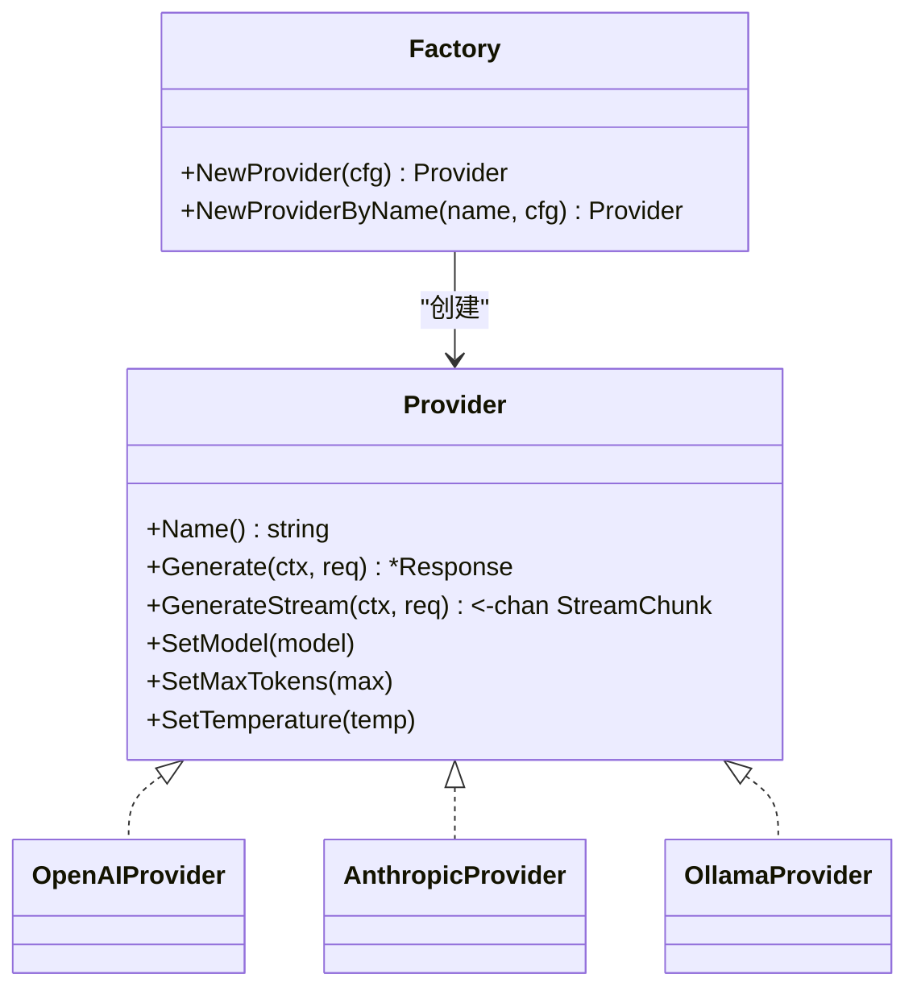
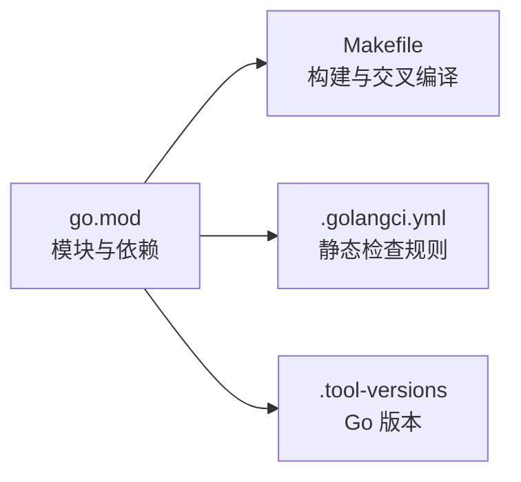

# 部署与运维

<cite>
**本文引用的文件**
- [main.go](file://main.go)
- [go.mod](file://go.mod)
- [Makefile](file://Makefile)
- [.golangci.yml](file://.golangci.yml)
- [.tool-versions](file://.tool-versions)
- [config.example.yaml](file://config.example.yaml)
- [cmd/root.go](file://cmd/root.go)
- [cmd/start.go](file://cmd/start.go)
- [cmd/config.go](file://cmd/config.go)
- [internal/config/config.go](file://internal/config/config.go)
- [internal/config/loader.go](file://internal/config/loader.go)
- [internal/config/defaults.go](file://internal/config/defaults.go)
- [internal/llm/provider.go](file://internal/llm/provider.go)
- [internal/llm/factory.go](file://internal/llm/factory.go)
- [internal/game/engine.go](file://internal/game/engine.go)
</cite>

## 目录
1. [简介](#简介)
2. [项目结构](#项目结构)
3. [核心组件](#核心组件)
4. [架构总览](#架构总览)
5. [详细组件分析](#详细组件分析)
6. [依赖分析](#依赖分析)
7. [性能考虑](#性能考虑)
8. [故障排除指南](#故障排除指南)
9. [结论](#结论)
10. [附录](#附录)

## 简介
本文件面向运维与平台工程团队，提供 CDND 项目的部署与运维指南。内容涵盖构建流程与依赖管理、多环境部署策略、性能调优与资源优化、日志与监控配置、容器化与 Kubernetes 部署、备份与灾难恢复、安全加固与漏洞防护、故障排除与性能监控工具、以及版本发布与更新流程。文档基于仓库源码进行分析，确保与实际实现一致。

## 项目结构
CDND 采用模块化分层组织：
- cmd 层：CLI 命令入口与子命令（启动、配置管理等）
- internal 子包：业务内核（配置、LLM 提供商抽象、游戏引擎、工具注册、UI、世界与规则等）
- pkg：通用库（如骰子与规则相关）
- data/scenarios/docs：数据与文档资源
- 根目录：构建与质量保障配置（go.mod、Makefile、.golangci.yml、.tool-versions）

图表来源
- [main.go:1-8](file://main.go#L1-L8)
- [cmd/root.go:1-95](file://cmd/root.go#L1-L95)
- [cmd/start.go:1-99](file://cmd/start.go#L1-L99)
- [cmd/config.go:1-124](file://cmd/config.go#L1-L124)
- [internal/game/engine.go:1-797](file://internal/game/engine.go#L1-L797)
- [internal/llm/factory.go:1-69](file://internal/llm/factory.go#L1-L69)
- [internal/llm/provider.go:1-114](file://internal/llm/provider.go#L1-L114)
- [internal/config/loader.go:1-151](file://internal/config/loader.go#L1-L151)
- [internal/config/config.go:1-54](file://internal/config/config.go#L1-L54)
- [internal/config/defaults.go:1-52](file://internal/config/defaults.go#L1-L52)

章节来源
- [main.go:1-8](file://main.go#L1-L8)
- [cmd/root.go:1-95](file://cmd/root.go#L1-L95)
- [internal/config/loader.go:1-151](file://internal/config/loader.go#L1-L151)

## 核心组件
- 应用入口与 CLI
  - 入口函数委托至 cmd.Execute，统一管理 Cobra 命令树与全局初始化。
- 配置系统
  - 通过 Viper 读取 YAML 配置文件、环境变量与默认值；支持初始化、查询、修改与持久化。
- LLM 抽象与工厂
  - Provider 接口定义统一的文本生成与流式生成能力；工厂按配置选择 OpenAI、Anthropic 或 Ollama 实现。
- 游戏引擎
  - 负责会话状态、工具注册、事件派发、存档/读档、与 LLM 的交互循环（含工具调用）。

章节来源
- [main.go:1-8](file://main.go#L1-L8)
- [cmd/root.go:1-95](file://cmd/root.go#L1-L95)
- [cmd/config.go:1-124](file://cmd/config.go#L1-L124)
- [internal/config/config.go:1-54](file://internal/config/config.go#L1-L54)
- [internal/config/loader.go:1-151](file://internal/config/loader.go#L1-L151)
- [internal/llm/provider.go:1-114](file://internal/llm/provider.go#L1-L114)
- [internal/llm/factory.go:1-69](file://internal/llm/factory.go#L1-L69)
- [internal/game/engine.go:1-797](file://internal/game/engine.go#L1-L797)

## 架构总览
CDND 的运行时架构围绕“CLI → 引擎 → LLM → 工具/规则/世界”的链路展开。配置系统贯穿始终，决定 LLM 提供商、游戏行为与显示特性。

图表来源
- [cmd/root.go:1-95](file://cmd/root.go#L1-L95)
- [cmd/start.go:1-99](file://cmd/start.go#L1-L99)
- [cmd/config.go:1-124](file://cmd/config.go#L1-L124)
- [internal/game/engine.go:1-797](file://internal/game/engine.go#L1-L797)
- [internal/llm/factory.go:1-69](file://internal/llm/factory.go#L1-L69)
- [internal/llm/provider.go:1-114](file://internal/llm/provider.go#L1-L114)
- [internal/config/loader.go:1-151](file://internal/config/loader.go#L1-L151)
- [internal/config/config.go:1-54](file://internal/config/config.go#L1-L54)

## 详细组件分析

### CLI 与配置管理
- 根命令负责全局初始化（PersistentPreRun），加载配置并绑定调试标志。
- config 子命令组提供 init/get/set，支持查看与修改配置，并持久化到用户目录下的 YAML。
- 配置文件默认位于用户主目录的 .cdnd/config.yaml，支持环境变量覆盖。

图表来源
- [cmd/root.go:1-95](file://cmd/root.go#L1-L95)
- [internal/config/loader.go:1-151](file://internal/config/loader.go#L1-L151)

章节来源
- [cmd/root.go:1-95](file://cmd/root.go#L1-L95)
- [cmd/config.go:1-124](file://cmd/config.go#L1-L124)
- [internal/config/loader.go:1-151](file://internal/config/loader.go#L1-L151)
- [internal/config/defaults.go:1-52](file://internal/config/defaults.go#L1-L52)
- [config.example.yaml:1-72](file://config.example.yaml#L1-L72)

### 游戏引擎与 LLM 交互
- 引擎在启动时注册工具集（骰子、技能检定、豁免、战斗、物品、世界标记等），并在每次输入后进入“LLM → 工具 → 反馈”的循环，最多迭代若干次。
- 引擎维护会话状态、历史消息、场景与世界标记，并在每次交互后更新状态与事件。

图表来源
- [cmd/start.go:1-99](file://cmd/start.go#L1-L99)
- [internal/game/engine.go:1-797](file://internal/game/engine.go#L1-L797)
- [internal/llm/factory.go:1-69](file://internal/llm/factory.go#L1-L69)
- [internal/llm/provider.go:1-114](file://internal/llm/provider.go#L1-L114)

章节来源
- [cmd/start.go:1-99](file://cmd/start.go#L1-L99)
- [internal/game/engine.go:1-797](file://internal/game/engine.go#L1-L797)
- [internal/llm/factory.go:1-69](file://internal/llm/factory.go#L1-L69)
- [internal/llm/provider.go:1-114](file://internal/llm/provider.go#L1-L114)

### LLM 提供商抽象与工厂
- Provider 接口统一了文本生成与流式生成能力，并通过工厂按配置选择具体实现。
- 支持 OpenAI、Anthropic 与 Ollama，默认提供者可在配置中切换。

图表来源
- [internal/llm/provider.go:1-114](file://internal/llm/provider.go#L1-L114)
- [internal/llm/factory.go:1-69](file://internal/llm/factory.go#L1-L69)

章节来源
- [internal/llm/provider.go:1-114](file://internal/llm/provider.go#L1-L114)
- [internal/llm/factory.go:1-69](file://internal/llm/factory.go#L1-L69)

## 依赖分析
- Go 模块与版本
  - 模块名为 github.com/zwh8800/cdnd，Go 版本要求 1.24.2。
  - 主要依赖包括 CLI 框架、UI 框架、Viper 配置、OpenAI/Anthropic SDK 与 UUID 库。
- 构建与交叉编译
  - Makefile 提供 build/run/test/install/lint/fmt/tidy/deps/build-all 等目标，支持跨平台二进制打包。
- 代码质量
  - .golangci.yml 启用多项静态检查与格式化规则，约束测试与生成代码的检查范围。

图表来源
- [go.mod:1-55](file://go.mod#L1-L55)
- [Makefile:1-105](file://Makefile#L1-L105)
- [.golangci.yml:1-106](file://.golangci.yml#L1-L106)
- [.tool-versions:1-2](file://.tool-versions#L1-L2)

章节来源
- [go.mod:1-55](file://go.mod#L1-L55)
- [Makefile:1-105](file://Makefile#L1-L105)
- [.golangci.yml:1-106](file://.golangci.yml#L1-L106)
- [.tool-versions:1-2](file://.tool-versions#L1-L2)

## 性能考虑
- 构建与运行
  - 使用 Makefile 的 -ldflags 注入版本、提交与构建时间，便于追踪与审计。
  - 交叉编译目标覆盖 Linux/macOS/Windows 平台，便于分发。
- LLM 调用与工具循环
  - 引擎对工具调用循环设置了最大迭代次数，避免无限循环导致资源耗尽。
  - 建议在生产环境合理设置 LLM 的 MaxTokens 与 Temperature，平衡生成质量与成本。
- 存档与历史
  - 配置允许限制最大历史回合数，避免内存膨胀；建议结合自动保存策略使用。
- UI 与渲染
  - 显示设置包含打字机效果与彩色输出，可根据终端能力与网络条件调整以降低渲染开销。

章节来源
- [Makefile:19-21](file://Makefile#L19-L21)
- [Makefile:90-105](file://Makefile#L90-L105)
- [internal/game/engine.go:230-316](file://internal/game/engine.go#L230-L316)
- [config.example.yaml:40-61](file://config.example.yaml#L40-L61)

## 故障排除指南
- 配置问题
  - 若配置文件未找到或解析失败，检查 ~/.cdnd/config.yaml 是否存在且格式正确；可通过 config init 重建。
  - 使用 config get/set 查看与修改配置项，确认环境变量覆盖生效。
- LLM 连接失败
  - 检查默认提供者与对应 API 密钥/BaseURL/模型设置；若使用本地 Ollama，确认服务可达。
- 启动失败
  - start 命令在创建 Provider、Engine 或 UI 启动阶段失败时会输出错误并退出；关注 stderr 输出定位问题。
- 日志与监控
  - 当前未见内置日志库与监控指标导出代码；可结合外部日志系统与系统监控工具进行观测。

章节来源
- [cmd/config.go:1-124](file://cmd/config.go#L1-L124)
- [internal/config/loader.go:1-151](file://internal/config/loader.go#L1-L151)
- [cmd/start.go:1-99](file://cmd/start.go#L1-L99)
- [config.example.yaml:62-72](file://config.example.yaml#L62-L72)

## 结论
CDND 的部署与运维重点在于：清晰的配置体系、可控的 LLM 供应商、稳健的游戏引擎与工具循环、完善的构建与交叉编译流程。建议在生产环境中强化日志与监控、完善备份与灾难恢复策略，并结合安全基线与漏洞扫描提升整体安全性。

## 附录

### 构建与依赖管理
- Go 版本与模块
  - 使用 .tool-versions 与 go.mod 固定 Go 版本与依赖范围。
- 依赖下载与整理
  - 使用 make deps 与 make tidy 管理依赖一致性。
- 构建与版本注入
  - 使用 LDFLAGS 注入版本、提交与构建时间，便于审计与追踪。

章节来源
- [.tool-versions:1-2](file://.tool-versions#L1-L2)
- [go.mod:1-55](file://go.mod#L1-L55)
- [Makefile:16-21](file://Makefile#L16-L21)
- [Makefile:62-68](file://Makefile#L62-L68)

### 多环境部署策略
- 开发环境
  - 使用 make dev/watch 快速迭代；可启用调试模式与本地 Ollama。
- 测试环境
  - 使用 config set 调整 LLM 参数与缓存策略；开启自动保存与历史限制。
- 生产环境
  - 固定版本与二进制；通过环境变量覆盖敏感配置；启用日志文件输出与外部日志集成。

章节来源
- [Makefile:77-87](file://Makefile#L77-L87)
- [cmd/root.go:64-67](file://cmd/root.go#L64-L67)
- [config.example.yaml:62-72](file://config.example.yaml#L62-L72)

### 性能调优与资源优化
- 并发与 I/O
  - LLM 调用为同步阻塞；建议在上游接入连接池与超时控制，避免阻塞 UI。
- 内存使用
  - 控制最大历史回合数与缓存 TTL；定期清理临时文件与日志。
- 网络 I/O
  - 合理设置 MaxTokens 与 Temperature；对长文本输出启用流式处理（如 LLM 支持）。

章节来源
- [internal/game/engine.go:230-316](file://internal/game/engine.go#L230-L316)
- [config.example.yaml:40-61](file://config.example.yaml#L40-L61)

### 日志记录与监控
- 日志级别与输出
  - 配置项支持设置日志级别与输出文件路径；建议在生产环境落盘并配合轮转。
- 外部集成
  - 可对接系统日志（如 journald/systemd）或集中式日志平台（如 Fluent Bit/Fluentd）。

章节来源
- [config.example.yaml:68-72](file://config.example.yaml#L68-L72)

### 容器化与 Kubernetes 部署
- Docker 镜像
  - 建议基于最小基础镜像构建；将二进制与配置目录映射到只读/可写卷。
- Kubernetes
  - 使用 Deployment/StatefulSet 管理副本与持久化；挂载配置卷与日志卷；暴露健康检查端点。
- LLM 供应商
  - 对云端供应商建议使用 Secret 管理 API 密钥；对本地 Ollama 建议独立 Pod 或 Service。

[本节为概念性指导，不直接分析具体源码文件]

### 备份与灾难恢复
- 存档策略
  - 启用自动保存并定期迁移至远端存储；验证恢复流程。
- 配置备份
  - 将 ~/.cdnd/config.yaml 作为独立备份对象；纳入版本控制或密文存储。

章节来源
- [config.example.yaml:42-45](file://config.example.yaml#L42-L45)

### 安全加固与漏洞防护
- 依赖安全
  - 使用 make tidy 保持 go.mod 清晰；定期扫描依赖漏洞。
- 配置安全
  - 敏感信息（API 密钥）通过环境变量注入；避免硬编码。
- 运行安全
  - 以非 root 用户运行；限制文件权限；启用只读根文件系统与最小权限。

章节来源
- [Makefile:62-68](file://Makefile#L62-L68)
- [internal/config/loader.go:50-51](file://internal/config/loader.go#L50-L51)

### 故障排除与性能监控工具
- 常用命令
  - make test/test-cover：单元测试与覆盖率报告。
  - make lint/fmt：静态检查与格式化。
- 性能监控
  - 结合系统监控（CPU/内存/磁盘/网络）与应用埋点（LLM 调用耗时、工具执行耗时）。

章节来源
- [Makefile:34-61](file://Makefile#L34-L61)
- [.golangci.yml:1-106](file://.golangci.yml#L1-L106)

### 版本发布与更新流程
- 版本标识
  - 通过 LDFLAGS 注入版本号、提交哈希与构建日期，便于追踪。
- 发布步骤
  - 本地测试 → 生成多平台二进制 → 上传制品 → 更新发行说明 → 部署到测试/生产环境。

章节来源
- [Makefile:5-7](file://Makefile#L5-L7)
- [Makefile:19-21](file://Makefile#L19-L21)
- [Makefile:90-105](file://Makefile#L90-L105)