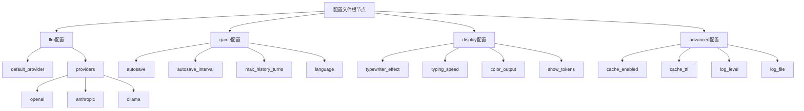
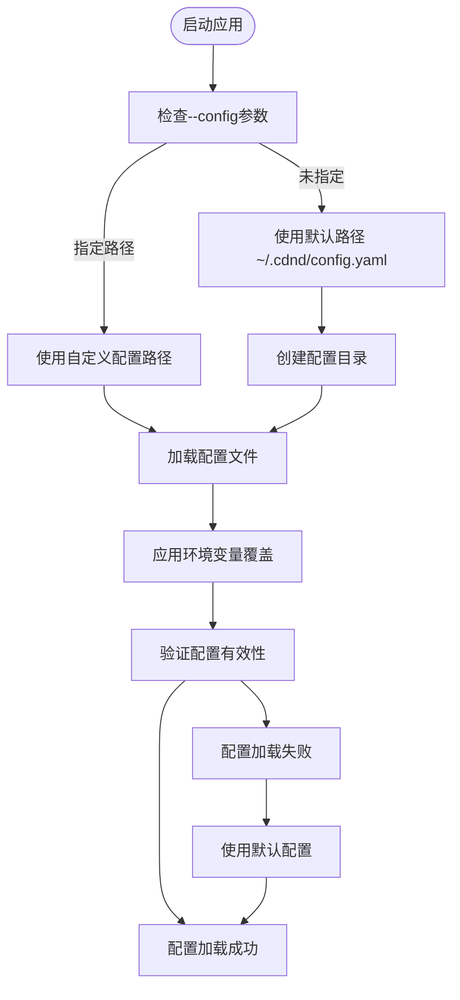
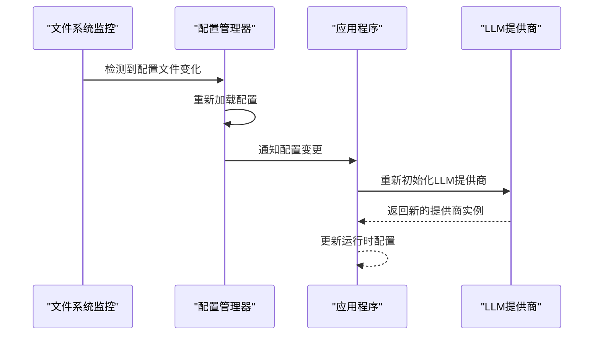
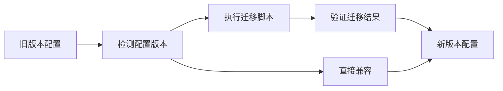

# 配置管理

<cite>
**本文引用的文件列表**
- [config.go](file://infrastructure/config/config.go)
- [loader.go](file://infrastructure/config/loader.go)
- [defaults.go](file://infrastructure/config/defaults.go)
- [config.example.yaml](file://config.example.yaml)
- [config.go](file://interface/cmd/config.go)
- [root.go](file://interface/cmd/root.go)
- [factory.go](file://infrastructure/llm/factory.go)
- [provider.go](file://infrastructure/llm/openai.go)
- [anthropic.go](file://infrastructure/llm/anthropic.go)
- [ollama.go](file://infrastructure/llm/ollama.go)
- [types.go](file://infrastructure/llm/types.go)
- [provider.go](file://interface/cmd/provider.go)
- [README.md](file://README.md)
</cite>

## 更新摘要
**所做更改**
- 更新了配置文件结构和字段说明，基于README.md中的详细配置示例
- 增强了LLM提供商配置的详细说明，包括OpenAI、Anthropic和Ollama的具体配置
- 完善了游戏设置、显示选项和高级配置的详细说明
- 添加了配置验证和错误处理的最佳实践
- 更新了配置管理的CLI命令说明和使用示例

## 目录
1. [简介](#简介)
2. [配置文件结构](#配置文件结构)
3. [LLM提供商配置](#llm提供商配置)
4. [游戏设置](#游戏设置)
5. [显示选项](#显示选项)
6. [高级配置](#高级配置)
7. [配置加载与验证](#配置加载与验证)
8. [配置管理CLI](#配置管理cli)
9. [配置验证与错误处理](#配置验证与错误处理)
10. [配置热重载与动态更新](#配置热重载与动态更新)
11. [配置最佳实践](#配置最佳实践)
12. [安全考虑](#安全考虑)
13. [配置迁移与版本升级](#配置迁移与版本升级)
14. [故障排除指南](#故障排除指南)
15. [结论](#结论)

## 简介
CDND的配置管理系统基于Viper实现，提供完整的配置文件加载、环境变量覆盖、默认值管理和CLI配置管理功能。系统支持多种LLM提供商配置，包括OpenAI、Anthropic Claude和Ollama本地模型，同时提供游戏设置、显示选项和高级配置的完整管理。

## 配置文件结构
配置文件采用YAML格式，位于用户主目录的`.cdnd/config.yaml`路径下。配置文件包含四个主要部分：

### 根级配置结构
- **llm**: LLM提供商相关配置
- **game**: 游戏行为设置
- **display**: 用户界面显示选项
- **advanced**: 高级功能配置



**图表来源**
- [config.go:8-53](file://infrastructure/config/config.go#L8-L53)
- [config.example.yaml:5-72](file://config.example.yaml#L5-L72)

## LLM提供商配置
LLM配置支持三种主要提供商，每种提供商都有特定的配置参数。

### 默认提供商设置
- **default_provider**: 指定默认使用的LLM提供商（openai、anthropic或ollama）

### OpenAI提供商配置
```yaml
llm:
  providers:
    openai:
      api_key: ""           # API密钥（可为空，使用环境变量）
      model: "gpt-4-turbo-preview"  # 使用的模型
      base_url: "https://api.openai.com/v1"  # API基础URL
      max_tokens: 4096      # 最大token数
      temperature: 0.7      # 生成温度
```

**支持的OpenAI兼容服务**：
- OpenAI官方API
- 阿里云DashScope兼容API
- 其他OpenAI兼容的服务

### Anthropic Claude提供商配置
```yaml
llm:
  providers:
    anthropic:
      api_key: ""           # API密钥
      model: "claude-3-opus-20240229"  # 使用的模型
      max_tokens: 4096      # 最大token数
      temperature: 0.7      # 生成温度
```

### Ollama本地模型配置
```yaml
llm:
  providers:
    ollama:
      model: "llama2"       # 本地模型名称
      base_url: "http://localhost:11434"  # Ollama服务地址
      max_tokens: 4096      # 最大token数
      temperature: 0.7      # 生成温度
```

**章节来源**
- [config.go:16-29](file://infrastructure/config/config.go#L16-L29)
- [defaults.go:10-31](file://infrastructure/config/defaults.go#L10-L31)
- [config.example.yaml:12-38](file://config.example.yaml#L12-L38)

## 游戏设置
游戏配置控制角色扮演游戏的核心行为和体验。

### 自动保存配置
- **autosave**: 是否启用自动保存功能（布尔值，默认true）
- **autosave_interval**: 自动保存的时间间隔（如"5m"、"10m"、"1h"）

### 历史记录设置
- **max_history_turns**: 内存中保留的最大历史回合数（整数，默认100）
- **language**: 游戏内容的语言设置（如"zh-CN"、"en-US"）

**章节来源**
- [config.go:31-37](file://infrastructure/config/config.go#L31-L37)
- [defaults.go:32-37](file://infrastructure/config/defaults.go#L32-L37)
- [config.example.yaml:40-49](file://config.example.yaml#L40-L49)

## 显示选项
显示配置控制终端界面的视觉效果和用户体验。

### 文本显示效果
- **typewriter_effect**: 是否启用打字机效果（布尔值，默认true）
- **typing_speed**: 打字机效果的速度（如"30ms"、"50ms"、"100ms"）

### 输出格式设置
- **color_output**: 是否启用彩色输出（布尔值，默认true）
- **show_tokens**: 是否显示token使用信息（布尔值，默认false）

**章节来源**
- [config.go:39-45](file://infrastructure/config/config.go#L39-L45)
- [defaults.go:38-43](file://infrastructure/config/defaults.go#L38-L43)
- [config.example.yaml:51-60](file://config.example.yaml#L51-L60)

## 高级配置
高级配置提供性能优化和调试功能。

### 缓存设置
- **cache_enabled**: 是否启用响应缓存（布尔值，默认true）
- **cache_ttl**: 缓存生存时间（如"1h"、"24h"、"7d"）

### 日志配置
- **log_level**: 日志级别（"debug"、"info"、"warn"、"error"，默认"info"）
- **log_file**: 日志文件路径（留空则仅输出到控制台）

**章节来源**
- [config.go:47-53](file://infrastructure/config/config.go#L47-L53)
- [defaults.go:44-49](file://infrastructure/config/defaults.go#L44-L49)
- [config.example.yaml:62-72](file://config.example.yaml#L62-L72)

## 配置加载与验证
配置系统采用多层次的加载和验证机制，确保配置的可靠性和灵活性。

### 配置加载流程


**图表来源**
- [loader.go:24-70](file://infrastructure/config/loader.go#L24-L70)
- [root.go:69-94](file://interface/cmd/root.go#L69-L94)

### 环境变量覆盖机制
系统支持通过环境变量覆盖配置文件中的任何设置。环境变量命名遵循以下规则：
- 配置键"llm.providers.openai.api_key"对应环境变量"LLM_PROVIDERS_OPENAI_API_KEY"
- 支持嵌套结构的环境变量命名

**章节来源**
- [loader.go:50-62](file://infrastructure/config/loader.go#L50-L62)
- [root.go:88](file://interface/cmd/root.go#L88)

## 配置管理CLI
CDND提供完整的CLI工具来管理配置文件。

### 配置初始化
```bash
# 初始化配置文件
cdnd config init

# 指定自定义配置路径
cdnd --config /path/to/config.yaml start
```

### 配置查看与修改
```bash
# 查看所有配置
cdnd config get

# 查看特定配置项
cdnd config get llm.default_provider

# 修改配置项
cdnd config set llm.default_provider openai
```

### LLM提供商管理
```bash
# 列出所有提供商
cdnd provider list

# 测试提供商连接
cdnd provider test openai

# 设置默认提供商
cdnd provider set-default openai
```

**章节来源**
- [config.go:21-84](file://interface/cmd/config.go#L21-L84)
- [provider.go:23-121](file://interface/cmd/provider.go#L23-L121)

## 配置验证与错误处理
系统实现了多层次的配置验证和错误处理机制。

### 配置验证规则
- **提供商验证**: 确保default_provider在providers中存在
- **必填字段检查**: API密钥、模型名称等关键字段的验证
- **数值范围验证**: max_tokens、temperature等数值的有效性检查
- **路径验证**: 配置文件路径和数据目录的可访问性检查

### 错误处理策略
- **配置文件不存在**: 自动创建默认配置文件
- **配置项无效**: 使用默认值继续执行，同时记录警告
- **提供商配置错误**: 返回明确的错误信息和修复建议
- **环境变量冲突**: 优先使用命令行参数，其次环境变量，最后配置文件

**章节来源**
- [loader.go:56-67](file://infrastructure/config/loader.go#L56-L67)
- [factory.go:12-20](file://infrastructure/llm/factory.go#L12-L20)

## 配置热重载与动态更新
当前实现支持配置文件的热重载，但需要适当的实现来支持完全的动态更新。

### 现有热重载机制
- **文件监控**: 监控配置文件的变化
- **自动重新加载**: 检测到变化时自动重新加载配置
- **渐进式更新**: 仅更新受影响的配置部分

### 建议的改进方案


**图表来源**
- [loader.go:24-70](file://infrastructure/config/loader.go#L24-L70)

**章节来源**
- [loader.go:24-70](file://infrastructure/config/loader.go#L24-L70)
- [config.go:66-84](file://interface/cmd/config.go#L66-L84)

## 配置最佳实践
遵循以下最佳实践可以确保配置系统的稳定性和安全性。

### 敏感信息保护
- **环境变量优先**: 将API密钥等敏感信息存储在环境变量中
- **配置文件权限**: 确保配置文件只有当前用户可读写权限
- **版本控制排除**: 将包含敏感信息的配置文件排除在版本控制之外

### 配置备份与恢复
- **定期备份**: 定期备份配置文件到安全位置
- **多环境配置**: 为不同环境维护独立的配置文件
- **配置模板**: 使用配置模板快速部署新环境

### 配置文档化
- **注释说明**: 为重要的配置项添加详细的注释说明
- **示例配置**: 提供完整的配置示例文件
- **变更日志**: 记录配置的重大变更和影响

## 安全考虑
配置系统涉及多个安全层面，需要特别注意以下安全事项。

### 环境变量安全
- **命名规范**: 遵循统一的环境变量命名约定
- **作用域限制**: 限制环境变量的作用范围和继承关系
- **清理机制**: 程序退出时清理敏感的环境变量

### 访问控制
- **文件权限**: 配置文件和目录设置适当的文件权限
- **用户隔离**: 不同用户之间的配置文件隔离
- **审计日志**: 记录配置文件的访问和修改操作

### 数据加密
- **传输加密**: 通过HTTPS等安全协议传输配置数据
- **存储加密**: 对敏感配置数据进行加密存储
- **内存保护**: 防止敏感配置信息在内存中泄露

## 配置迁移与版本升级
系统支持配置的平滑迁移和版本升级。

### 版本兼容性
- **向后兼容**: 新版本保持对旧配置格式的支持
- **自动迁移**: 提供配置自动迁移工具
- **降级支持**: 支持从新版本降级到旧版本

### 迁移策略


**图表来源**
- [defaults.go:7-51](file://infrastructure/config/defaults.go#L7-L51)
- [loader.go:72-96](file://infrastructure/config/loader.go#L72-L96)

### 迁移工具
- **配置转换器**: 自动转换配置格式和字段名称
- **完整性检查**: 验证迁移后配置的完整性和正确性
- **回滚机制**: 支持迁移失败时的配置回滚

## 故障排除指南
提供常见配置问题的诊断和解决方法。

### 配置文件问题
- **配置文件未找到**: 检查`~/.cdnd/config.yaml`是否存在，使用`cdnd config init`创建
- **配置语法错误**: 使用YAML验证工具检查配置文件格式
- **权限问题**: 确保配置文件具有正确的读写权限

### LLM提供商问题
- **API密钥错误**: 验证API密钥的有效性和权限范围
- **网络连接问题**: 检查网络连接和防火墙设置
- **模型不可用**: 确认所选模型在提供商处可用

### 性能问题
- **加载缓慢**: 检查配置文件大小和复杂度
- **内存占用高**: 调整max_history_turns等内存相关配置
- **响应延迟**: 优化LLM提供商的网络设置和超时参数

### 调试技巧
- **启用调试模式**: 使用`--debug`标志获取详细日志
- **配置验证**: 使用`cdnd config get`验证配置的当前状态
- **环境变量检查**: 使用`printenv`检查环境变量的设置

**章节来源**
- [config.go:21-84](file://interface/cmd/config.go#L21-L84)
- [loader.go:56-67](file://infrastructure/config/loader.go#L56-L67)
- [README.md:83-160](file://README.md#L83-L160)

## 结论
CDND的配置管理系统通过Viper提供了强大而灵活的配置管理能力。系统支持多种LLM提供商、完整的游戏设置、丰富的显示选项和高级功能配置。通过CLI工具、环境变量覆盖、配置验证和错误处理机制，确保了配置管理的易用性和可靠性。

建议在生产环境中进一步完善配置热重载、运行时验证和安全防护机制，以提供更好的用户体验和系统稳定性。同时，完善的配置文档和迁移工具将有助于长期维护和版本升级。