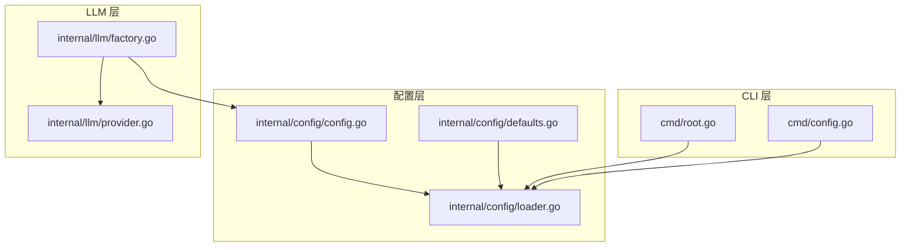
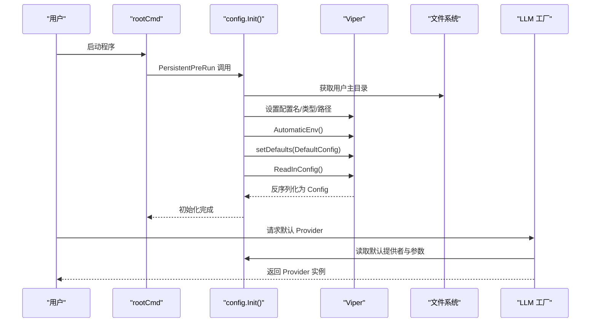
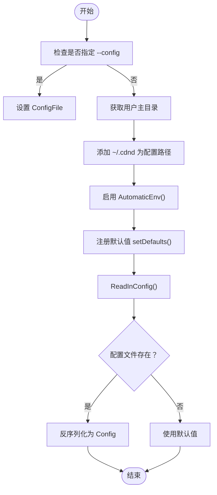
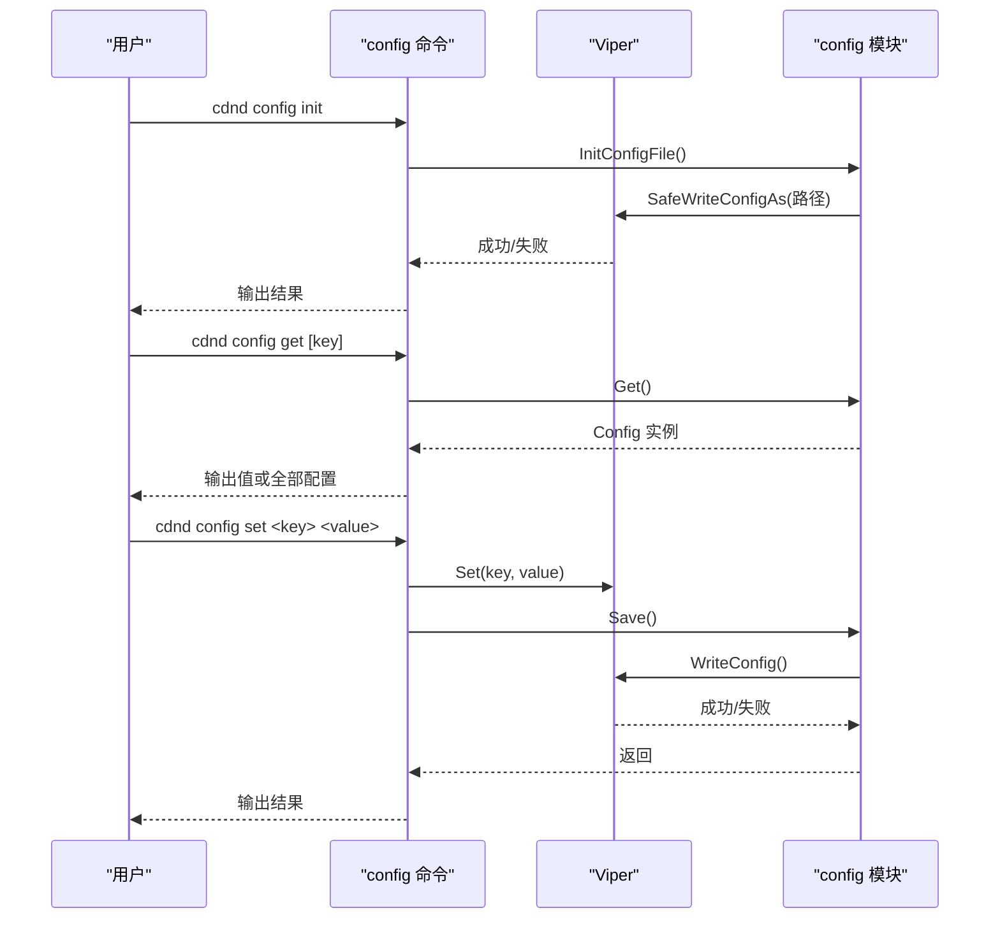
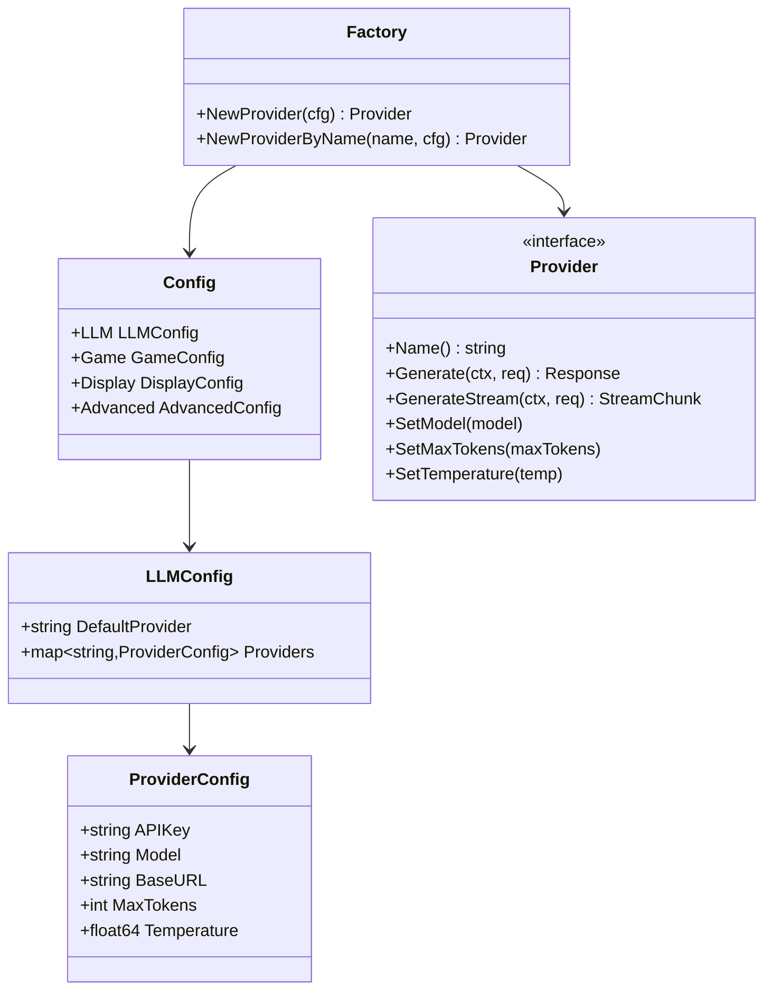
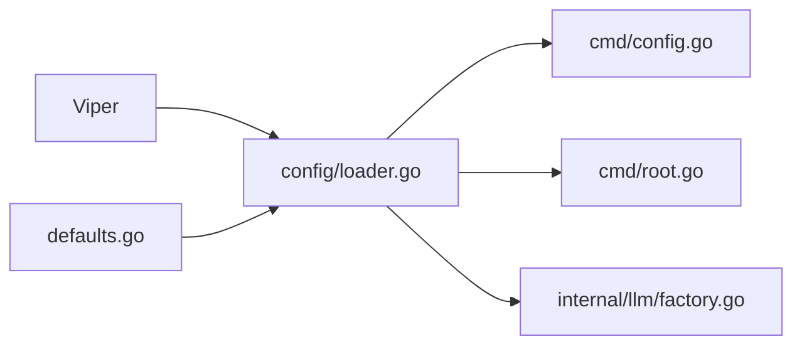

# 配置管理

<cite>
**本文引用的文件列表**
- [config.go](file://internal/config/config.go)
- [loader.go](file://internal/config/loader.go)
- [defaults.go](file://internal/config/defaults.go)
- [config.example.yaml](file://config.example.yaml)
- [config.go](file://cmd/config.go)
- [root.go](file://cmd/root.go)
- [factory.go](file://internal/llm/factory.go)
- [provider.go](file://internal/llm/provider.go)
</cite>

## 目录
1. [简介](#简介)
2. [项目结构](#项目结构)
3. [核心组件](#核心组件)
4. [架构总览](#架构总览)
5. [详细组件分析](#详细组件分析)
6. [依赖关系分析](#依赖关系分析)
7. [性能考量](#性能考量)
8. [故障排除指南](#故障排除指南)
9. [结论](#结论)
10. [附录](#附录)

## 简介
本文件面向管理员与开发者，系统性阐述 CDND 的配置管理系统。该系统基于 Viper 实现，提供配置文件加载、环境变量覆盖、默认值管理、配置持久化与 CLI 管理能力，并与 LLM 提供者工厂、游戏引擎等模块深度集成。文档涵盖配置结构、字段语义、验证与错误处理、热重载与动态更新、最佳实践与安全建议、迁移与版本升级、调试与排障、自动化脚本与批量操作，以及与功能模块的集成方式。

## 项目结构
配置相关代码集中在 internal/config 目录，CLI 命令位于 cmd 目录，LLM 提供者工厂位于 internal/llm 目录。整体采用“分层+模块化”组织：
- 配置模型与默认值：internal/config
- 配置加载与持久化：internal/config
- CLI 配置管理：cmd
- LLM 提供者工厂：internal/llm
- 应用启动与全局初始化：cmd/root.go

图表来源
- [config.go:1-54](file://internal/config/config.go#L1-L54)
- [defaults.go:1-52](file://internal/config/defaults.go#L1-L52)
- [loader.go:1-151](file://internal/config/loader.go#L1-L151)
- [root.go:1-95](file://cmd/root.go#L1-L95)
- [config.go:1-124](file://cmd/config.go#L1-L124)
- [factory.go:1-69](file://internal/llm/factory.go#L1-L69)
- [provider.go:1-114](file://internal/llm/provider.go#L1-L114)

章节来源
- [config.go:1-54](file://internal/config/config.go#L1-L54)
- [loader.go:1-151](file://internal/config/loader.go#L1-L151)
- [defaults.go:1-52](file://internal/config/defaults.go#L1-L52)
- [root.go:1-95](file://cmd/root.go#L1-L95)
- [config.go:1-124](file://cmd/config.go#L1-L124)
- [factory.go:1-69](file://internal/llm/factory.go#L1-L69)
- [provider.go:1-114](file://internal/llm/provider.go#L1-L114)

## 核心组件
- 配置模型 Config：包含 LLM、Game、Display、Advanced 四个子配置域，字段映射到 YAML 键。
- 默认值 DefaultConfig：提供各子域的默认值，作为 Viper 默认值与回退来源。
- 加载器 Loader：负责初始化 Viper、设置默认值、读取配置文件、反序列化、保存配置、生成配置路径。
- CLI 配置命令：init/get/set，支持初始化配置文件、查看与修改配置项。
- LLM 工厂：根据配置选择默认提供者并创建对应 Provider 实例。

章节来源
- [config.go:8-53](file://internal/config/config.go#L8-L53)
- [defaults.go:7-51](file://internal/config/defaults.go#L7-L51)
- [loader.go:24-150](file://internal/config/loader.go#L24-L150)
- [config.go:12-123](file://cmd/config.go#L12-L123)
- [factory.go:9-68](file://internal/llm/factory.go#L9-L68)

## 架构总览
配置系统在应用启动时初始化，优先读取用户主目录下的 ~/.cdnd/config.yaml；同时启用环境变量覆盖；默认值来源于 DefaultConfig 并注册到 Viper。CLI 提供配置的查看与修改能力，修改后可直接写回配置文件。LLM 工厂从配置中读取默认提供者与提供者参数，创建具体 Provider 实例。

图表来源
- [root.go:31-37](file://cmd/root.go#L31-L37)
- [loader.go:24-70](file://internal/config/loader.go#L24-L70)
- [defaults.go:7-51](file://internal/config/defaults.go#L7-L51)
- [factory.go:9-41](file://internal/llm/factory.go#L9-L41)

## 详细组件分析

### 配置模型与字段语义
- LLM 配置
  - default_provider：默认使用的 LLM 提供者名称（如 openai、anthropic、ollama）。
  - providers：提供者集合，键为提供者名称，值包含 api_key、model、base_url、max_tokens、temperature。
- 游戏配置
  - autosave：是否启用自动保存。
  - autosave_interval：自动保存周期。
  - max_history_turns：内存中保留的最大历史回合数。
  - language：游戏内容语言。
- 显示配置
  - typewriter_effect：是否启用打字机效果。
  - typing_speed：打字机速度。
  - color_output：是否启用彩色输出。
  - show_tokens：是否显示 token 使用信息。
- 高级配置
  - cache_enabled：是否启用响应缓存。
  - cache_ttl：缓存生存时间。
  - log_level：日志级别。
  - log_file：日志文件路径（留空则仅输出到控制台）。

章节来源
- [config.go:8-53](file://internal/config/config.go#L8-L53)
- [config.example.yaml:5-72](file://config.example.yaml#L5-L72)

### 默认值与 Viper 集成
- DefaultConfig 提供初始默认值。
- setDefaults 将默认值注册到 Viper，确保即使配置文件缺失或字段缺失也能获得合理默认。
- AutomaticEnv 启用后，环境变量可覆盖配置项（例如 llm.providers.openai.api_key 对应环境变量名）。
- Init 会尝试读取 ~/.cdnd/config.yaml；若不存在则使用默认值。

章节来源
- [defaults.go:7-51](file://internal/config/defaults.go#L7-L51)
- [loader.go:24-96](file://internal/config/loader.go#L24-L96)
- [root.go:69-94](file://cmd/root.go#L69-L94)

### 配置加载流程
- 若通过 --config 指定配置文件路径，则优先使用该路径。
- 否则在用户主目录下查找 .cdnd/config.yaml。
- 读取配置后进行反序列化到 Config 结构体。
- 支持保存配置到文件（Save/SaveAs）。

图表来源
- [loader.go:24-70](file://internal/config/loader.go#L24-L70)
- [root.go:69-94](file://cmd/root.go#L69-L94)

章节来源
- [loader.go:24-70](file://internal/config/loader.go#L24-L70)
- [root.go:69-94](file://cmd/root.go#L69-L94)

### CLI 配置管理
- config init：在 ~/.cdnd 下创建带默认值的配置文件。
- config get [key]：获取指定键值；不带键则打印完整配置。
- config set <key> <value>：设置键值并保存到配置文件。

图表来源
- [config.go:21-84](file://cmd/config.go#L21-L84)
- [loader.go:108-150](file://internal/config/loader.go#L108-L150)

章节来源
- [config.go:12-123](file://cmd/config.go#L12-L123)
- [loader.go:108-150](file://internal/config/loader.go#L108-L150)

### LLM 工厂与配置集成
- NewProvider 根据配置的 default_provider 选择并创建对应 Provider。
- NewProviderByName 支持按名称创建指定 Provider。
- 工厂将 internal/config.ProviderConfig 转换为 internal/llm.ProviderConfig，传递给具体 Provider 实现。

图表来源
- [config.go:8-29](file://internal/config/config.go#L8-L29)
- [factory.go:9-68](file://internal/llm/factory.go#L9-L68)
- [provider.go:64-83](file://internal/llm/provider.go#L64-L83)

章节来源
- [factory.go:9-68](file://internal/llm/factory.go#L9-L68)
- [provider.go:64-83](file://internal/llm/provider.go#L64-L83)
- [config.go:8-29](file://internal/config/config.go#L8-L29)

### 配置验证与错误处理
- 配置加载错误：当 ReadInConfig 报错且非“配置文件未找到”时返回错误；否则使用默认值继续。
- 提供者选择错误：当 default_provider 为空或在 providers 中不存在时返回错误。
- CLI 错误：config get 未找到键时输出错误并退出；config set 保存失败时输出错误并退出。
- 建议：在业务层对关键配置（如 API Key、BaseURL、模型名）进行二次校验，确保运行时可用性。

章节来源
- [loader.go:56-67](file://internal/config/loader.go#L56-L67)
- [factory.go:11-19](file://internal/llm/factory.go#L11-L19)

### 热重载与动态更新
- 当前实现：配置在应用启动时一次性加载并反序列化到全局 Config 实例；CLI 的 set 会保存到文件，但不会自动刷新运行时配置。
- 建议方案：
  - 引入配置变更监听：在 loader 中使用 Viper 的 Watch 功能或外部文件监控，检测配置文件变化后触发重新加载。
  - 分层配置：将“运行时可热更新”的配置项拆分为独立的运行时配置对象，通过原子替换或锁保护的方式更新。
  - 优雅重启：对于影响较大的配置（如 LLM 提供者切换），建议触发服务重启以确保一致性。

章节来源
- [loader.go:24-70](file://internal/config/loader.go#L24-L70)
- [config.go:66-84](file://cmd/config.go#L66-L84)

### 配置结构与字段详解
- llm.default_provider：决定默认 LLM 提供者。
- llm.providers.<name>.api_key：提供者 API 密钥（可通过环境变量覆盖）。
- llm.providers.<name>.model/base_url/max_tokens/temperature：模型、基础 URL、最大 token、温度。
- game.autosave/autosave_interval/max_history_turns/language：自动保存、周期、历史回合数、语言。
- display.typewriter_effect/typing_speed/color_output/show_tokens：显示效果与输出。
- advanced.cache_enabled/cache_ttl/log_level/log_file：缓存、日志级别与文件。

章节来源
- [config.go:8-53](file://internal/config/config.go#L8-L53)
- [config.example.yaml:5-72](file://config.example.yaml#L5-L72)

## 依赖关系分析
- 配置加载依赖 Viper：设置配置名/类型/路径、读取配置、写回配置、环境变量覆盖。
- CLI 依赖 config 模块：调用 InitConfigFile、Get、Save 等。
- LLM 工厂依赖 config 模块：读取默认提供者与参数。
- 应用启动依赖 rootCmd：PersistentPreRun 中调用 config.Init()。

图表来源
- [loader.go:1-151](file://internal/config/loader.go#L1-L151)
- [defaults.go:1-52](file://internal/config/defaults.go#L1-L52)
- [config.go:1-124](file://cmd/config.go#L1-L124)
- [root.go:1-95](file://cmd/root.go#L1-L95)
- [factory.go:1-69](file://internal/llm/factory.go#L1-L69)

章节来源
- [loader.go:1-151](file://internal/config/loader.go#L1-L151)
- [config.go:1-124](file://cmd/config.go#L1-L124)
- [root.go:1-95](file://cmd/root.go#L1-L95)
- [factory.go:1-69](file://internal/llm/factory.go#L1-L69)

## 性能考量
- 配置读取：一次性的磁盘读取与反序列化，开销极低。
- 环境变量覆盖：AutomaticEnv 会扫描匹配的环境变量，建议仅在必要时开启或限制命名空间。
- 缓存：advanced.cache_enabled 与 cache_ttl 控制响应缓存，有助于减少 LLM 调用次数，提升交互流畅度。
- 日志：合理设置 log_level 与 log_file，避免高频写入影响性能。

## 故障排除指南
- 配置文件未找到：确认 ~/.cdnd/config.yaml 是否存在；可通过 cdnd config init 创建。
- 配置项无效：使用 cdnd config get 查看当前值；使用 cdnd config set 修改并保存。
- 提供者不可用：检查 llm.default_provider 与对应 providers.<name> 的配置；确认 API Key、BaseURL、模型名正确。
- 环境变量覆盖异常：确认环境变量命名符合 Viper 命名规范（大小写与分隔符）。
- 日志问题：检查 advanced.log_level 与 advanced.log_file；必要时临时设为 debug 并输出到控制台定位问题。

章节来源
- [config.go:21-84](file://cmd/config.go#L21-L84)
- [loader.go:56-67](file://internal/config/loader.go#L56-L67)
- [root.go:69-94](file://cmd/root.go#L69-L94)

## 结论
CDND 的配置系统以 Viper 为核心，结合默认值与环境变量覆盖，实现了灵活、可扩展的配置管理。通过 CLI 提供了便捷的配置初始化、查看与修改能力，并与 LLM 工厂紧密集成。建议在生产环境中引入配置热重载与运行时校验，强化安全与稳定性；同时完善配置迁移与版本升级机制，保障长期演进。

## 附录

### 配置最佳实践
- 敏感信息保护：优先通过环境变量注入 API Key；避免将密钥写入配置文件。
- 配置备份：定期备份 ~/.cdnd/config.yaml；建议纳入版本控制或私有仓库。
- 分环境配置：使用不同环境变量区分开发/测试/生产；必要时提供多份配置文件。
- 文档化：为关键配置项补充注释与示例，便于团队协作与审计。

### 安全考虑
- 环境变量命名：遵循 Viper 命名规则，避免与系统变量冲突。
- 访问权限：确保 ~/.cdnd 目录与配置文件权限最小化，仅允许当前用户访问。
- 日志脱敏：避免在日志中输出敏感信息（如 API Key）。

### 配置迁移与版本升级
- 新增字段：在 defaults.go 中添加默认值；在 loader.go 的 setDefaults 中注册默认值。
- 字段重命名：提供迁移脚本，读取旧键并写入新键；或在加载时做兼容映射。
- 版本标记：可在配置中加入版本字段，便于运行时判断是否需要迁移。

### 配置调试与自动化
- 调试：使用 cdnd config get 查看当前配置；临时启用 debug 模式观察行为差异。
- 自动化：编写 shell 脚本批量初始化配置、批量设置常用参数、导出当前配置快照。
- 批量操作：通过循环遍历配置键，结合 CLI 的 set 命令实现批量更新。