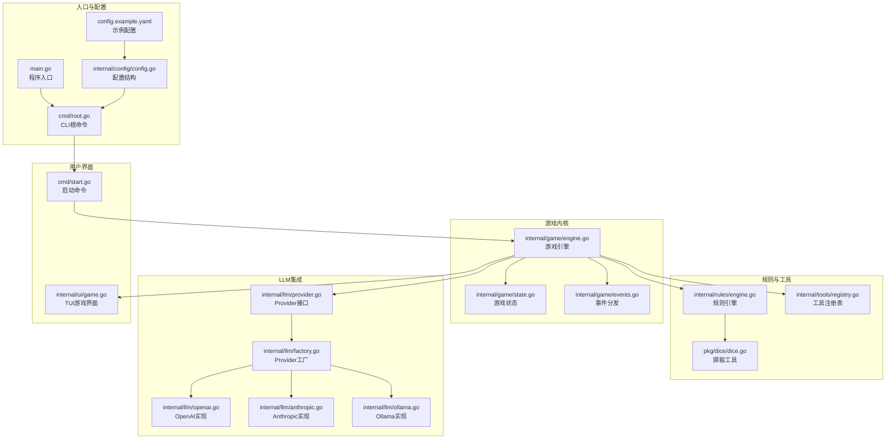
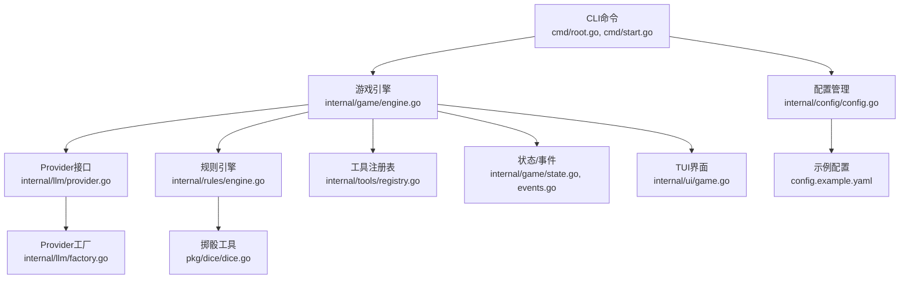
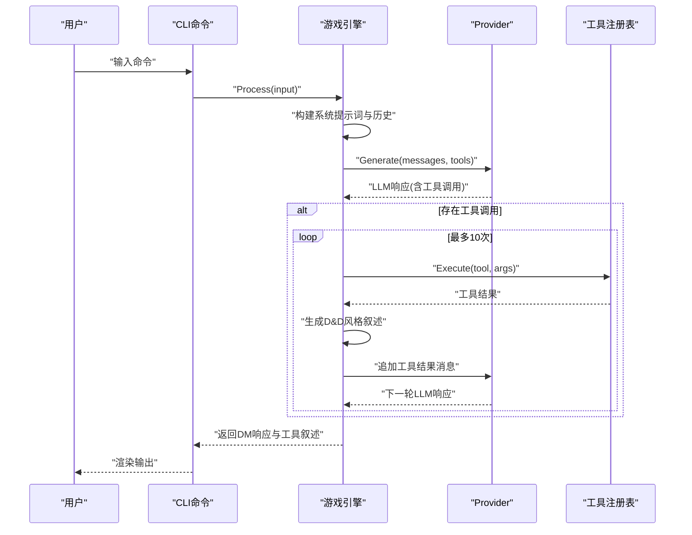
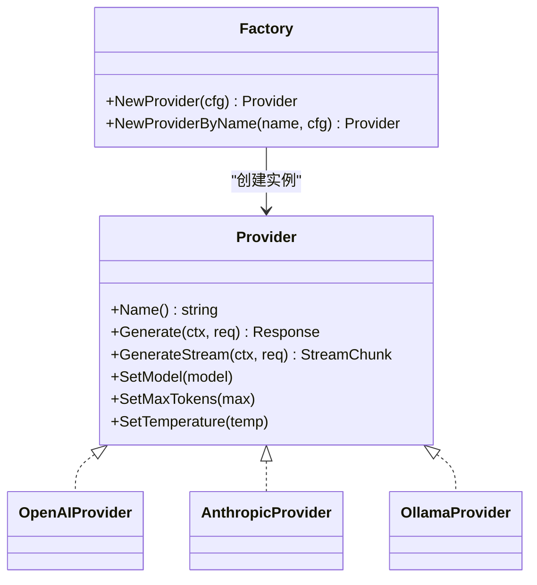
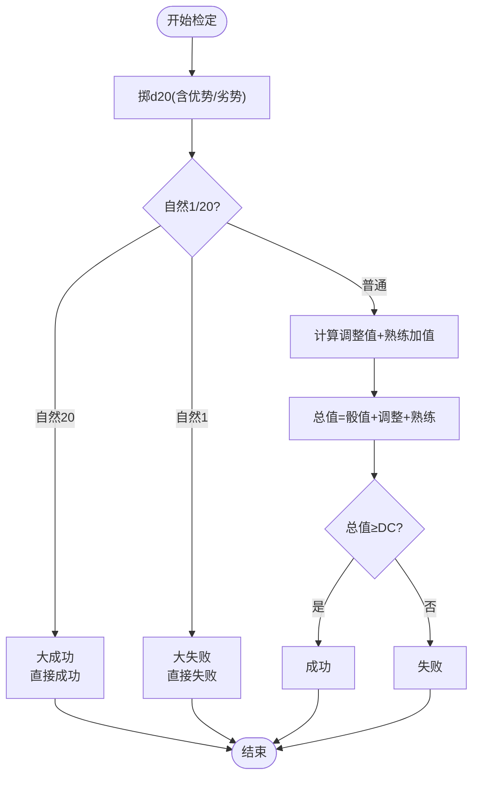
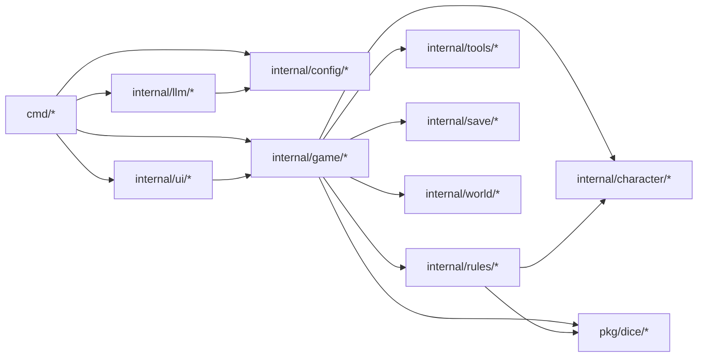

# 项目概述

<cite>
**本文引用的文件**
- [main.go](file://main.go)
- [go.mod](file://go.mod)
- [cmd/root.go](file://cmd/root.go)
- [cmd/start.go](file://cmd/start.go)
- [internal/game/engine.go](file://internal/game/engine.go)
- [internal/llm/provider.go](file://internal/llm/provider.go)
- [internal/llm/factory.go](file://internal/llm/factory.go)
- [internal/tools/registry.go](file://internal/tools/registry.go)
- [internal/character/character.go](file://internal/character/character.go)
- [internal/ui/game.go](file://internal/ui/game.go)
- [internal/config/config.go](file://internal/config/config.go)
- [internal/rules/engine.go](file://internal/rules/engine.go)
- [pkg/dice/dice.go](file://pkg/dice/dice.go)
- [config.example.yaml](file://config.example.yaml)
- [Makefile](file://Makefile)
</cite>

## 目录
1. [简介](#简介)
2. [项目结构](#项目结构)
3. [核心组件](#核心组件)
4. [架构总览](#架构总览)
5. [详细组件分析](#详细组件分析)
6. [依赖分析](#依赖分析)
7. [性能考虑](#性能考虑)
8. [故障排除指南](#故障排除指南)
9. [结论](#结论)
10. [附录](#附录)

## 简介
CDND 是一款由大语言模型（LLM）驱动的命令行龙与地下城第五版（D&D 5e）角色扮演游戏。它通过 AI 驱动的动态叙事，结合完整的 D&D 5e 规则系统与工具调用机制，为玩家提供沉浸式的互动式冒险体验。项目支持多种 LLM 提供商（OpenAI、Anthropic Claude、Ollama），并通过 CLI 与 Bubble Tea TUI 提供双入口交互方式。

- 核心价值与目标
  - AI 驱动的动态叙事：通过 LLM 将玩家输入转化为丰富的剧情反馈，并可按需调用工具进行规则判定与世界状态变更。
  - 完整的 D&D 5e 规则系统：内置属性、技能、豁免、检定、伤害、AC 等规则引擎，确保游戏逻辑符合官方规则。
  - 工具调用机制：将规则判定与世界状态变更封装为“工具”，LLM 可自动选择并调用，形成“思考-行动-反馈”的智能循环。
  - 多提供商支持：统一抽象的 Provider 接口，支持云端与本地模型，便于切换与扩展。
  - 友好的用户界面：CLI 命令行与 Bubble Tea TUI 双通道，满足不同用户的交互偏好。

- 与其他 D&D 工具的区别与优势
  - 规则与叙事一体化：不仅提供规则判定，还能将判定结果融入叙述，增强沉浸感。
  - 工具驱动的状态管理：通过工具调用实现对角色、物品、场景、标记等的可控变更，避免硬编码。
  - 多提供商兼容：统一接口适配多家 LLM，降低迁移成本。
  - 本地与云端兼顾：既可使用云端 API，也可通过 Ollama 运行本地模型，保护隐私与离线可用性。

- 技术栈与系统要求
  - 技术栈：Go 1.24.2、Cobra（CLI）、Viper（配置）、Bubble Tea（TUI）、Charm Bracelet 生态（样式与终端交互）、OpenAI/Anthropic SDK、UUID、Dice 工具等。
  - 系统要求：支持 Linux、macOS、Windows；需要可访问 LLM API（或本地 Ollama 服务）；建议具备基本的命令行与 YAML 配置知识。

**章节来源**
- [cmd/root.go:27-30](file://cmd/root.go#L27-L30)
- [go.mod:3](file://go.mod#L3)

## 项目结构
项目采用模块化的分层组织方式，围绕“CLI 命令”、“游戏引擎”、“LLM 提供者”、“规则引擎”、“工具注册表”、“UI 界面”、“配置管理”等核心模块展开，职责清晰、耦合度低。

**图表来源**
- [main.go:1-8](file://main.go#L1-L8)
- [cmd/root.go:24-67](file://cmd/root.go#L24-L67)
- [cmd/start.go:22-89](file://cmd/start.go#L22-L89)
- [internal/game/engine.go:22-56](file://internal/game/engine.go#L22-L56)
- [internal/llm/provider.go:64-83](file://internal/llm/provider.go#L64-L83)
- [internal/llm/factory.go:9-41](file://internal/llm/factory.go#L9-L41)
- [internal/tools/registry.go:9-29](file://internal/tools/registry.go#L9-L29)
- [internal/rules/engine.go:8-14](file://internal/rules/engine.go#L8-L14)
- [pkg/dice/dice.go:9-19](file://pkg/dice/dice.go#L9-L19)
- [internal/ui/game.go:19-62](file://internal/ui/game.go#L19-L62)
- [internal/config/config.go:8-14](file://internal/config/config.go#L8-L14)
- [config.example.yaml:1-72](file://config.example.yaml#L1-L72)

**章节来源**
- [main.go:1-8](file://main.go#L1-L8)
- [cmd/root.go:24-67](file://cmd/root.go#L24-L67)
- [cmd/start.go:22-89](file://cmd/start.go#L22-L89)
- [internal/game/engine.go:22-56](file://internal/game/engine.go#L22-L56)
- [internal/llm/provider.go:64-83](file://internal/llm/provider.go#L64-L83)
- [internal/llm/factory.go:9-41](file://internal/llm/factory.go#L9-L41)
- [internal/tools/registry.go:9-29](file://internal/tools/registry.go#L9-L29)
- [internal/rules/engine.go:8-14](file://internal/rules/engine.go#L8-L14)
- [pkg/dice/dice.go:9-19](file://pkg/dice/dice.go#L9-L19)
- [internal/ui/game.go:19-62](file://internal/ui/game.go#L19-L62)
- [internal/config/config.go:8-14](file://internal/config/config.go#L8-L14)
- [config.example.yaml:1-72](file://config.example.yaml#L1-L72)

## 核心组件
- CLI 命令行接口（Cobra/Viper）
  - 根命令负责初始化配置、全局标志与帮助信息；子命令如 start 负责启动流程。
  - 支持配置文件路径、调试模式等全局选项，以及启动参数（存档槽位、剧本、跳过创建等）。

- 游戏引擎（Engine）
  - 聚合状态、规则、世界、存档、工具与事件分发，提供统一的 Process 流程：构建提示词 → LLM 生成 → 工具调用 → 结果反馈 → 循环。
  - 支持存档/读档、阶段切换、场景管理、事件订阅等。

- LLM 提供者（Provider 抽象与工厂）
  - Provider 接口统一 Generate/GenerateStream 等能力；工厂根据配置创建具体实现（OpenAI、Anthropic、Ollama）。
  - 支持模型、最大 token、温度等参数配置。

- 规则引擎（Rules）
  - 实现 D&D 5e 的检定、豁免、攻击、伤害、AC 等规则；与掷骰工具协作，保证数值与判定逻辑准确。

- 工具注册表（Registry）
  - 统一注册与执行各类工具（骰子、技能检定、伤害、治疗、物品、场景移动、NPC 管理、标记等），并支持按阶段权限控制。

- 用户界面（Bubble Tea TUI）
  - 提供状态栏、剧情输出区、输入框的三段式布局；支持 Tab 展开/收起状态栏、Braille 加载动画、自动滚动等。

- 配置管理（Viper）
  - 支持 YAML 配置文件、环境变量与默认值合并；涵盖 LLM 提供者、游戏设置、显示与高级选项。

**章节来源**
- [cmd/root.go:24-67](file://cmd/root.go#L24-L67)
- [cmd/start.go:22-89](file://cmd/start.go#L22-L89)
- [internal/game/engine.go:22-56](file://internal/game/engine.go#L22-L56)
- [internal/llm/provider.go:64-83](file://internal/llm/provider.go#L64-L83)
- [internal/llm/factory.go:9-41](file://internal/llm/factory.go#L9-L41)
- [internal/rules/engine.go:8-14](file://internal/rules/engine.go#L8-L14)
- [pkg/dice/dice.go:9-19](file://pkg/dice/dice.go#L9-L19)
- [internal/tools/registry.go:9-29](file://internal/tools/registry.go#L9-L29)
- [internal/ui/game.go:19-62](file://internal/ui/game.go#L19-L62)
- [internal/config/config.go:8-14](file://internal/config/config.go#L8-L14)

## 架构总览
CDND 采用“命令行入口 + 游戏引擎 + LLM Provider + 规则引擎 + 工具系统 + UI 界面”的分层架构。CLI 负责初始化与流程编排，引擎负责状态与规则协调，Provider 负责与外部模型交互，工具注册表提供可插拔的领域动作，UI 提供交互体验。

**图表来源**
- [cmd/root.go:24-67](file://cmd/root.go#L24-L67)
- [cmd/start.go:22-89](file://cmd/start.go#L22-L89)
- [internal/game/engine.go:22-56](file://internal/game/engine.go#L22-L56)
- [internal/llm/provider.go:64-83](file://internal/llm/provider.go#L64-L83)
- [internal/llm/factory.go:9-41](file://internal/llm/factory.go#L9-L41)
- [internal/rules/engine.go:8-14](file://internal/rules/engine.go#L8-L14)
- [pkg/dice/dice.go:9-19](file://pkg/dice/dice.go#L9-L19)
- [internal/tools/registry.go:9-29](file://internal/tools/registry.go#L9-L29)
- [internal/ui/game.go:19-62](file://internal/ui/game.go#L19-L62)
- [internal/config/config.go:8-14](file://internal/config/config.go#L8-L14)
- [config.example.yaml:1-72](file://config.example.yaml#L1-L72)

## 详细组件分析

### 游戏引擎（Engine）与工具调用循环
- 关键职责
  - 管理游戏状态（会话、回合、场景、标记、历史、战斗等）。
  - 构建系统提示词与历史上下文，调用 LLM 并解析工具调用。
  - 执行工具（骰子、检定、伤害、治疗、物品、场景、NPC、标记等），生成 D&D 风格叙述。
  - 分发事件（阶段变更、场景变更、角色受伤/治疗、工具执行等）。
  - 支持存档/读档与自动保存策略。

- 工具调用循环（Agentic Loop）
  - 步骤：构建上下文 → LLM 生成（含工具定义）→ 若无工具调用则结束 → 否则执行工具 → 反馈工具结果 → 循环（最多10次）→ 超限报错。
  - 工具定义来自注册表，参数通过 JSON 解析，结果格式化为消息内容并加入历史。

**图表来源**
- [internal/game/engine.go:195-316](file://internal/game/engine.go#L195-L316)
- [internal/tools/registry.go:37-57](file://internal/tools/registry.go#L37-L57)
- [internal/llm/provider.go:64-83](file://internal/llm/provider.go#L64-L83)

**章节来源**
- [internal/game/engine.go:22-56](file://internal/game/engine.go#L22-L56)
- [internal/game/engine.go:195-316](file://internal/game/engine.go#L195-L316)
- [internal/tools/registry.go:37-57](file://internal/tools/registry.go#L37-L57)

### LLM Provider 抽象与工厂
- Provider 接口
  - 统一方法：Name、Generate、GenerateStream、SetModel、SetMaxTokens、SetTemperature。
  - 请求/响应结构：Message、Request、Response、Usage、StreamChunk、ToolDefinition、ToolCall。

- 工厂模式
  - 根据配置中的默认提供者或指定名称创建具体 Provider 实例（OpenAI、Anthropic、Ollama）。
  - 将内部 ProviderConfig 转换为 llm.ProviderConfig 传递给具体实现。

**图表来源**
- [internal/llm/provider.go:64-114](file://internal/llm/provider.go#L64-L114)
- [internal/llm/factory.go:9-68](file://internal/llm/factory.go#L9-L68)

**章节来源**
- [internal/llm/provider.go:64-114](file://internal/llm/provider.go#L64-L114)
- [internal/llm/factory.go:9-68](file://internal/llm/factory.go#L9-L68)

### 规则引擎与掷骰工具
- 规则引擎
  - 检定/豁免：支持优势/劣势、熟练加值、自然 1/20 特殊判定。
  - 攻击与伤害：计算命中、AC、伤害、暴击伤害。
  - AC 计算：基础 AC = 10 + 敏捷调整值（装备部分待扩展）。

- 掷骰工具
  - Roll/RollDice/D20/D20WithModifier 等函数，支持优势/劣势与自然 1/20 暴击判定。
  - 使用 crypto/rand 保证真随机性，失败时安全回退。

**图表来源**
- [internal/rules/engine.go:91-140](file://internal/rules/engine.go#L91-L140)
- [pkg/dice/dice.go:71-113](file://pkg/dice/dice.go#L71-L113)

**章节来源**
- [internal/rules/engine.go:91-140](file://internal/rules/engine.go#L91-L140)
- [pkg/dice/dice.go:71-113](file://pkg/dice/dice.go#L71-L113)

### 工具注册表与工具分类
- 注册表
  - 注册工具、执行工具、列出工具、检查权限（按游戏阶段）。
  - 支持从 JSON 参数执行工具，便于 LLM 调用。

- 工具分类与叙述
  - 分类：骰子、角色、物品、世界等。
  - 生成 D&D 风格叙述，包含状态标记（✅/❌/⚠️）、分隔框与场景化描述。

**章节来源**
- [internal/tools/registry.go:9-29](file://internal/tools/registry.go#L9-L29)
- [internal/game/engine.go:457-504](file://internal/game/engine.go#L457-L504)
- [internal/game/engine.go:506-520](file://internal/game/engine.go#L506-L520)
- [internal/game/engine.go:548-713](file://internal/game/engine.go#L548-L713)

### TUI 界面与交互
- 界面组成
  - 状态栏：显示阶段、角色信息（可展开/收起）。
  - 剧情输出区：viewport 滚动展示历史与 DM 响应。
  - 输入框：用户输入命令，回车提交。

- 交互细节
  - 加载动画：Braille 旋转器 + 进度点动画 + D&D 风格文案池。
  - 布局自适应：根据窗口大小重新计算 viewport 与输入框尺寸。
  - 历史恢复：从存档恢复历史对话，跳过工具消息。

**章节来源**
- [internal/ui/game.go:19-62](file://internal/ui/game.go#L19-L62)
- [internal/ui/game.go:84-175](file://internal/ui/game.go#L84-L175)
- [internal/ui/game.go:228-241](file://internal/ui/game.go#L228-L241)
- [internal/ui/game.go:253-282](file://internal/ui/game.go#L253-L282)
- [internal/ui/game.go:284-359](file://internal/ui/game.go#L284-L359)

### 配置与示例
- 配置结构
  - LLM：默认提供者、各提供者 API Key、模型、BaseURL、MaxTokens、Temperature。
  - Game：自动保存、间隔、历史回合数、语言。
  - Display：打字机效果、速度、彩色输出、显示 token。
  - Advanced：缓存、TTL、日志级别与文件。

- 示例配置
  - 提供 OpenAI、Anthropic、Ollama 的示例配置项，便于快速上手。

**章节来源**
- [internal/config/config.go:8-54](file://internal/config/config.go#L8-L54)
- [config.example.yaml:5-72](file://config.example.yaml#L5-L72)

## 依赖分析
- 外部依赖
  - Cobra/Viper：CLI 与配置管理。
  - Bubble Tea/Lipgloss：TUI 与样式。
  - OpenAI/Anthropic SDK：云端 LLM 集成。
  - UUID：唯一标识生成。
  - Go 标准库：context、encoding/json、time、crypto/rand 等。

- 模块间依赖
  - cmd 依赖 internal/config、internal/game、internal/llm、internal/ui。
  - internal/game 依赖 internal/character、internal/config、internal/llm、internal/rules、internal/save、internal/tools、internal/world、pkg/dice。
  - internal/llm 依赖 internal/config。
  - internal/ui 依赖 internal/game、internal/save。
  - internal/rules 依赖 pkg/dice、internal/character。
  - pkg/dice 为纯工具模块，无外部依赖。

**图表来源**
- [go.mod:5-14](file://go.mod#L5-L14)
- [cmd/root.go:8-10](file://cmd/root.go#L8-L10)
- [internal/game/engine.go:10-20](file://internal/game/engine.go#L10-L20)
- [internal/llm/factory.go:6](file://internal/llm/factory.go#L6)

**章节来源**
- [go.mod:5-14](file://go.mod#L5-L14)
- [cmd/root.go:8-10](file://cmd/root.go#L8-L10)
- [internal/game/engine.go:10-20](file://internal/game/engine.go#L10-L20)
- [internal/llm/factory.go:6](file://internal/llm/factory.go#L6)

## 性能考虑
- LLM 调用与流式响应
  - 支持 GenerateStream 以提升响应感知；注意控制最大迭代次数与上下文长度，避免超时与费用过高。
- 工具调用循环
  - 限制最大迭代次数（默认10次），防止无限循环；合理设计工具粒度，减少不必要的重复调用。
- 存档与历史
  - 控制 max_history_turns，避免内存膨胀；必要时启用自动保存与缓存（advanced.cache_enabled）。
- UI 渲染
  - viewport 按窗口大小动态计算，避免频繁重绘；加载动画使用定时器，帧率稳定。
- 掷骰随机性
  - 使用 crypto/rand 保证真随机性；在极端情况下回退到安全值，确保稳定性。

[本节为通用指导，无需特定文件引用]

## 故障排除指南
- 配置问题
  - 确认 ~/.cdnd/config.yaml 存在且格式正确；检查 default_provider 与对应 provider 的 api_key/base_url/model/max_tokens/temperature。
  - 使用环境变量覆盖（Viper 自动读取匹配环境变量）。

- LLM 提供者错误
  - 检查 API Key 与 BaseURL；确认网络可达；尝试更换默认提供者或使用 Ollama 本地模型。
  - 若提示 unknown provider 或未找到提供者，检查配置中的键名与大小写。

- 工具执行错误
  - 工具不存在：确认工具名称拼写与注册；检查工具权限（按阶段限制）。
  - 参数解析失败：确保传入 JSON 参数格式正确；留意参数类型（整数/浮点）。

- TUI 交互异常
  - AltScreen/键盘事件：确保终端支持；退出时按 Ctrl+C 或 Esc。
  - 布局错乱：调整终端窗口大小；viewport 会自动重算。

- 存档/读档问题
  - 存档槽位冲突或损坏：清理无效存档；检查 autosave_interval 与缓存 TTL。
  - 角色数据缺失：确认角色创建流程完成；检查角色结构完整性。

**章节来源**
- [internal/config/config.go:8-54](file://internal/config/config.go#L8-L54)
- [config.example.yaml:5-72](file://config.example.yaml#L5-L72)
- [internal/llm/factory.go:11-41](file://internal/llm/factory.go#L11-L41)
- [internal/tools/registry.go:37-57](file://internal/tools/registry.go#L37-L57)
- [internal/ui/game.go:84-175](file://internal/ui/game.go#L84-L175)

## 结论
CDND 将 D&D 5e 的规则体系与现代 LLM 能力有机结合，通过工具调用与事件驱动的方式实现了可扩展、可交互、可存档的 AI 驱动叙事系统。其模块化设计与多提供商支持使其既适合初学者快速上手，也为有经验的开发者提供了良好的扩展空间。建议在生产环境中合理配置 LLM 参数、启用自动保存与缓存，并根据需求选择合适的 Provider 与 UI 交互方式。

[本节为总结性内容，无需特定文件引用]

## 附录
- 快速开始
  - 安装依赖：make deps
  - 构建：make build
  - 运行：make run 或 ./bin/cdnd
  - 启动新游戏：cdnd start
- 开发与测试
  - 单元测试：make test
  - 代码格式化：make fmt
  - 依赖整理：make tidy
  - 交叉编译：make build-all

**章节来源**
- [Makefile:26-105](file://Makefile#L26-L105)